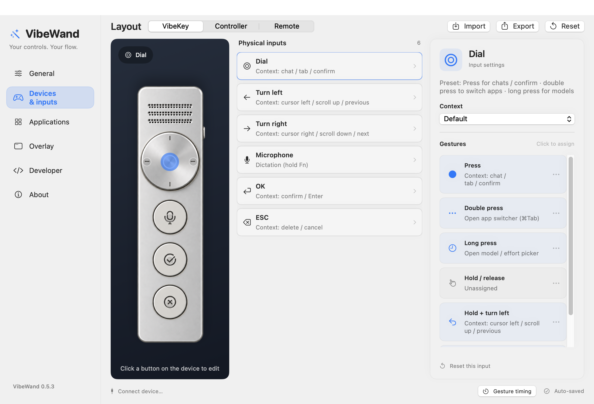

# VibeWand

**Read, edit, and dictate with the controls in your hand.**

A native macOS utility that turns a dial, gamepad, or remote into a control surface for your AI workflow. Use the apps and input method you already know, with physical controls that follow what you are doing.

[简体中文](README.zh-CN.md) · [Getting started](docs/getting-started.en.md) · [Documentation](docs/README.md) · [Project website](https://vibewand.xuhao1.me)


## Why VibeWand

- **Controls that follow context.** Scroll through a conversation, move the caret in a draft, or choose an item in a recognized picker using the same navigation controls.
- **Hold to dictate.** Hold the microphone key or △, speak, and release to finish. VibeWand sends the Fn trigger to your configured dictation service.
- **Switch without reaching for the keyboard.** Open conversations, move between browser tabs, or choose another macOS app.
- **Make the layout yours.** Click a control in the device picture to remap its gestures. Each hardware template keeps its own settings.
- **Native and local.** A quiet floating panel, Chinese and English interfaces, and local configuration. No VibeWand cloud account or API key is required.



*Implemented settings interface, captured in 0.5.3. Current bindings are described in the [default-controls guide](docs/core-experience.en.md).*

## Hardware

| Type | Connection | Default experience |
| --- | --- | --- |
| **VibeKey / Ulanzi AU05** | Built-in receiver backend | Turn the dial to navigate; hold the microphone key to dictate; OK / ESC confirm and return. |
| **Gamepad / Controller** | Automatic macOS GameController discovery over USB or paired Bluetooth | R1 / R2 navigate, ○ confirms, □ deletes, × returns, △ holds dictation. Supported touchpads move the pointer. |
| **Remote** | Requires a verified HID profile | Direction, center, back, and voice preset; hardware integration is experimental. |

AU05 input and a local Bluetooth controller have been observed on hardware. Controller button coverage depends on what macOS exposes; USB and touchpad behavior need validation on your model. The Remote preset is a configurable layout, not a plug-and-play compatibility claim. See [hardware and complete mappings](docs/device-templates.en.md).

## A few controls, a complete workflow

Read a reply → hold to dictate a draft → release and edit → confirm when ready. Navigation scrolls while reading, moves the caret in an observed nonempty draft, and selects candidates in a recognized picker. Double-press the VibeKey dial or × on the Controller to open macOS app switching.

Built-in adapters cover **Codex, DeepSeek Harness, browsers, WeChat, and Feishu**. Behavior varies with each app's exposed controls and shortcuts; Return follows its own send/newline setting. Add other apps through editable shortcut presets. See [application support](docs/applications.en.md).

## Download and install

**[Download VibeWand for macOS — Apple Silicon](https://github.com/xuhao1/VibeWand/releases/download/v0.5.5/VibeWand-0.5.5-macOS-arm64.zip)** · [Release notes](https://github.com/xuhao1/VibeWand/releases/latest)

Requires **macOS 13+** and an **Apple Silicon Mac** (M series). Download the ZIP, extract it in Finder, drag **VibeWand.app** into **Applications**, then double-click to open it. No development tools are needed.

Allow VibeWand in **System Settings → Privacy & Security → Accessibility**, then choose your hardware in **Settings → Devices & inputs**. For AU05, quit Ulanzi Studio first. Without hardware, choose **Settings → Developer → Demo**.

This release is ad-hoc signed and is not Apple-notarized; see [Getting started](docs/getting-started.en.md) for first-open instructions.

### Build from source

For your own build, install **Xcode** with a **Swift 5.9+ toolchain**, download the source, and run this in the project folder:

```sh
bash scripts/build-app.sh
```

Then open `dist/VibeWand.app` in Finder. See the [compilation guide](docs/development.md) for toolchain and signing details.

## Documentation

[Default controls](docs/core-experience.en.md) · [Settings and remapping](docs/settings.en.md) · [Applications](docs/applications.en.md) · [Troubleshooting](docs/troubleshooting.en.md) · [Development](docs/development.md)

The [documentation index](docs/README.md) includes Chinese guides, hardware references, and engineering records. For contributions and bug reports, see [Contributing](CONTRIBUTING.md).

## Privacy and license

VibeWand processes device input and configuration locally. It uses Accessibility and local keyboard/pointer events; it does not record audio or upload conversations. Dictation is handled by macOS or your chosen input method, whose own privacy policy applies.

Source is available under [PolyForm Noncommercial 1.0.0](LICENSE). **Personal noncommercial use, modification, and redistribution are permitted under its terms. Commercial use requires contacting [Hao Xu](https://github.com/xuhao1) and obtaining a separate license before use.** [Ask about commercial licensing](https://github.com/xuhao1/VibeWand/issues/new?title=Commercial%20licensing%20inquiry).

Because it restricts commercial use, this is a source-available license rather than an OSI-approved open-source license. Third-party components retain their original licenses; see [acknowledgments](third-party/README.md).

Created by **Dr. Hao Xu**, Tenure-track Associate Professor at Nanjing University. [Personal website](http://xuhao1.me) · [GitHub](https://github.com/xuhao1)
