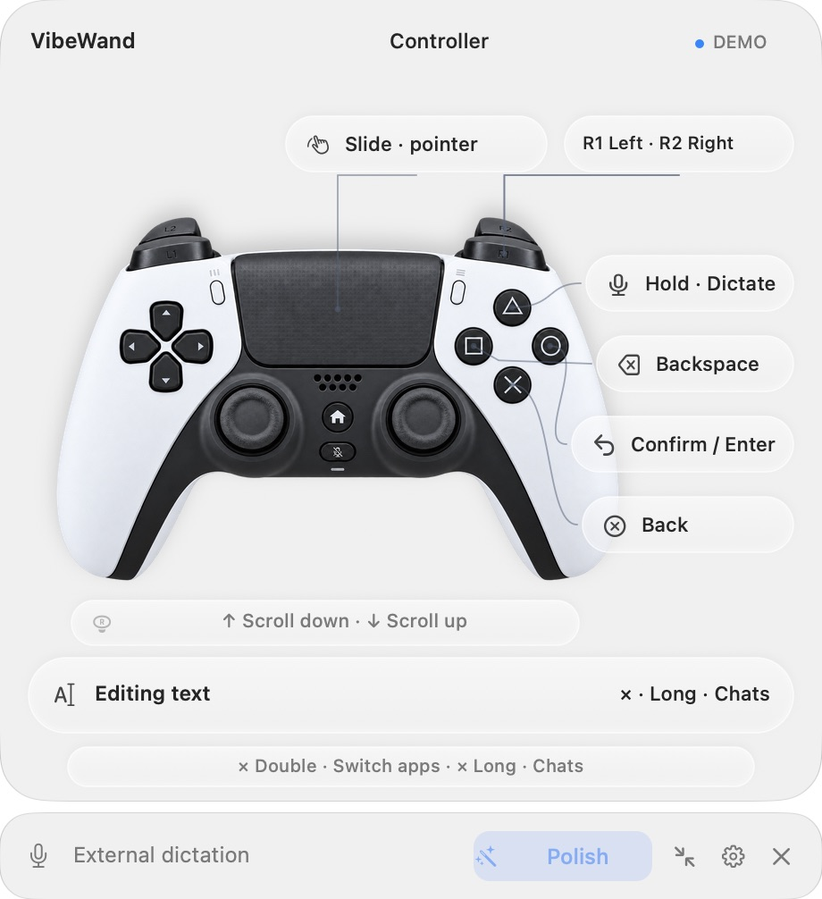

# VibeWand

**One wand to command them all.**

A dial, a game controller, a remote or just the keyboard, plus a spoken sentence, for driving the AI tools on your Mac: Codex, Claude, DeepSeek Harness and WorkBuddy, Claude Code, Codex and OpenCode in a terminal, and browsers, WeChat and Feishu.

[简体中文](README.zh-CN.md) · [Get started](docs/getting-started.en.md) · [Apps](#apps) · [Computer use](#computer-use) · [Documentation](docs/README.md) · [Project site](https://vibewand.xuhao1.me)


Most of vibe coding is not typing. You read a reply, flip between chats, change the model, say a sentence, and wait. One hand is enough for all of that. VibeWand puts it on a dial or a controller so you can lean back while you work.

The tools keep multiplying, and each has its own chat list, model menu and shortcuts. VibeWand replaces none of them. It puts them behind one set of motions: the same dial reads, the same button listens and the same press switches in every app, and the work is still done by the software you chose. What is unified is the way in, not the features. That is what "One wand to command them all" means.

## What it does

- **Read.** Turn the dial or push a stick to scroll the conversation. Once the draft has text in it, the same motion moves the cursor instead.
- **Speak.** Hold the microphone button and talk. When you let go, the text is in the composer, and nothing is sent for you. Use the built-in recognition, which records from the microphone of the device you are holding: macOS dictation or your own speech API, both of which take your own vocabulary, or SenseVoice running on this Mac with no key and no network. Or keep using an input method such as Typeless.
- **Switch.** Press once for the chat list, turn to choose, press to confirm. Long-press for reasoning effort and models. Double-press to switch macOS apps.
- **Remap.** Every button's press, double press and long press can be reassigned in Settings, and each device keeps its own layout.
- **Command.** Hold the command key and say “switch to the Codex chat about the microphone” or “open the Runtime.swift tab”, and it finds and opens it for you; “set the effort to the lowest” works the menu that Codex's model button opens. The model is yours to choose: DeepSeek, OpenAI, Anthropic, a local model or any compatible address. It works as soon as one is set up, and can instead run as a plugin of a DeepSeek Harness you installed yourself, where each conversation can be read and models are set up; see [Command mode](docs/command-mode.en.md).

<p align="center"></p>

*Actual VibeWand 0.8.1 window, captured in Demo mode.*

A floating overlay shows what each button will do right now. It collapses into a thin bar when you want it out of the way, and the button that expands and collapses it never moves.

## Devices

| Type | Connection | Tested with |
| --- | --- | --- |
| **VibeKey**<br> | USB receiver, built-in protocol | Ulanzi VibeKey (AU05) |
| **Controller**<br> | USB or Bluetooth, detected by macOS | Sony DualSense (PS5) |
| **Remote**<br> | Needs an imported HID profile | Xiaomi Bluetooth Remote 2 Pro |
| **Keyboard** | No device needed: six key combinations stand for the buttons, and any key, a custom keyboard's extra keys included, is recorded by pressing it | Key events posted into a test window; a physical custom keyboard has not been tried |

Several devices can stay connected at once. Press a button on one and the overlay and button layout follow it; there is nothing to switch in Settings. A Bluetooth controller powers itself off after about ten idle minutes, so Settings has a "Keep the controller awake" switch.

Per-model details are in the [hardware guide](docs/device-templates.en.md).

**VibeWand is an independent project. It is not affiliated with, sponsored by or endorsed by Ulanzi, Sony, Xiaomi or any other device maker. Product names and trademarks belong to their owners.**

## Apps

| Kind | Program | Chats | Model / effort | Dictation |
| --- | --- | --- | --- | --- |
| AI desktop apps | Codex | ⌘K palette | Effort slider; press again for the model list | ✓ |
| | Claude | ⌘K palette | Model menu, then the effort slider | ✓ |
| | DeepSeek Harness | Sidebar chat list | Model menu and its submenu | ✓ |
| | WorkBuddy | Sidebar task search; ⌘K fallback | Model menu | Pasted on release |
| Command-line agents | Claude Code, Codex and OpenCode in iTerm2 | Types `/resume` | Types `/model` | Pasted on release |
| Browsers | Safari, Chrome, Edge, Brave, Firefox, Opera, Vivaldi | Next tab | Address bar | ✓ |
| Messaging | WeChat, Feishu / Lark | Search / switch chats | — | ✓ |
| Any other app | Added in Settings by bundle ID | The shortcut you assign | The shortcut you assign | ✓ |

The first five rows, the AI tools, were exercised on a real machine. The terminal row was accepted in iTerm2 3.7.3 against Codex CLI 0.160.0, Claude Code 2.1.289 and OpenCode 1.18.34 with the screen read back after every step: with a draft at the prompt turning moves the cursor and ESC deletes, a command is typed only at an empty prompt, and buttons keep answering while the agent works; see the [acceptance record](docs/terminal-acceptance.md). WorkBuddy 5.6.2 passed native UI readback checks for task search and opening, model switching, draft editing and dictation delivery with transcript replay. WeChat has only a `⌘F` compatibility mapping, because its chat controls cannot be read.

Three things work in apps that are not in the table. Dictation follows the keyboard focus: native fields fill in as you speak, and everything else gets a single paste when you release, after which your clipboard is put back. A double press switches macOS apps. The controller's touchpad moves the pointer and clicks. App actions such as chats and models go only to the apps in the table and to rules you added yourself, matched by full bundle ID and never by window title, and each one can be turned off in Settings. Per-app details, tested versions and known limits are in [Applications](docs/applications.en.md).

## Computer use

What VibeWand does is computer use: it works out what the front app is showing and operates it for you. By default it takes no screenshots, and it never clicks coordinates. It reads the control structure that macOS Accessibility provides, the same one a screen reader gets. An action starts either from a button you press or from a sentence you say.

| | Driven by buttons | Driven by a sentence ([command mode](docs/command-mode.en.md)) |
| --- | --- | --- |
| Status | Released | Released in 0.9.0; usable once a model is set up |
| Who decides what happens | The button and the current context, by fixed rules; no model is involved | The model you configured, choosing among 13 tools. A picture of the window and, in plugin mode, the harness's own tools are added only if you turn them on |
| What it looks at | Which app is in front; whether focus is in a field and whether the draft is empty; whether a chat, model or effort list is open and what it offers; input-method candidates and unknown dialogs | App, window and chat titles; the kind, name and state of the controls in the front window; the status line an app announces |
| What it does | Presses buttons and adjusts sliders; sends shortcuts and arrow keys; scrolls the conversation; parks the pointer on a candidate or clicks it; writes or pastes text; switches apps | Finds and opens chats; opens an app's own search and types the keywords; switches apps, opens a file or URL; presses a control, sends a shortcut, chooses a menu item, types into a field |
| Reach | The apps in the table above and the rules you added | Any app whose controls can be read, one at a time |

Both paths keep the same rules:

- **Nothing is sent for you.** Text stays in the field, and Return is yours to press. By default command mode asks only before deleting, sending, submitting or paying; you can have it ask at every step, or not at all.
- **An action goes only to the target that was in front when you pressed.** If the app, window or focus has changed, the action is dropped.
- **Structure is read, content is not.** A field is known only as empty or not. Conversation text and documents are not read, no screenshot is taken unless you turn on the window picture for command mode, and nothing is typed into a password field. A terminal has no controls, so only the few rows next to the cursor are read to find the prompt, reduced to a state and dropped.
- **No shell and no file access by default.** Configuration runs no scripts, and the model cannot reach anything outside its tool list. In plugin mode you can hand it the harness's own tools, a shell and files among them; the harness's sandbox holds them at the permission mode you chose.

What each capability covers, which channel each app uses and what has been verified in real apps is in [Computer use](docs/computer-use.en.md).

## Install

**[Download VibeWand 0.10.0 (Apple Silicon)](https://github.com/xuhao1/VibeWand/releases/download/v0.10.0/VibeWand-0.10.0-macOS-arm64.zip)** · [Release notes](https://github.com/xuhao1/VibeWand/releases/latest)

Requires macOS 26 or later on an M-series Mac (0.8.4 is the last version for macOS 13 to 15). Unzip, drag **VibeWand.app** into Applications and open it. The first launch shows a guide that walks you through the steps below, voice input and command mode; every step can be skipped. By hand:

1. Allow VibeWand under System Settings → Privacy & Security → Accessibility. Without it, the app can neither see the composer nor send keys.
2. Connect your device. For the VibeKey, quit Ulanzi Studio first; the two cannot share the receiver.
3. No device yet? Try Settings → Developer → Demo mode.

This build is ad-hoc signed and not notarized by Apple, so the first launch takes one extra step. See [Get started](docs/getting-started.en.md).

### Build from source

You need Xcode 26 or later and Opus from Homebrew. The minimum system is macOS 26:

```sh
brew install opus
bash scripts/build-app.sh
```

The result is `dist/VibeWand.app`. The build downloads pinned versions of Node.js and DeepSeek Harness as the kernel for command mode, which makes the app about 324 MB; `VIBEWAND_SKIP_KERNEL=1` leaves it out. More in the [development guide](docs/development.md).

## Documentation

[Default controls](docs/core-experience.en.md) · [Settings and remapping](docs/settings.en.md) · [Voice input](docs/voice-input.md) · [Command mode](docs/command-mode.en.md) · [Applications](docs/applications.en.md) · [Troubleshooting](docs/troubleshooting.en.md) · [Development](docs/development.md)

## Privacy

Device input and configuration stay on your Mac. VibeWand has no server and needs no account. With an external input method it only holds Fn for you. With built-in recognition, audio stays in memory; macOS dictation runs on device when it can, SenseVoice always does, and API mode sends audio to the endpoint you entered. Keys live in the macOS Keychain and are never part of an exported configuration. Dictated text goes into the field and no further; sending it is up to you. A terminal has no composer control, so VibeWand reads the few rows next to the cursor to find the prompt; they are reduced to a state in memory and dropped, never stored or sent anywhere.

Command mode is on by default, and until you set up a model it does nothing and contacts no service. After that, the words of your commands, the titles of apps and chats, and the labels of controls in the front window while the interface is operated are sent to the model service you chose yourself. The contents of fields and documents are not, unless you turn on the window picture, which shows the model the window as it is. What each command did is recorded on this Mac and deleted after 14 days. See [Command mode](docs/command-mode.en.md#what-is-sent).

## License

The source is under [PolyForm Noncommercial 1.0.0](LICENSE). Personal, noncommercial use, modification and distribution are allowed. **Commercial use requires a separate license from [the author, Hao Xu](https://github.com/xuhao1)**; open a [commercial licensing inquiry](https://github.com/xuhao1/VibeWand/issues/new?title=Commercial%20licensing%20inquiry) to ask. Because commercial use is restricted, this is source-available rather than open source as the OSI defines it. Third-party components keep their own licenses; see [acknowledgements](third-party/README.md). The licensing questions still open for this version are listed in [Licensing and copyright: open items](docs/licensing-open-items.md).

By **Dr. Xu** · [Homepage](http://xuhao1.me) · [GitHub](https://github.com/xuhao1)
