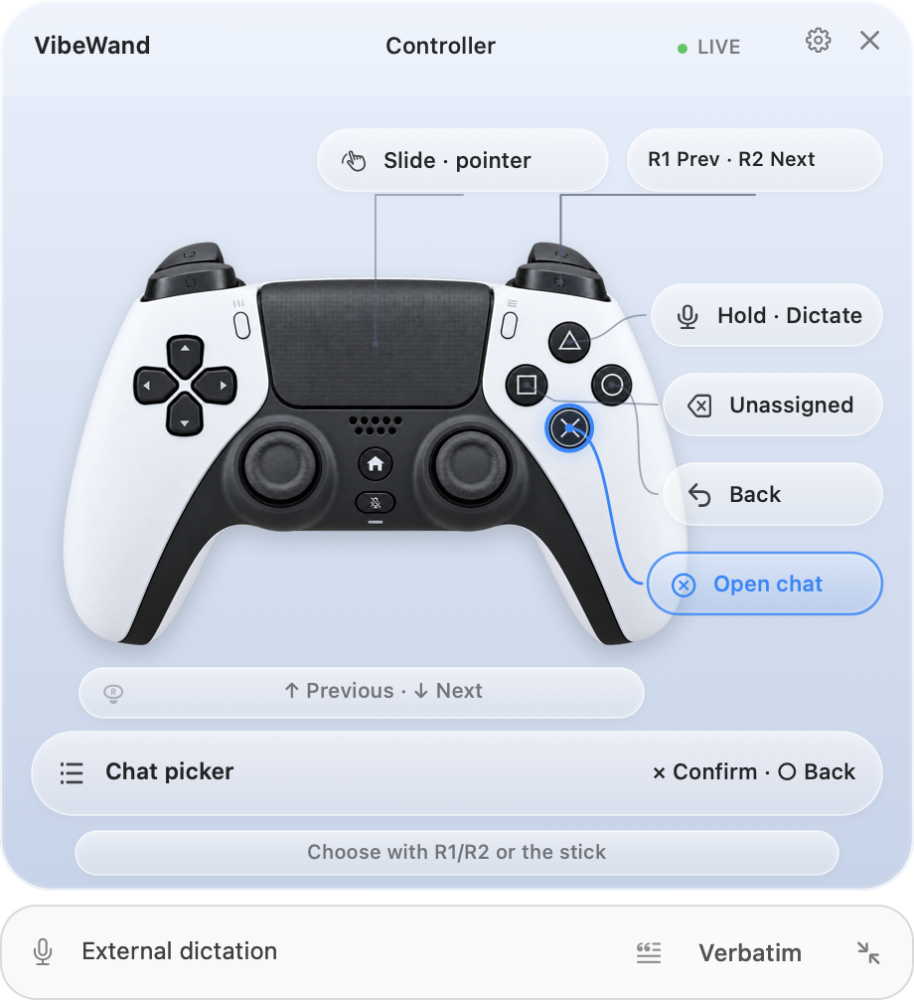

# VibeWand

用旋钮、手柄或遥控器操作 Codex、Claude、DeepSeek Harness、WorkBuddy 的 macOS 小工具。

[English](README.md) · [快速开始](docs/getting-started.md) · [文档目录](docs/README.md) · [项目主页](https://vibewand.xuhao1.me)


Vibe coding 的大部分时间其实不在打字：读回复、翻会话、换模型、说一句话，然后等。这些事一只手就够了。VibeWand 把它们放到一个旋钮或手柄上，人可以靠在椅背上干活。

## 能做什么

- **读**：转旋钮或推摇杆滚动对话。输入框里有字时，同一个动作改成移动光标。
- **说**：按住麦克风键说话，松开后文字出现在输入框里，不会替你发送。可以用自带的识别（系统听写或你自己的语音 API），也可以继续用 Typeless、豆包这类输入法。
- **切**：按一下打开会话列表，转动选择，再按确认。长按调推理强度、换模型。双击切换 macOS 应用。
- **改**：每个按键的单击、双击、长按都能在设置里重新分配，每种设备各存一套。

<p align="center"></p>

屏幕上有个悬浮面板，告诉你当前每个键会做什么。嫌占地方可以收成一条，展开和收起的按钮始终在同一个位置。

## 支持的设备

| 类型 | 接入方式 | 实测设备 |
| --- | --- | --- |
| **VibeKey**<br> | USB 接收器，内置协议 | Ulanzi VibeKey（AU05） |
| **手柄**<br> | USB 或蓝牙，macOS 自动识别 | Sony DualSense（PS5 手柄） |
| **遥控器**<br> | 需要导入 HID 配置 | 小米蓝牙遥控器 2 Pro |

几个设备可以同时连着。在哪个上面按键，面板和按键布局就跟到哪个，不用进设置切换。蓝牙手柄闲置十来分钟会自己关机，设置里有个“保持手柄唤醒”的开关。

各型号的细节见[硬件指南](docs/device-templates.md)。

**VibeWand 是独立项目，与 Ulanzi、Sony、小米及其他设备厂商没有隶属、合作、赞助或背书关系。产品名称与商标归各自所有者。**

## 支持的应用

| 应用 | 会话 | 模型 / 强度 | 听写 |
| --- | --- | --- | --- |
| Codex | ⌘K 面板 | 强度滑块，再按一次进模型列表 | ✓ |
| Claude | ⌘K 面板 | 模型菜单，确认后进强度滑块 | ✓ |
| DeepSeek Harness | 侧边栏会话列表 | 模型菜单及其子菜单 | ✓ |
| WorkBuddy | 侧边栏搜索任务；⌘K 回退 | 模型菜单 | 松开后粘贴 |
| 浏览器 | 切换标签页 | 地址栏 | ✓ |
| 微信、飞书 | 搜索 / 切换聊天 | — | ✓ |

以上四款 AI 工具均在本机实测过。WorkBuddy 5.6.2 已通过原生界面回读验收：搜索并打开任务、切换模型、编辑草稿，以及用转录回放验证听写写入。听写不挑应用：原生输入框边说边写，其他应用在松开后粘贴一次，剪贴板随后恢复原样。别的应用可以在设置里加一条快捷键规则，见[应用适配](docs/applications.md)。

## 安装

**[下载 VibeWand 0.8.1（Apple Silicon）](https://github.com/xuhao1/VibeWand/releases/download/v0.8.1/VibeWand-0.8.1-macOS-arm64.zip)** · [版本说明](https://github.com/xuhao1/VibeWand/releases/latest)

需要 macOS 13 以上和 M 系列芯片。解压后把 **VibeWand.app** 拖进“应用程序”，打开它，然后：

1. 在“系统设置 → 隐私与安全性 → 辅助功能”里允许 VibeWand。没有这个权限它既看不到输入框也发不了按键。
2. 接上设备。VibeKey 需要先退出 Ulanzi Studio，两者不能同时占用接收器。
3. 没有设备也可以先看看：“设置 → 开发者 → 演示模式”。

这个版本是临时签名，没有做 Apple 公证，第一次打开要多点一步，见[快速开始](docs/getting-started.md)。

### 从源码编译

需要 Xcode 26 以上和 Homebrew 的 Opus：

```sh
brew install opus
bash scripts/build-app.sh
```

产物在 `dist/VibeWand.app`。更多细节见[开发指南](docs/development.md)。

## 文档

[默认操作](docs/core-experience.md) · [设置与改键](docs/settings.md) · [语音输入](docs/voice-input.md) · [应用适配](docs/applications.md) · [问题排查](docs/troubleshooting.md) · [开发指南](docs/development.md)

## 隐私

设备输入和配置都在本机处理，VibeWand 没有自己的服务器，也不需要账号。听写用外置输入法时，它只替你按住 Fn；用内置识别时，录音只留在内存里，系统听写能离线就离线，语音 API 模式会把录音发到你自己填的地址。密钥存在 macOS 钥匙串里，导出配置不会带上。听写的文字只写进输入框，发不发由你决定。

## 许可

源码采用 [PolyForm Noncommercial 1.0.0](LICENSE)。个人非商用可以使用、修改和分发；**商用需要先联系[作者徐浩](https://github.com/xuhao1)取得单独授权**，可以直接提一个[商业授权咨询](https://github.com/xuhao1/VibeWand/issues/new?title=Commercial%20licensing%20inquiry)。因为限制了商业用途，它是源码公开，但不算 OSI 定义的开源。第三方组件保留各自的许可证，见[致谢](third-party/README.md)。

作者：**Dr. Xu** · [个人主页](http://xuhao1.me) · [GitHub](https://github.com/xuhao1)
