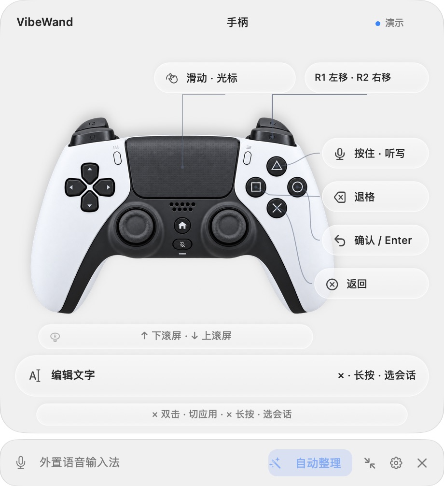

# VibeWand

**One wand to command them all.**

[](https://www.bilibili.com/video/BV169Hf6oEeq/)

<p align="center"><a href="https://www.bilibili.com/video/BV169Hf6oEeq/">▶ 观看三分钟宣传片</a></p>

一个旋钮、手柄、遥控器，或者就用键盘，再加一句话，操作 Mac 上的各种 AI 工具：Codex、Claude、DeepSeek Harness、WorkBuddy，终端里的 Claude Code、Codex、OpenCode，以及浏览器、微信和飞书。

[English](README.md) · [快速开始](docs/getting-started.md) · [支持的应用](#支持的应用) · [Computer use](#computer-use) · [文档目录](docs/README.md) · [项目主页](https://vibewand.xuhao1.me)

<table align="center">
<tr>
<td align="center"><br><sub>Codex</sub></td>
<td align="center"><br><sub>Claude</sub></td>
<td align="center"><br><sub>DeepSeek<br>Harness</sub></td>
<td align="center"><br><sub>WorkBuddy</sub></td>
<td align="center"><br><sub>iTerm2</sub></td>
<td align="center"><br><sub>Safari</sub></td>
<td align="center"><br><sub>Chrome</sub></td>
<td align="center"><br><sub>微信</sub></td>
<td align="center"><br><sub>飞书</sub></td>
</tr>
</table>

Vibe coding 的大部分时间其实不在打字：读回复、翻会话、换模型、说一句话，然后等。这些事一只手就够了。VibeWand 把它们放到一个旋钮或手柄上，人可以靠在椅背上干活。

工具越来越多，每个都有自己的会话列表、模型菜单和快捷键。VibeWand 不替代其中任何一个，只把它们收到同一组动作后面：在哪个应用里都是同一个旋钮读、同一个键说、同一下切换，活儿还是你选的那个软件干。统一的是入口，不是功能，这就是 “One wand to command them all”。

## 能做什么


- **读**：转旋钮或推摇杆滚动对话。输入框里有字时，同一个动作改成移动光标。
- **说**：按住麦克风键说话，松开后文字出现在输入框里，不会替你发送。可以用自带的识别，它用你手里那个设备的麦克风录音：系统听写或你自己的语音 API，能填自己的词表；或者在本机运行的 SenseVoice，不用密钥也不用联网。也可以继续用 Typeless、豆包这类输入法。
- **切**：按一下打开会话列表，转动选择，再按确认。长按调推理强度、换模型。双击切换 macOS 应用。
- **改**：每个按键的单击、双击、长按都能在设置里重新分配，每种设备各存一套。
- **令**：按住命令键说“切到 Codex 里讨论麦克风的那个会话”或“打开 Runtime.swift 那个标签页”，它替你找到并打开；说“强度调到最低”，它会在 Codex 模型按钮弹出的菜单里调。模型由你选：DeepSeek、OpenAI、Anthropic、本机模型或任何兼容的地址，配好就能用；也可以作为插件跑在你自己装的 DeepSeek Harness 上，在那里看每段对话、配模型。见[命令模式](docs/command-mode.md)。

<p align="center"></p>

*VibeWand 0.8.1 实际运行窗口截图，使用演示模式。*

屏幕上有个悬浮面板，告诉你当前每个键会做什么。嫌占地方可以收成一条，展开和收起的按钮始终在同一个位置。

## 支持的设备

| 类型 | 接入方式 | 实测设备 |
| --- | --- | --- |
| **VibeKey**<br> | USB 接收器，内置协议 | Ulanzi VibeKey（AU05） |
| **手柄**<br> | USB 或蓝牙，macOS 自动识别 | Sony DualSense（PS5 手柄） |
| **遥控器**<br> | 需要导入 HID 配置 | 小米蓝牙遥控器 2 Pro |
| **键盘** | 不需要设备：六组组合键各代表一个按键，任何键都能按一下录下来，自定义键盘的扩展键也行 | 测试窗口里的合成按键；实体的自定义键盘还没有试过 |

几个设备可以同时连着。在哪个上面按键，面板和按键布局就跟到哪个，不用进设置切换。蓝牙手柄闲置十来分钟会自己关机，设置里有个“保持手柄唤醒”的开关。

各型号的细节见[硬件指南](docs/device-templates.md)。

**VibeWand 是独立项目，与 Ulanzi、Sony、小米及其他设备厂商没有隶属、合作、赞助或背书关系。产品名称与商标归各自所有者。**

## 支持的应用

| 程序 | 滚动阅读 | 切换会话 | 换模型 | 调推理强度 | 听写 |
| --- | :-: | :-: | :-: | :-: | :-: |
|  Codex | ✓ | ✓ | ✓ | ✓ | ✓ |
|  Claude | ✓ | ✓ | ✓ | ✓ | ✓ |
|  DeepSeek Harness | ✓ | ✓ | ✓ | ✓ | ✓ |
|  WorkBuddy | ✓ | ✓ 任务 | ✓ | — | ✓ |
|  iTerm2 里的 Claude Code、Codex、OpenCode | ✓ | ✓ | ✓ | 仅 Codex | ✓ |
|   浏览器：Safari、Chrome、Edge、Brave、Firefox、Opera、Vivaldi | ✓ | ✓ 标签页 | — | — | ✓ |
|   微信、飞书 / Lark | ✓ | ✓ 聊天 | — | — | ✓ |

✓ 是你在这个应用里能做的事；每个应用里具体怎么操作、实测版本和已知边界见[应用适配](docs/applications.md)。几处说明：

- WorkBuddy 里切换的是任务；它的思考开关和更细的推理设置还得在它自己的菜单里调。
- 终端里的三个工具都能切换会话和换模型，推理强度目前只有 Codex 能用旋钮调。
- 浏览器里切换的是标签页；没有模型可换，同一个键改为跳到地址栏。
- 微信和飞书里切换的是聊天。微信的聊天控件读不到，会话键只是打开它自己的搜索，选择结果还没有在真实应用里验证过。

前五行 AI 工具均在本机实测过。终端一行在 iTerm2 3.7.3 里对 Codex CLI 0.160.0、Claude Code 2.1.289、OpenCode 1.18.34 逐步读回屏幕验收，见[验收记录](docs/terminal-acceptance.md)；WorkBuddy 5.6.2 已通过原生界面回读验收：搜索并打开任务、切换模型、编辑草稿，以及用转录回放验证听写写入。

不在表里的应用也有三件事能用：听写跟着键盘焦点走，原生输入框边说边写，其他应用在松开后粘贴一次，剪贴板随后恢复原样；双击切换 macOS 应用；手柄触摸板移动指针和点击。想让别的应用也响应切换会话和换模型这两个键，在设置里按 bundle ID 添加它并指定快捷键。这类应用动作只发给表里的应用和你自己加的规则，按完整的 bundle ID 匹配，不看窗口标题，每一项都能在设置里单独关掉。

应用的名称和图标是各自所有者的商标，这里只用来说明兼容性；VibeWand 与它们没有隶属、赞助或背书关系。

## Computer use

VibeWand 干的是 computer use 这类事：看懂前台应用的界面，替你操作它。它读的是 macOS 辅助功能给出的控件结构，和读屏软件拿到的是同一份；默认不截图，也不凭画面去点。遇到不提供控件的应用，可以让命令模式看窗口截图并在图上点击。动作要么来自你按的键，要么来自你说的一句话。

| | 按键驱动 | 一句话驱动（[命令模式](docs/command-mode.md)） |
| --- | --- | --- |
| 状态 | 已发布 | 已随 0.9.0 发布；配好模型后可用 |
| 谁决定做什么 | 你按的键和当前场景，规则固定，不经过模型 | 你配置的模型，从 13 个工具里选。看窗口截图并在图上点击，以及插件模式下 Harness 自己的工具，要你打开才有 |
| 看什么 | 前台是哪个应用；焦点在不在输入框、草稿空不空；会话、模型、强度列表开没开、有哪些候选；输入法候选和未知弹窗 | 应用、窗口和会话的标题；前台窗口里控件的类型、名称和状态；应用播报的状态行；打开看窗口后，还有窗口的截图和从图里认出的文字 |
| 做什么 | 按下按钮、调滑块；发快捷键和方向键；在对话区滚动；把指针停到候选上或点击；写入或粘贴文字；切换应用 | 查找并打开会话；打开应用自带的搜索并填词；切应用、打开文件或网址；按控件、发快捷键、选菜单项、往输入框里写字；打开看窗口后，还能点击截图里的一行文字或一个位置 |
| 作用范围 | 上表里的应用和你加的规则 | 任何读得到控件的应用，打开看窗口后也包括不提供控件的应用，一次一个 |

两条路守同一组规矩：

- **不替你发送。** 文字停在输入框里，回车由你按。命令模式默认只在删除、发送、提交、支付这类操作前问你；可以改成每一步都问，或者完全不问。
- **动作只发给按键那一刻的目标。** 应用、窗口或焦点变了，动作作废。
- **读结构，不读内容。** 输入框只知道空不空；不读会话正文和文档，不截屏、不凭画面点击（除非你为命令模式打开看窗口截图），不往密码框里写字。终端没有控件，只读光标旁的几行来找提示符，归约成状态就丢弃。
- **默认没有命令行和文件读写。** 配置不执行脚本，模型够不到工具表以外的东西。插件模式下你可以把 Harness 自己的工具交给它，其中有命令行和文件，由 Harness 的沙箱按你选的权限档位管着。

每项能力的细节、各应用走哪条通道、哪些已经在真实应用里验证过，见 [Computer use](docs/computer-use.md)。

## 安装

**[下载 VibeWand 0.10.1（Apple Silicon）](https://github.com/xuhao1/VibeWand/releases/download/v0.10.1/VibeWand-0.10.1-macOS-arm64.zip)** · [版本说明](https://github.com/xuhao1/VibeWand/releases/latest)

需要 macOS 26 以上和 M 系列芯片（0.8.4 是最后一个支持 macOS 13–15 的版本）。解压后把 **VibeWand.app** 拖进“应用程序”并打开。第一次打开会出现引导，带你走完下面几步、语音输入和命令模式，每一步都可以跳过。手动做的话：

1. 在“系统设置 → 隐私与安全性 → 辅助功能”里允许 VibeWand。没有这个权限它既看不到输入框也发不了按键。
2. 接上设备。VibeKey 需要先退出 Ulanzi Studio，两者不能同时占用接收器。
3. 没有设备也可以先看看：“设置 → 开发者 → 演示模式”。

这个版本是临时签名，没有做 Apple 公证，第一次打开要多点一步，见[快速开始](docs/getting-started.md)。

### 从源码编译

需要 Xcode 26 以上和 Homebrew 的 Opus，最低系统是 macOS 26：

```sh
brew install opus
bash scripts/build-app.sh
```

产物在 `dist/VibeWand.app`。构建时会下载固定版本的 Node.js 和 DeepSeek Harness 作为命令模式的内核，应用因此约 327 MB；`VIBEWAND_SKIP_KERNEL=1` 可以跳过。更多细节见[开发指南](docs/development.md)。

## 文档

[默认操作](docs/core-experience.md) · [设置与改键](docs/settings.md) · [语音输入](docs/voice-input.md) · [命令模式](docs/command-mode.md) · [应用适配](docs/applications.md) · [问题排查](docs/troubleshooting.md) · [开发指南](docs/development.md)

## 隐私

设备输入和配置都在本机处理，VibeWand 没有自己的服务器，也不需要账号。听写用外置输入法时，它只替你按住 Fn；用内置识别时，录音只留在内存里，系统听写能离线就离线，SenseVoice 始终在本机识别，语音 API 模式会把录音发到你自己填的地址。密钥存在 macOS 钥匙串里，导出配置不会带上。听写的文字只写进输入框，发不发由你决定。终端没有输入框控件，VibeWand 会读光标旁边的几行来找提示符，在内存里归约成状态后就丢弃，不保存也不外传。

命令模式默认开启，但在你配好模型之前什么都不做，也不联系任何服务。配好以后，你说出的命令、应用和会话的标题，以及操作界面时前台窗口控件上的文字，会发给你自己选的模型服务；输入框和文档的内容不会，除非你打开看窗口截图：发出去的是窗口当时的样子，和从图里认出的文字。每条命令的过程记录在本机，14 天后删除。详见[命令模式](docs/command-mode.md#发出去的内容)。

## 许可

源码采用 [PolyForm Noncommercial 1.0.0](LICENSE)。个人非商用可以使用、修改和分发；**商用需要先联系[作者徐浩](https://github.com/xuhao1)取得单独授权**，可以直接提一个[商业授权咨询](https://github.com/xuhao1/VibeWand/issues/new?title=Commercial%20licensing%20inquiry)。因为限制了商业用途，它是源码公开，但不算 OSI 定义的开源。第三方组件保留各自的许可证，见[致谢](third-party/README.md)。这个版本还没有处理的许可问题列在[许可与版权遗留项](docs/licensing-open-items.md)。

作者：**Dr. Xu** · [个人主页](http://xuhao1.me) · [GitHub](https://github.com/xuhao1)
