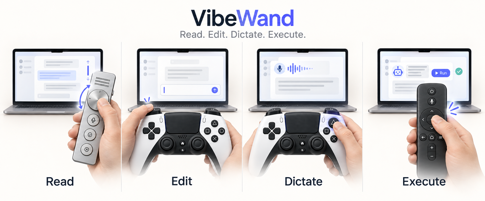
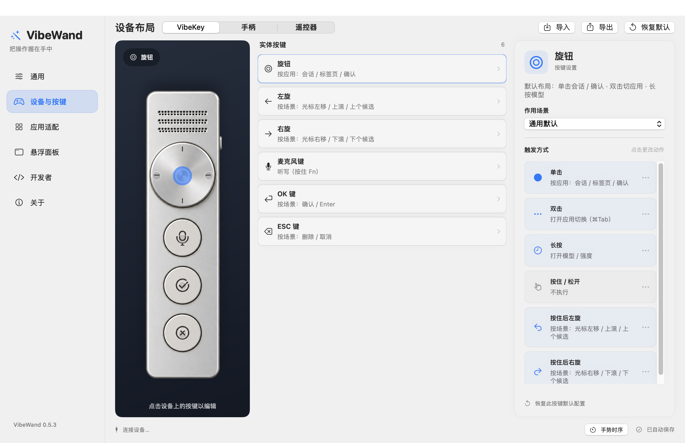
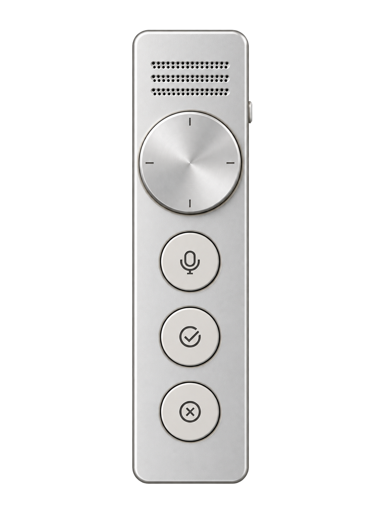
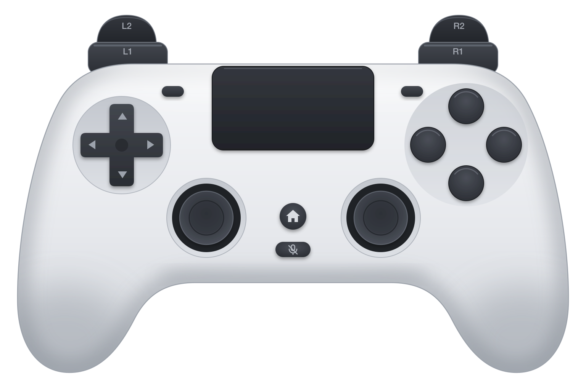
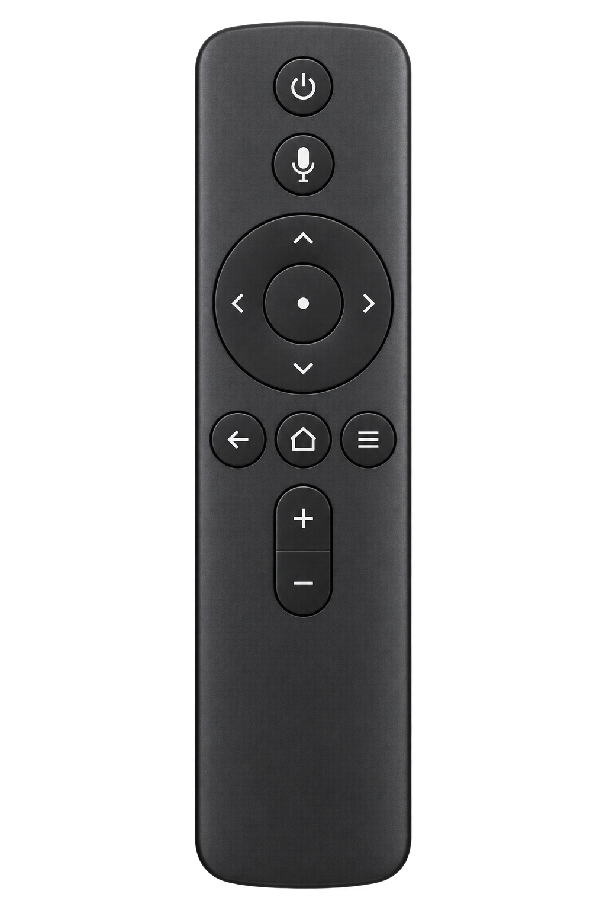

# VibeWand

**把阅读、编辑和听写，握在手中。**

一款原生 macOS 工具，也是让你**不用鼠标和键盘进行 Vibe Coding** 的好助手。内置适配 **Codex 和 DeepSeek Harness**，用旋钮、手柄或遥控器完成受支持工作流中的阅读、听写、编辑与确认。同一套控件还能跨程序切换、浏览网页、切换标签页，并在**微信和飞书**中聊天，继续使用你熟悉的输入法。

[English](README.md) · [快速开始](docs/getting-started.md) · [文档目录](docs/README.md) · [项目主页](https://vibewand.xuhao1.me)



## 为什么用 VibeWand

- **操作跟随场景。** 阅读时滚屏，有字的草稿中移动光标，已识别的选择器中切换候选，无需换一套按键。
- **按住就说。** 按住麦克风键或 △，说完松开；选择外置输入法、macOS 系统听写，或自己的语音 API。
- **边说边写，也能自动整理。** 内置听写实时预览文字，可选择原词或整理后的输出；只更新本次听写范围，不自动发送消息。
- **切换更顺手。** 打开会话、切换浏览器标签，或选择另一个 macOS 应用。
- **按自己的习惯配置。** 在设备图上点击控件，修改其触发动作；每种硬件模板独立保存。
- **原生、本地运行。** 完整设备面板或紧凑语音条、中英文界面、本地配置，无需 VibeWand 云账号或 API Key。



*来自 0.5.3 的已实现设置界面；当前默认映射见[默认操作指南](docs/core-experience.md)。*

## 硬件支持

| 默认支持类型 | 接入方式 | 默认体验 | 典型支持设备 |
| --- | --- | --- | --- |
| **VibeKey**<br> | 内置接收器后端 | 转动导航、按住听写，OK / ESC 确认与返回。 | Ulanzi VibeKey（AU05） |
| **Controller（手柄）**<br> | macOS GameController，USB 或蓝牙接入 | 按场景导航、确认 / 返回 / 删除、按住听写，以及触摸板光标操作。 | Sony DualSense（PS5 手柄） |
| **Remote Controller（遥控器）**<br> | 对应设备的 HID 配置 | 方向环导航、中央键确认，语音 / 返回 / 菜单键完成常用操作。 | 小米蓝牙遥控器 2 Pro |

连接设置、各型号能力与实测范围见[硬件指南](docs/device-templates.md)。

**VibeWand 是独立项目，与 Ulanzi、Sony、小米及其他设备提供商没有任何隶属、合作、赞助、背书或其他关系。产品名称与商标归各自所有者。**

## 少量控件，串起日常操作

阅读回复 → 按住听写草稿 → 松开后编辑 → 准备好再确认。导航在阅读时滚屏，在已识别的非空草稿中移动光标，在选择器中切换候选。双击 VibeKey 旋钮或手柄 ×，即可打开 macOS 应用切换。

内置适配覆盖 **Codex、DeepSeek Harness、浏览器、微信与飞书**。具体行为随应用控件和快捷键而变化；Return 是否发送消息由目标应用决定。其他应用可通过快捷键预设添加，详见[应用适配](docs/applications.md)。

## 下载与安装

**[下载 VibeWand macOS 版 — Apple Silicon](https://github.com/xuhao1/VibeWand/releases/download/v0.6.0/VibeWand-0.6.0-macOS-arm64.zip)** · [版本说明](https://github.com/xuhao1/VibeWand/releases/latest)

要求 **macOS 13+**、**Apple Silicon Mac（M 系列）**。下载 ZIP，在 Finder 中解压，将 **VibeWand.app** 拖入「应用程序」，再双击打开，无需安装开发工具。

在「系统设置 → 隐私与安全性 → 辅助功能」允许 VibeWand，再到「设置 → 设备与按键」选择硬件。AU05 使用前先退出 Ulanzi Studio。没有设备时，可在「设置 → 开发者 → 演示模式」体验。

本版本使用临时签名，尚未通过 Apple 公证；首次打开说明见[快速开始](docs/getting-started.md)。

### 从源码编译

如需自行编译，请安装 **Xcode 26+** 与 **Homebrew Opus**，并使用 Apple Silicon Mac，下载源码，在项目目录执行：

```sh
bash scripts/build-app.sh
```

之后在 Finder 中打开 `dist/VibeWand.app`。工具链与签名说明见[编译指南](docs/development.md)。

## 使用文档

[默认操作](docs/core-experience.md) · [设置与改键](docs/settings.md) · [语音输入](docs/voice-input.md) · [应用适配](docs/applications.md) · [问题排查](docs/troubleshooting.md) · [开发指南](docs/development.md)

[文档目录](docs/README.md)统一收录中英文指南、硬件参考及工程记录。贡献代码或报告问题前，请阅读[贡献说明](CONTRIBUTING.md)。

## 隐私与许可

设备输入和配置在本机处理。外置模式只发送 Fn；内置模式主动录制麦克风，音频暂存在内存中。系统听写支持时优先在本机识别，其他语言可能使用 Apple 在线服务；API 模式在录音中上传音频到用户配置的服务。密钥独立保存在 macOS 钥匙串，配置导出不包含密钥。听写文字只插入原输入框，不自动发送。见[语音输入](docs/voice-input.md)。

源码采用 [PolyForm Noncommercial 1.0.0 非商用许可证](LICENSE)。**允许按条款进行个人非商用使用、修改和分发；商用必须联系[作者徐浩](https://github.com/xuhao1)，并在使用前取得单独商业许可。** 可提交[商业授权咨询](https://github.com/xuhao1/VibeWand/issues/new?title=Commercial%20licensing%20inquiry)。

因限制商业用途，本项目属于源码公开，不属于 OSI 定义的开源许可。第三方组件保留原有许可证，见[致谢与第三方记录](third-party/README.md)。

作者：**Dr. Xu**。[个人主页](http://xuhao1.me) · [GitHub](https://github.com/xuhao1)
