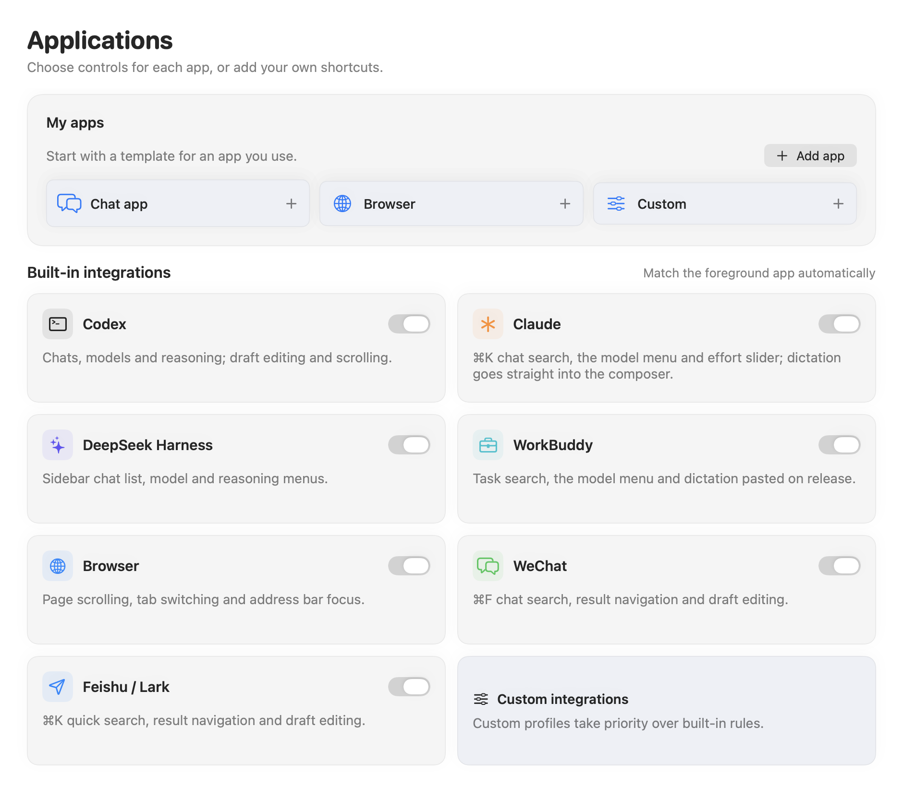

# Application support

[简体中文](applications.md) · [Documentation](README.md)

Settings → Applications lets you enable or disable each adapter, with settings saved locally. Unsupported or disabled apps receive no business-action keystrokes. App actions apply to the foreground target. Delayed actions do not continue in an unrelated app or window after focus changes. Recognized input-method candidates and unknown dialogs take precedence and receive native confirm / cancel behavior.

## Codex

Chats open through the `⌘K` command palette: turn to choose, confirm to open.

The model button (the one labelled with the current model) is pressed through accessibility rather than a shortcut. Current Codex builds put effort and model in one popover: the first "model / effort" press opens the effort slider, which turning adjusts; pressing again inside the popover opens the model list, and confirming a model returns to effort. `⌃⇧M` is only the fallback when no button is found.

An empty composer's placeholder is not a draft, so turning still scrolls while the empty composer has focus.

## Claude

Claude desktop (`com.anthropic.claudefordesktop`). Chats open through the `⌘K` search palette. The model action presses the "Model: …" button beside the composer and turning moves through the menu; confirming a model continues to the "Effort" slider, which you can simply back out of. Dictation is pasted into the composer on release.

Exercised on a real machine: dictation, opening / moving / cancelling the chat palette, opening / moving / confirming in the model menu, and recognition of the effort popover.

## DeepSeek Harness

Harness is an Electron app and does not publish its web content to accessibility clients by default. VibeWand asks it to (`AXManualAccessibility`) the first time it sees the app; only then can the composer and buttons be recognised.

Its `⌘K` is a name filter for the sidebar, and arrow keys do not pick rows there, so chats are chosen from the sidebar's chat list itself: press once to enter, turning parks the pointer on each row, confirm opens it and back leaves everything untouched. It ends by itself after 20 idle seconds. Workspace rows are in the list too; confirming one expands or collapses it.

The model action presses the "Select model, current …" button. The menu has two levels: confirm the "Model" row, then choose in the submenu.

Exercised on a real machine with `0.2.0-rc.2`: dictation, switching chats and back, and entering / cancelling the two-level model menu.

## WorkBuddy

WorkBuddy desktop (`com.tencent.workbuddy.mac`) has a built-in integration from 0.8.0. Settings → Applications can disable it independently.

This is a hidden-window rendering of the implemented 0.8.0 settings page, not a capture of live WorkBuddy operation.

The chat action first presses the sidebar's Search button. In 5.6.2, both this button and the default `⌘K` open Global search. Enter a query, choose the Tasks category if needed, turn to select a result, confirm to open, and back to cancel. With no recent searches, a query is needed first. If the sidebar is hidden or its button is unavailable, the action falls back to `⌘K`; expand the sidebar if the composer intercepts it. A custom integration can override a changed shortcut.

The model action presses the composer's button labelled `Select model`. Turn to choose a model, confirm to apply, and back to close the menu. Disabled models, the Max switch and settings actions are excluded from model candidates. Thinking toggles and finer reasoning settings remain in WorkBuddy's own model-detail menus.

Dictation is pasted once into the current composer on release, then the clipboard is restored; it does not send a message. Turning moves the caret and ESC deletes when a draft has text; an empty draft scrolls. On first contact, VibeWand asks Electron to publish its accessibility content.

0.8.1 passed live acceptance on the installed WorkBuddy **5.6.2** using native accessibility and key events. Checks read back search-result selection, confirmed task opening and return to Home, changed and restored the model, pasted text, moved the caret and deleted. The full dictation-delivery pipeline was exercised with transcript replay: it appended to an existing test draft, waited until completion to paste, and restored the clipboard. See the [acceptance record](workbuddy-acceptance.md).

The run fixed an unrecognised `AXComboBox` model trigger and an empty composer whose placeholder, including extra inline spacing, was exposed as draft text. Audio recognition and physical-device input were not retested in this adapter acceptance run.

## Claude Code, Codex and OpenCode in a terminal

Built for iTerm2 (`com.googlecode.iterm2`); it can be turned off under Settings → Applications. A terminal draws its interface as text, so VibeWand cannot see whether a list is open. Nothing is recognised here; fixed keys are sent instead:

| Action | What is sent | Afterwards |
| --- | --- | --- |
| Chats (press the dial) | Clear the current input line (`⌃U`), type `/resume`, Return | Turning sends ↑ / ↓, confirm sends Return, back sends Esc |
| Models (long-press the dial) | Clear the current input line, type `/model`, Return | Same |
| Turn (otherwise) | Scroll wheel | Claude Code and OpenCode scroll their own transcript; Codex scrolls the terminal's scrollback |
| ESC | Escape | Hold to keep sending Backspace |
| OK | Return | — |
| Dictation | Pasted at the prompt on release | Nothing is sent for you |

Both commands work in all three tools: OpenCode completes `/resume` to `/sessions` and `/model` to `/models`. The command is pasted, so an active Chinese input method cannot swallow it, and your clipboard is put back afterwards.

Things to know:

- Opening a list first clears whatever is on the current input line, so a draft is never submitted together with the command. A multi-line draft is not fully cleared (Claude Code clears only its last line), so deal with those yourself first.
- A list counts as open until you confirm, go back, or leave it alone for 20 seconds. For 4 seconds after choosing a model you can keep turning, which covers the effort list Codex shows next.
- The draft at the prompt cannot be read, so turning always scrolls and never moves a caret.
- In Claude Code's model list Return means "set as default"; "this session only" is `s` on the keyboard.
- Pressing the dial at a plain shell prompt only produces a "no such file: /resume" error.

Commands and keys were checked in a background terminal against Claude Code 2.1.234, Codex CLI 0.156.1 and OpenCode 1.2.5: opening the chat and model lists, moving up and down, cancelling, clearing the line with `⌃U`, pasting and Backspace. The full path through iTerm2 3.7.3 and a physical device has not been exercised yet.

## Browsers

The browser allowlist includes Safari, Chrome, Edge, Brave, Firefox, Opera, and Vivaldi. Default rotation scrolls the page. Pressing the dial sends `⌃Tab` for the next tab; the model-entry action maps to `⌘L` for the address bar.

A focused webpage input does not automatically turn default rotation into caret movement. Explicit caret actions remain configurable. Double-press still opens global application switching.

## WeChat and Feishu

These apps share reading, editing, search, confirm, and cancel behavior through keyboard mappings: `⌘F` for WeChat and `⌘K` for Feishu. A nonempty draft supports caret movement and deletion; reading / empty drafts scroll. Candidates and dialogs take priority. OK sends Return, whose send/newline meaning follows the application's own preference.

Feishu’s `⌘K` search dialog was checked on the local client. WeChat 4.1.15 did not expose readable chat controls to Accessibility, so `⌘F` remains a compatibility mapping and search-candidate / draft automation is unverified. Destructive editing is allowed only after observing an editable input.

This integration does not use Feishu cloud APIs, organization profiles, contact lists, or account credentials.

## Add a custom application

In Applications, add an app and choose its local `.app` bundle to read its name and full bundle ID, or enter them manually. Rules match that exact bundle ID; another app with the same display name does not match. Start with Chat app, Browser, or Custom, then assign a key and ⌘ / ⌥ / ⌃ / ⇧ modifiers to each operation. Rules can be edited, enabled / disabled, or removed and are saved locally.

| Preset | Primary: chats / tabs | Secondary: search / address bar | Context behavior |
| --- | --- | --- | --- |
| Chat app | `⌘K` | `⌘K` | Reading, draft editing, and observed search-candidate behavior |
| Browser | `⌃Tab` | `⌘L` | Default navigation scrolls even while a webpage input has focus |
| Custom | Unassigned | Unassigned | Uses configured shortcuts without assuming chat or model pickers |

All three presets provide Return confirmation, Escape cancellation, up / down candidates, left / right caret movement, and Backspace deletion; each shortcut is editable. Empty scroll bindings use native scrolling, or you can specify an app's own scroll shortcuts. Input-method candidates and unknown dialogs retain native Return / Escape, so a chat-send binding does not replace native confirmation.

A custom rule takes precedence over a built-in adapter for the same bundle ID. Disabling that rule disables adaptation for that app; removing it restores the built-in rule. Presets are editable starting points: the target app must support the chosen shortcuts. Sending a key is not evidence of an observed picker or universal compatibility with all chat apps and browsers.
