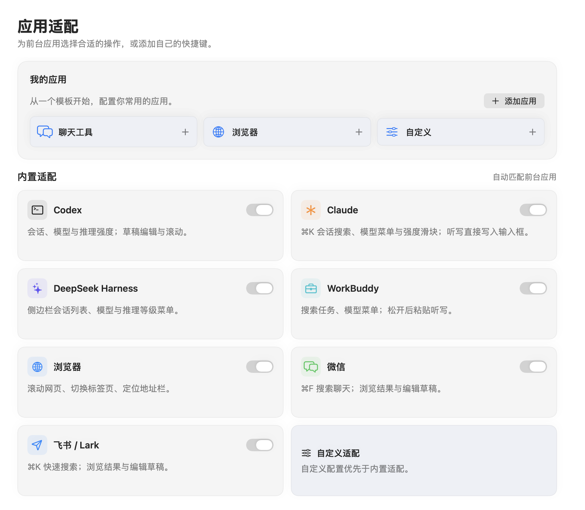
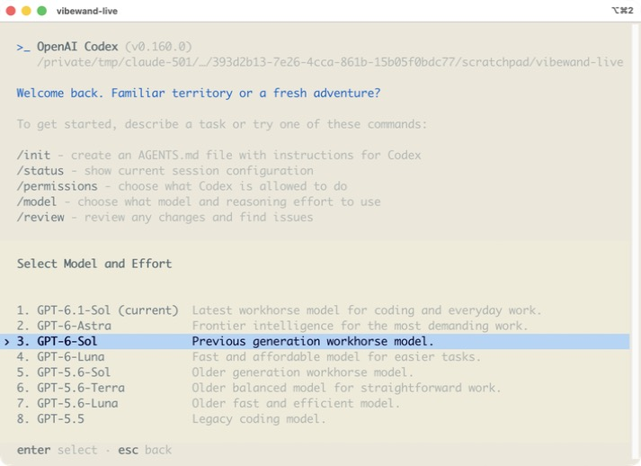

# 应用适配

[English](applications.en.md) · [文档目录](README.md)

在「应用适配」中可分别启用或关闭适配，设置保存在本机；未适配或禁用的应用不会收到业务按键。应用操作针对当前前台应用执行；切换前台或窗口后，不继续发送原上下文中延迟的操作。未知弹窗与已识别输入法候选优先得到原生确认 / 取消，避免把旋转错误解释为编辑动作。

## Codex

会话入口是 `⌘K` 命令面板，转动选择、确认打开。

模型按钮（标着当前模型的那个）直接通过辅助功能按下，不依赖快捷键。当前版本的 Codex 把强度和模型放在同一个弹层里：第一次按“模型 / 强度”打开强度滑块，转动调节；在弹层里再按一次进入模型列表，转动选择、确认后回到强度。找不到按钮时才退回 `⌃⇧M`。

空输入框的占位文字不算草稿，所以聚焦在空输入框时转动仍然是滚屏。

## Claude

Claude 桌面版（`com.anthropic.claudefordesktop`）。会话入口是 `⌘K` 搜索面板。模型入口按下输入框旁的“Model: …”按钮，菜单里转动选择；确认模型后会接着打开“Effort”强度滑块，不想改就返回。听写在松开后粘贴进输入框。

已在本机实测：听写写入、会话面板的打开 / 移动 / 取消、模型菜单的打开 / 移动 / 确认、强度弹层的识别。

## DeepSeek Harness

Harness 是 Electron 应用，默认不向辅助功能公开网页内容；VibeWand 第一次遇到它时会请求公开（`AXManualAccessibility`），之后才能识别输入框和按钮。

它的 `⌘K` 只是侧边栏的名称过滤框，方向键选不了条目，所以会话改为直接在侧边栏的“会话”列表里选：按一下进入，转动时指针停到对应的行上，确认即打开，返回则什么都不动。20 秒不操作自动退出。列表里也包含工作区行，确认它会展开或收起。

模型入口按下“选择模型，当前…”按钮，菜单是两级的：先确认“模型”这一行，再在子菜单里选。

已在本机 `0.2.0-rc.2` 实测：听写写入、会话切换并切回、两级模型菜单的进入与取消。

## WorkBuddy

WorkBuddy 桌面版（`com.tencent.workbuddy.mac`）从 0.8.0 起提供内置适配，可在「设置 → 应用适配」单独关闭。

图为 0.8.0 已实现设置页面的隐藏窗口渲染，不是 WorkBuddy 实机操作截图。

会话动作优先按下侧边栏的「搜索」按钮；5.6.2 的这个按钮和默认 `⌘K` 都打开「全局搜索」。输入关键词，可选择「任务」分类，再转动选择结果、确认打开，返回取消。首次没有最近搜索记录时需要先输入关键词。侧边栏收起或按钮暂不可读时回退到 `⌘K`；如果输入框拦截快捷键，请展开侧边栏后再试。改过快捷键可添加自定义适配覆盖。

模型动作直接按下输入框旁标为 `Select model` 的按钮，转动选择模型，确认应用，返回关闭菜单。菜单中灰色禁用模型、Max 开关及设置入口不会作为模型候选。思考开关与更细的推理设置仍在 WorkBuddy 自己的模型详情菜单中操作。

听写在松开后一次粘贴到当前输入框，随后恢复剪贴板，不自动发送。草稿有字时转动移动光标、ESC 删除；草稿为空时滚动。第一次接入会请求 Electron 公开辅助功能内容。

0.8.1 已在本机 WorkBuddy **5.6.2** 通过原生辅助功能和按键程序完成实机验收：查询后读取结果的选中状态，确认打开任务并回到首页；选择另一模型、回读变化并恢复；粘贴文字、移动光标、删除；完整听写写入链路用转录回放验证追加到已有测试草稿、结束前不粘贴、剪贴板恢复。详见[验收记录](workbuddy-acceptance.md)。

实测修复了模型入口公开为 `AXComboBox` 时找不到控件，以及空输入框将带额外空格的占位提示公开为正文而被误判成草稿的问题。音频识别和物理设备输入没有在本次适配验收中重新测试。

## 终端里的 Claude Code、Codex、OpenCode

以 iTerm2（`com.googlecode.iterm2`）为准，可在「设置 → 应用适配」单独关闭。终端把整个界面画成文字，没有输入框控件可读，所以 VibeWand 读光标附近的几行，判断三件事：光标是不是停在认识的提示符上，提示符里有没有草稿，提示符是不是被一个列表盖住了。认识的提示符是 Codex 的 `›`、Claude Code 的 `❯`（都在行首）和 OpenCode 输入框左边的 `┃`。

| 屏幕上是 | 转动 | ESC | 旋钮单击 / 长按 | OK |
| --- | --- | --- | --- | --- |
| 空的提示符 | 滚屏 | Escape；工具正在工作时就是中断 | 输入 `/resume` / `/model` 并回车 | 回车 |
| 有草稿的提示符 | 左右移动光标 | 删除光标前一个字符，按住连续删除 | 不动草稿，提示先发送或清空 | 回车，也就是发送 |
| VibeWand 打开的列表 | ↑ / ↓ | Esc，返回或取消 | 回车确认 | 回车 |
| 别的画面：shell、键盘打开的列表、授权询问 | 滚屏 | Escape，按住连续退格 | 什么都不输入 | 回车 |

听写在松开后粘贴到提示符，不自动发送。手柄模板里 □ 删除、○ 确认、× 是 Escape，同样按上表的状态走。

上图是 0.8.4 验收时的实际窗口截图：长按旋钮输入 `/model` 后转动两格，Codex 的模型列表停在第三行。

需要知道的几点：

- **命令怎么输入。** 只在空提示符下输入。命令用粘贴送入，中文输入法开着也不会吞掉字母，剪贴板随后恢复；等提示符这一行只剩这条命令才回车。行里还有别的文字就不回车，命令留在原处，不会连同草稿一起发出去。0.8.3 及之前用 `⌃U` 清空输入行的做法已经去掉，草稿不会再被清掉。
- **列表什么时候算开着。** VibeWand 输入了命令，而且屏幕上确实出现了列表：提示符不见了，画面里有 Esc 的按键提示。提示符一回来就结束，不再靠计时猜。Codex 选完模型接着出现的强度列表、在强度列表按 Esc 回到的模型列表都会跟上。20 秒不操作也会结束，这时按一下 ESC 再重新打开。
- **什么算草稿。** 光标前有字，或者草稿折成、写成了多行。把光标一路移到最前面，它仍然是草稿：VibeWand 记住的是这段文字的指纹，不是文字本身。
- **滚屏。** Codex、OpenCode 和全屏渲染的 Claude Code 接管了鼠标滚轮，滚动的是它们自己的对话；经典渲染的 Claude Code 滚动的是 iTerm2 的回滚区。提示符里有草稿时转动改成移动光标，和其他应用一样。
- **工具正在工作时。** Codex 和 Claude Code 工作时在窗口标题里转圈，Codex 每秒大约十次。0.8.3 及之前把标题当成“目标有没有变”的一部分，于是工具一工作，ESC、删除、OK 全部被当成目标已变而丢弃。终端的标题现在不参与这个判断。
- **读了什么。** 只读光标上方最多 12 行到屏幕末尾的文字，不读回滚区；在内存里归约成上面的状态后就丢弃，不保存、不写日志、不导出。

各工具自己的行为：

- Claude Code 的模型列表里回车是“设为默认”，“仅本次会话”按键盘 `s`，强度用键盘 `←` / `→`。它的全屏渲染会在命令后面显示参数提示（`/model [model]`），VibeWand 认得这种提示。
- Codex 的强度列表里回车同样是设为默认。任务进行中它不接受 `/resume` 和 `/model`，命令会被它自己拒绝，VibeWand 不会当作列表已打开。
- OpenCode 把 `/resume` 补全成 `/sessions`、把 `/model` 补全成 `/models`。它会把超过 150 个字符或 3 行的粘贴折叠成 `[Pasted ~1 lines]`，长一点的听写在输入框里就看不到原文；想看到原文，在 `opencode.json` 里加 `"experimental": { "disable_paste_summary": true }`。

已知边界：

- tmux 分屏时，右侧窗格里的提示符不在行首，不识别。
- Codex 的 `!` shell 模式、Claude Code 的 `!` 和 `#` 模式换了行首符号，不算提示符：ESC 是 Escape，按住才退格。
- 光标停在草稿最前面、而 VibeWand 之前没见过这段草稿时，它看起来和占位提示一样；这时按旋钮会输入命令，但因为行里还有别的字不会回车。
- 键盘打开的列表和授权询问不接管转动；OK 确认当前选项，ESC 拒绝或取消。
- 没有适配的命令行工具只有滚屏、Escape、回车和听写粘贴。Terminal.app 等其他终端没有适配。

0.8.4 已在本机 iTerm2 **3.7.3** 里对 Codex CLI **0.160.0**、Claude Code **2.1.289**（经典与全屏两种渲染）、OpenCode **1.18.34** 完成实机验收：听写粘贴、单击与按住删除、移动光标、有草稿时拒绝打开列表、会话与模型列表的打开 / 移动 / 取消，以及 Codex 工作中的删除与 Escape 中断。按键由生产运行时发出，每一步读回终端文字核对；实体设备的按键没有在这次验收里按过。详见[验收记录](terminal-acceptance.md)。

## 浏览器

浏览器适配名单包括 Safari、Chrome、Edge、Brave、Firefox、Opera、Vivaldi。默认旋转滚动网页，旋钮单击发送 `⌃Tab` 切到下一标签页；模型入口动作在浏览器中改为 `⌘L` 聚焦地址栏。浏览器不会仅因网页输入框有焦点就把旋转自动改成移动光标；需要编辑光标时可配置显式光标动作。双击仍可进入全局应用切换。

## 微信与飞书

复用阅读、编辑、搜索 / 会话入口、确认与取消逻辑，微信使用 `⌘F`，飞书使用 `⌘K` 打开搜索 / 切换入口。草稿有字时移动光标与删除，空草稿时滚动；候选与弹窗优先处理。OK 对应 Return，消息发送还是换行由应用现有设置决定。

飞书的 `⌘K` 搜索界面已在本机核对。微信 4.1.15 未向辅助功能暴露可读的聊天控件，因此 `⌘F` 仍是兼容映射，搜索候选与草稿编辑尚未实机验证；只有识别到可编辑输入框后才允许删除等编辑动作。

这里不使用飞书开放平台、企业身份、聊天 API 或账号凭证，不读取云端通讯录，也不配置组织 Profile。

## 添加自定义应用

在「应用适配」添加应用，选择本机 `.app` 自动取得名称和完整 bundle ID，或手动填写。规则按完整 bundle ID 精确匹配；相同名称的其他应用不会自动命中。可选择聊天工具、浏览器或自定义预设，再为各项操作设置一个按键及 ⌘ / ⌥ / ⌃ / ⇧ 修饰键。规则支持编辑、启用 / 禁用与删除，保存于本机。

| 预设 | 主操作（会话 / 标签页） | 辅助操作（搜索 / 地址栏） | 场景行为 |
| --- | --- | --- | --- |
| 聊天工具 | `⌘K` | `⌘K` | 复用阅读、草稿编辑与搜索候选识别 |
| 浏览器 | `⌃Tab` | `⌘L` | 默认始终滚屏，不因网页输入框有焦点改成光标移动 |
| 自定义 | 不执行 | 不执行 | 使用明确配置的键盘动作，不推定聊天或模型选择器 |

三种预设都提供 Return 确认、Escape 返回、上下候选、左右光标与 Backspace 删除；这些快捷键均可更改。滚屏快捷键为空时使用原生滚动，也可指定应用自己的上下滚动快捷键。输入法候选和未知弹窗仍使用原生 Return / Escape，避免聊天发送映射干扰原生确认。

同一 bundle ID 的自定义规则优先于内置适配；禁用该自定义规则会禁用这个应用的适配，删除后才回到内置规则。预设只是可编辑的起点，目标应用必须实际支持所选快捷键；发送了按键不代表已经识别出选择器，也不代表所有聊天工具或浏览器已经通过实机验收。
