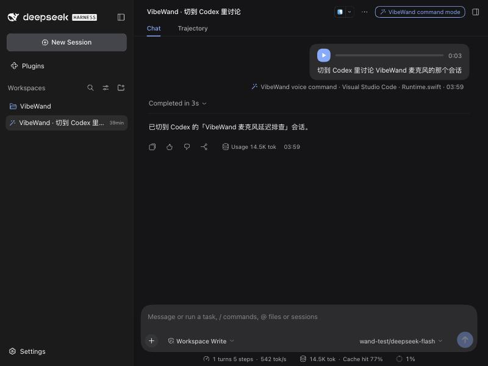

# 命令模式

[English](command-mode.en.md) · [Computer use](computer-use.md) · [文档目录](README.md)

按住命令键说一句话，松开后 VibeWand 替你找到应用、会话或控件。它负责找到、打开、按下、把字放好；真正的工作仍由你选的软件完成。

**随 0.9.0 发布，需要 macOS 26。**0.10.0 新增：两种内核共用一个协调器、插件模式下可选 Harness 的全部工具、让模型看窗口截图、对话保留到一天、一周或一直保留、在弹出的菜单里选和调（例如换 Codex 的模型和强度）、[首次引导](getting-started.md#首次引导)。0.10.1 新增：[看着截图操作不提供控件的窗口](#让模型看窗口截图并点击)，例如网易云音乐。0.11.0 新增：[听与说](#听与说)，把结果说出来，由语音服务的 Omni 模型一个包办或多个模型组合，声音可选可换；说出来的命令[留着录音](#agent-记录)，在 [Harness 里显示成语音消息](#插件模式)。

## 配置模型

命令模式默认开启，但在你配好模型之前什么都不做：命令键不起作用，设备上的按键保持原样，也没有任何内容离开这台 Mac。0.11.0 起，「语音输入」用“阿里 Qwen 实时语音”并保存了密钥也算配好了模型：命令默认交给它的 Omni 模型，见[听与说](#听与说)。

「设置 → 命令模式 → 模型」最上面选内核。两种内核跑的是同一个协调器，用法相同：**内置**是 VibeWand 替你装好的那一份 DeepSeek Harness，模型在这一页配，见本节；**插件模式**用你自己安装的 DeepSeek Harness，模型、密钥和登录都是它的，对话也存在它那里，见[插件模式](#插件模式)。第一次打开 VibeWand 时，[引导](getting-started.md)会带你选。

内置内核的配置：

1. **选服务。**内置了 DeepSeek、OpenAI、Anthropic、OpenRouter、Google Gemini、阿里云百炼、Moonshot、智谱、火山方舟、硅基流动，以及本机的 Ollama、LM Studio、oMLX。别的服务选“自定义地址”，填地址并选接口：OpenAI Chat Completions、OpenAI Responses 或 Anthropic Messages。
2. **保存这个地址的 API Key。**它存在这台 Mac 的钥匙串里，按地址保存，换了地址不会带过去；只在启动命令内核时交给它。费用由你在该服务的账户承担。本机服务和自定义地址可以不填。
3. **选模型。**点“获取模型列表”，从服务返回的列表里挑；服务不提供列表时直接填模型 ID。
4. 点“保存并测试”。内核会用这套配置让模型回一个字，告诉你用了多久；失败时显示服务的原话，例如密钥无效或模型名不对。

可以调的还有：

| 项目 | 说明 |
| --- | --- |
| 思考强度 | 模型默认、关闭、低、中、高。“模型默认”不发送任何参数。命令通常很短，关闭或调低一般更快 |
| 上下文长度 | 模型能容纳的 token 数。从列表选模型时，服务给了就自动填上；留空由内核按 262144 计算。本机模型请按实际填写 |
| 附加参数（JSON） | 原样并入内核里这个服务的配置，覆盖上面生成的同名项。例如让本机 Qwen 关闭思考：`{"compat": {"thinkingFormat": "qwen-chat-template"}}` |
| 给模型的备注 | 每次对话开头都会告诉模型的话：常用的叫法、偏好的应用、项目的别名。它补充规则，不能改变规则 |

内置的服务里，只有 DeepSeek 用真实密钥跑通过（OpenAI 兼容和 Anthropic 兼容两种接口各一次）；其余只核对过地址存在。不支持用 OAuth 登录账号，只支持 API Key。

命令的语音走内置识别：系统听写，或「语音输入」里配置的语音 API。它与你听写用不用外置输入法无关，并且按原词转写，不做自动整理。

## 插件模式

把内核换成你自己安装的 DeepSeek Harness：同一个协调器，作为它的一个插件运行。这样做的用处是：

- **对话在 Harness 里看。**每段对话保存在 Harness 自己的会话库里，标题是“VibeWand · ”加第一条命令的原话，不属于任何项目，在桌面版或网页版侧栏的“未分组”下。点开能看到完整的上下文：系统提示词、每一轮、每次工具调用和它返回的内容、用量和上下文占用；打开了[看窗口截图](#让模型看窗口截图并点击)时，模型看过的图也在里面。
- **模型在 Harness 里配。**模型服务、API Key 和账号登录（包括 OAuth）都用 Harness 的，VibeWand 这边不用再存密钥。默认用 Harness 设定的默认模型；点“测试并列出模型”后，可以从 Harness 里的全部模型中另选一个。
- **可以把 Harness 自己的工具也交给模型，**见[模型能用什么](#模型能用什么)。

打开方式：「设置 → 命令模式 → 模型 → 内核」选“插件模式”。需要已安装 DeepSeek Harness 桌面版，或终端里的 `dsh` 命令（Homebrew 或 `~/.local/bin`）。

**怎么看到对话。**设置页的“在浏览器里查看对话”会新启动一份 Harness 网页版并打开它，列表一定是最新的。已经开着的 Harness 不会发现别的程序写入的新对话：桌面版要退出后重新打开，网页版要刷新页面；新对话在点开之前显示为“未命名”，点开后才出现标题。

**在 Harness 里显示成语音消息（0.11.0）。**设置页的“在 Harness 里把命令显示成语音消息”打开后，VibeWand 用 Harness 自己的插件命令（`dsh plugin --profile … add`）把一个界面插件 `vibewand-view` 加进它的桌面版和网页版。之后在 Harness 里：

- 命令模式开始的对话，在侧栏里带一个魔杖标记，顶栏写着“VibeWand 命令模式”；
- 你说的每条命令是一条语音消息：一个播放键、进度和时长，下面是识别出的文字，再下面一行是当时所在的应用和窗口；没有录音的命令（系统听写，或关了“保留语音命令的录音”）只显示文字；
- 别的对话、别的消息一律不变：这个插件只认以“VibeWand ·”开头的消息，其余原样交还给 Harness 自己的界面。

实际截图：测试用的 Harness 网页版（英文界面）里，一条 VibeWand 语音命令。对话和录音是测试生成的，录音是一段合成的单音。

录音不进 Harness 的会话库，也不发给模型：消息里只有一行“Spoken, 7 s. Recording 记录名”，播放时由插件的宿主那一半从 VibeWand 的记录目录读出 `voice.wav`。所以录音被清理后（14 天），语音消息还在，播放键会写明录音已不在。桌面版的配置只能在它完全退出时改，Harness 自己会拒绝并说明；切换后重新打开桌面版。插件列在 Harness 的“插件”页里，在那里或在 VibeWand 里都能去掉。内置内核没有自己的界面，语音消息在 VibeWand 的 [Agent 记录](#agent-记录)里播放。

**在 Harness 里点开过的对话会被它接手。**之后 VibeWand 接不上这一段，下一条命令自动开始新对话。只想看、还想接着说的话，等这段对话说完再去看。

**兼容性。**DeepSeek Harness 仍在预览期，接口变动频繁，所以插件明确声明了它验证过的版本，Harness 自己会拒绝在其他版本上加载它：

| VibeWand | 插件 | 已验证的 DeepSeek Harness |
| --- | --- | --- |
| 0.9.0 | `vibewand-coordinator` 0.9.0 | 0.2.0-rc.2（桌面版自带的运行时） |
| 0.10.0 | `vibewand-coordinator` 0.10.0；全部工具时另加 `vibewand-overlay` 0.10.0 | 0.2.0-rc.2 |
| 0.10.1 | `vibewand-coordinator` 0.10.1；全部工具时另加 `vibewand-overlay` 0.10.1 | 0.2.0-rc.2 |
| 0.10.2 | `vibewand-coordinator` 0.10.2；全部工具时另加 `vibewand-overlay` 0.10.2。内容与 0.10.1 的相同，只有版本号变了 | 0.2.0-rc.2 |
| 0.11.0 | `vibewand-coordinator` 0.11.0；全部工具时另加 `vibewand-overlay` 0.11.0；打开了“显示成语音消息”时，Harness 的桌面版和网页版里另有 `vibewand-view` 0.11.0 | 0.2.0-rc.2 |

设置页会显示检测到的版本和“已验证 / 未验证”。版本不在表里时，命令不会运行，并告诉你原因；可以打开“仍然在这个未验证的版本上尝试”，VibeWand 会按 Harness 的规矩为“这个插件版本 + 这个 Harness 版本”登记一条例外。它可能出错，出错时改回内置内核。Harness 桌面版会自动更新，更新后遇到这种情况是预期之内的。内置的那一份固定在 0.2.0-rc.2，不受影响。

**它在 Harness 里做了什么。**只写一处：`~/.dsh/profiles/vibewand/`，里面是指向插件的配置，每次启动内核时重写。模型服务那几行（`llm-pi-ai`、`llm-deepseek`、`llm-deepseek-account`）是从你的桌面版配置（没有时用网页版的）里原样抄过来的，所以你在 Harness 里改了模型，下一段对话就生效；你的界面设置和你自己插入的插件不会被带过来。对话写进 Harness 的会话库，这正是这个模式的目的。VibeWand 不改动 Harness 的密钥文件、其他配置和已有的会话；运行中的 Harness 进程照常维护它自己的数据，例如刷新登录令牌、更新会话索引。

**不变的。**权限档位、悬浮窗、Agent 记录、对话保留时长和上限都照常。思考强度只在所选模型提供那一档时生效。上下文长度、附加参数和上面“配置模型”里的其余各项只对内置内核有效。

**要知道的。**每次“测试”会在 Harness 里留下一段很短的对话。“清除全部记录”只清 VibeWand 自己的记录，Harness 里的对话请在 Harness 里删除。

## 模型能用什么

「设置 → 命令模式 → 模型能用什么」有两项。

### 工具

| 选项 | 模型能做的 |
| --- | --- |
| 仅 VibeWand 的工具（默认） | 找应用和会话，读取和操作前台窗口的控件。没有命令行，不读写文件，不上网 |
| 加上 Harness 的全部工具 | 另外还有 Harness 自带的命令行、文件读写、网页搜索、技能和子任务，相当于对着你的 Harness 说话 |

第二项只在插件模式下有：内置的那一份没有装这些工具。选了它以后：

- 模型的工作目录是 VibeWand 的一个临时目录（`~/Library/Application Support/VibeWand/harness/VibeWand`），不是你的任何项目；要动你的文件时它得用完整路径。
- 回答较长时，悬浮窗只显示最后一行，全文在 Harness 里看。
- 屏幕上的事仍然优先用 VibeWand 的工具；系统提示词仍是 VibeWand 的那一份，后面接上 Harness 工具的用法。
- Harness 的工具由 Harness 自己的沙箱管，档位跟着 VibeWand 的[权限](#权限)走；它要问你时，问题同样出现在悬浮窗上。

### 让模型看窗口截图并点击

默认关闭。打开后模型多两个工具：`ui_screenshot` 看一眼被操作的那个窗口的截图，`ui_click` 用指针点击图里的位置。0.10.0 里只有前一个，开关叫“让模型看窗口截图”；点击和下面说的认字是 0.10.1 加的，开关也随之改了名。

- **看。**截图上标着控件的编号，并附上在本机从图里认出的文字（中文和英文）：一行一个编号，带着它在图里的位置。它用来读窗口里显示的内容、分清长得一样的控件、核对只有眼睛看得出的结果。只拍被操作的那一个窗口，不拍整个屏幕和别的应用；发出去的图长边不超过 1600 像素。
- **点。**有些应用不向辅助功能提供控件，整个窗口是自己画的，网易云音乐就是这样：控件列表是空的，以前到这一步就做不下去。现在模型可以点击认出的某一行文字，或图上的一个位置（图标、封面这类没有字的东西），点完直接拿到点击之后的窗口截图。读得到控件的窗口，按的仍然是控件。
- **输入和翻页还是用键盘。**先点一下输入框再输入；要看列表后面的内容，点进去以后发 Page Down。读不到输入框时，输入的文字进没进去改为用看的：窗口里多出了这些字才算进去了。
- **点击同样受[权限](#权限)档位管。**那个位置上认出的文字，或辅助功能在那里报出的控件名，含删除、发送、提交这类字样时，每次都先问你；“每步确认”下每次点击都问。只点被操作的那个窗口：截图之后窗口动过，或那个位置被别的应用挡住，就不点。
- 需要 macOS 的“屏幕录制”权限，授权后要重新打开 VibeWand。字是在本机认的，不能看图的模型也可以靠它读窗口、点文字；认图标和画面要一个能看图的模型。内置内核按“能看图”把图交给你配的模型，模型不支持时这一步会失败，关掉这一项即可。
- 装好或更新以后，系统第一次认字要准备半分钟左右。开关开着时 VibeWand 一启动就先做这件事，不用等到第一条命令。
- 模型看过的图保存在这条命令的 Agent 记录里。插件模式下它也随对话存在 Harness 里：在这段对话的 Trajectory 视图里选中 `ui_screenshot` 那一步，Result 里就是那张图；Chat 视图里这一步显示的是图片的附件记录。

## 听与说

**0.11.0 新增。**「设置 → 命令模式 → 听与说」决定三件事：结果和问题要不要说出来，由哪些模型来听、做、说，用哪个声音。

### 把结果和问题说出来

默认开启。命令做完后的那一句、缺什么、要你确认或挑选的问题，除了显示在悬浮窗上也说给你听。再按命令键、按停止或回答了问题，立刻安静；开始听写时也是。“已停止”“用时过长”这类 VibeWand 自己的提示不读。

### 一个模型，或多个模型组合

**一个模型**（默认）：语音服务的 Omni 模型（`qwen3.8-omni-flash-realtime`）包办，它自己听你的录音，直接调用工具，再用自己的声音回答。「语音输入」的听写服务是“阿里 Qwen 实时语音”并保存了密钥时生效：配好了这个语音服务，就已经有了命令用的模型，不用另配。条件不满足时按“多个模型组合”运行，设置页会写明。

- **录音和识别出的字都给它。**它自己听录音，识别出的那行字是同一句话的第二种听法：识别把名字写错了，它按录音里说的做；它自己听岔的词，可以对照识别的结果。悬浮窗上显示的就是识别出的那行字，它也用作对话标题和 Agent 记录里的原话；松开后只等识别出字，不再等模型把它重写一遍。
- **会说话。**做完以后它用一句话告诉你结果；只是问它一件事（“现在几点了”）时，它直接回答，不调用工具。需要确认和挑选的问题，以及它没有自己说出来的结果，是 VibeWand 自己的话，必须一字不差：这些也由它来说，为此单开一段只有这一个请求的会话，所以听到的始终是同一个模型的同一个声音。语音服务一时没有回应时，这一句改由 macOS 的语音读。“把结果和问题说出来”关掉时它只写不说。
- **内核不变。**它是接在同一个内核上的又一个模型服务：内置和插件模式都能用，工具、权限档位、对话保留、Agent 记录照常，插件模式下对话仍存在你的 Harness 里。“模型”里配置的模型在这期间不用，插件模式下 Harness 自己的模型也不会被带进这段对话。
- **不能看图。**打开了[看窗口截图并点击](#让模型看窗口截图并点击)时，它靠在本机认出的文字读窗口和点击，图标和画面它看不到。
- **同一段对话里更早的命令，**它看到的是当时识别出的文字和每一步工具返回的内容，听到的只有当前这一句。
- **发到哪里。**录音、命令涉及的应用和窗口标题、工具返回的内容都发给语音服务，而不是“模型”里的服务，费用记在语音服务的密钥上。上下文按 12 万 token 计算：这是实测能容纳的量，服务没有公布上限。

**多个模型组合**：一条命令走三步，各由一个模型做。语音服务把录音转成文字；“模型”里配置的模型（比如 DeepSeek V4.1 Flash，插件模式下是你的 Harness 的模型）读这行字去执行，它自己不出声；结果和问题由语音服务的合成模型（`qwen-audio-3.1-tts-flash`）读出来，一句话大约一秒后出声。合成模型用的是「语音输入」里那个阿里语音服务的地址和密钥，发给它的只有要读出来的那一句。没有配这个语音服务，或者声音选了“macOS 自带的语音”时，由 macOS 朗读，按那句话的语言选已安装的音质最好的声音，什么都不发给语音服务。

### 声音

声音是语音服务给说话的那个模型的官方音色。设置里按女声、男声、方言、外语口音与英语、童声与角色分组列出，旁边有“试听”，选了以后下一句话就换。

- **一个模型时**是 Omni 模型的 56 个音色，默认 Serena（苏瑶）。有 Raymond、Zane 这样的男声，Sunny（四川话）、Dylan（北京话）、Rocky（粤语）这样的方言，还有各国口音。
- **多个模型组合时**是合成模型的 68 个音色，默认龙安温：普通话的男女声、英语的男女声、童声和几个角色。只会英语的音色读不好中文。
- **也可以直接说。**“换成男声”“换个沉稳点的男声”“换一个四川话的女声”：模型先看这张表，再换成合适的那一个，并用新的声音告诉你换好了。这个工具只在 VibeWand 用语音服务的声音说话时才交给模型。
- 两种组合各记各的声音。音色表是按上面这两个模型写的：语音服务换成别的 Omni 模型时，表里的名字它未必都认识，不认识的音色会让命令报错。

语速、音量、情绪这类说话方式没有做成设置。实测 Omni 模型不按系统指令改变说法；改成在对话里要求它时，它会光说不做，不再调用工具。

实现见[开发指南](development.md)。

## 权限

「设置 → 命令模式 → 权限」决定它动手之前问不问你：

| 档位 | 行为 |
| --- | --- |
| 每步确认 | 切换应用、打开会话、按下控件、发送按键、输入文字，每一步都先在悬浮窗显示要做什么，等你按确认键。读取界面和查找不用确认 |
| 只确认有风险的（默认） | 导航和输入直接执行。名称含删除、丢弃、不保存、发送、提交、支付等字样的按钮和菜单项，多行输入框里的回车，以及 ⌘回车、⌘⌫、⌘Q，每次等你确认。0.10.0 起，交出权限的按钮也算：允许、授权、批准、同意、Full access |
| 跳过全部确认 | 什么都不问，包括删除、发送和提交。模型认错控件或听错话时，这些操作也会直接执行 |

无论哪一档：返回键随时停止；有几个候选都像时仍然让你选；你切走以后，后续操作作废。

交给模型 Harness 的全部工具时，这三档同时决定 Harness 的沙箱：

| 档位 | Harness 自己的工具 |
| --- | --- |
| 每步确认 | 按“只读”运行：读文件、查资料直接做，写文件或改动系统的每一步先问你 |
| 只确认有风险的 | 按“工作区可写”运行：只能写 VibeWand 的临时目录，写到别处或需要更大权限的命令先问你 |
| 跳过全部确认 | 按“完全访问”运行：命令和文件改动都直接执行 |

## 命令键

按住说话，松开执行。

| 输入方式 | 默认 |
| --- | --- |
| VibeKey | 长按旋钮并保持，说完松开。命令模式可用时，模型入口改为长按 OK。0.11.0 起，旋钮一按下就开始录音，认定是长按以后这段录音才算数，见[语音输入](voice-input.md) |
| 手柄 | 按住 R1（0.10.2 起；0.10.1 及以前是 L2） |
| 键盘 | 单独按住右 ⌘ 约 0.2 秒；可在设置里换成其他右侧修饰键或关闭。用[键盘布局](device-templates.md#键盘)时也是这个键 |
| 遥控器 | 没有默认键，请自行绑定 |

「设备与按键」里可以把“命令（按住说话）”绑到任意按键，你自己绑过的键位优先于以上默认。绑在不能按住的按键上时，按一下开始，再按一下结束。关闭命令模式，或模型还没配好时，这些默认键位不存在，VibeKey 的长按旋钮仍是模型入口。

**松开没有被收到时（0.11.0）。**无线设备的“松开”偶尔到不了：2026-10-07 的日志里有一次录音在松开后又录了十来秒，直到下一次按键才停。现在识别出的文字 4 秒没有再变，就当作已经松开，把这句命令交出去；之后真正的松开不再起作用。听写不这样做，听写时停下来想一想是常事。

右 ⌘ 和其他键一起按时照常是修饰键，不会被当作命令。已被输入法或其他软件占用的键到不了 VibeWand：例如豆包输入法用按住右 ⌥ 做语音键，所以默认没有选它。按住没有反应时，换一个键。

## 能说什么

- **找会话。**“切到 Codex 里讨论麦克风的那个会话。”Codex 走它自己的会话列表，直接打开；有几个都像时，浮层列出候选。列表里只有这台 Mac 上的会话，查不到时改用 Codex 自己的 `⌘K` 搜索。
- **其他应用里找会话。**Claude、DeepSeek Harness、WorkBuddy、飞书、微信没有可查询的列表：VibeWand 把应用带到前台，打开它自带的搜索并填入关键词，之后照常用旋钮选。
- **切应用，打开文件或网址。**“打开备忘录。”
- **操作前台窗口。**“打开 Runtime.swift 那个标签页。”VibeWand 读取这个窗口的控件，按下其中一个、发一个快捷键、选一个菜单项，或把文字放进输入框。
- **在弹出的菜单里选和调（0.10.0 起）。**在 Codex 里说“强度调到最低”“模型换成 GPT-6.1 Sol”。VibeWand 按下输入框旁的模型选择器，读出弹层里新出现的那几项；模型从列表里选，强度这种用方向键调的一行则一格一格地调，每调一格读一次应用播报的档位，到位后关掉弹层。应用没有叫“low”的档位时，它取最接近的一档并在结果里说明是哪一档。
- **纠正。**再按命令键说“不是这个，下一个”。同一段对话里的命令互相看得见，见[对话与上下文](#对话与上下文)。

再说一句新的命令，会立即中断上一句。

## 进行中

悬浮面板的语音条显示听到的话、正在做的步骤和需要你回答的问题。最下面一行是这条命令的状态：用的模型、上下文占用（已用 / 总量和百分比，新对话时写“新对话”）、进行到第几步、当前的权限档位。面板被你隐藏时，命令期间它会自己出现，结束后再收起。

| 需要时 | 设备 | 键盘 |
| --- | --- | --- |
| 选候选 | 转动、摇杆或方向键 | ↑ ↓ |
| 确认 | 确认键 | 回车 |
| 停止 | 返回键（VibeKey 的 ESC） | Esc |

键盘上的方向键和回车只在有问题等你回答时交给命令；执行过程中只有 Esc 会被接管。问题 45 秒没有回答视为取消。

## 对话与上下文

连续的命令属于同一段对话，所以可以接着说“不是这个，换下一个”。「设置 → 命令模式 → 对话与上下文」里可以改：

| 项目 | 默认 | 说明 |
| --- | --- | --- |
| 保留对话 | 5 分钟 | 多久没有新命令后，下一条命令开始新对话。可选每条命令重新开始、5 分钟、30 分钟、2 小时、一天、一周，或一直保留到你点“现在开始新对话” |
| 单条命令最长用时 | 2 分钟 | 含等你回答的时间。本机模型较慢时调长，最长 10 分钟 |
| 单条命令最多步数 | 24 | 模型调用工具的次数，可选 12、24、48 |

对话用掉上下文的八成后，下一条命令自动开始新对话。“现在开始新对话”立即结束当前对话；改动命令模式的任何设置也会。这张卡片上写着当前对话已有几条命令、上下文用了多少。

对话存在内核的会话库里，不在内存里：内核进程空闲 5 分钟后退出，下一条命令把同一段对话接上，退出并重新打开 VibeWand 之后也一样。保留得越久，上下文占得越多，每次回答越慢也越贵。接不上时（这段对话在 Harness 里被点开过、会话文件不在了）自动开始新对话。

## Agent 记录

「设置 → 命令模式 → Agent 记录 → 查看记录…」按时间列出最近的命令。选一条可以看到：命令原话和当时所在的应用，模型的思考，每一步工具调用的参数和返回的内容，你确认或拒绝了哪一步，每次回答后的上下文占用，以及最后告诉你的那句话。

记录保存在 `~/Library/Application Support/VibeWand/tasks/`，14 天后自动删除。它包含工具返回的内容，也就是应用、窗口、会话的标题和控件上的文字，单条超过 4000 字的截断；打开了看窗口截图时，还有模型看过的图。交给模型 Harness 的工具时，它们的调用和返回同样记在里面。内置内核自己的会话库在同一目录的 `kernel/` 下，只留还能接着说的那一段。“清除全部记录”会删除记录、内置内核的会话库和当前对话；Harness 里的对话不动。

## 它不会做的事

- **不擅自发送或提交。**输入的文字停在输入框里。只有你的命令明说要发送、提交或删除时它才会去做，并且按上面的权限档位先问你；选了“跳过全部确认”就不再问。
- **只操作一个应用：**按下命令键时在前台的那个，或它为你切到的那个。你切走以后，后续操作作废。
- **不截图、不凭画面点击，除非你打开。**默认只读控件，不提供控件的界面（画布、自绘内容、网易云音乐这类应用）做不了。打开[让模型看窗口截图并点击](#让模型看窗口截图并点击)后，它能看见被操作的窗口并点击图里的位置；读得到控件时，按的仍然是控件。
- **不读输入框和文档的内容，**只知道输入框是否为空、有多少字、光标在哪，用来确认输入的文字确实进去了；不向密码框输入。
- **没有命令行和文件读写，除非你交给它。**默认模型能调用的只有 VibeWand 的 13 个工具，见[开发指南](development.md)；插件模式下选了“加上 Harness 的全部工具”才有 Harness 的那些。

**语音命令的录音（0.11.0）。**说出来的命令，录音和它的记录放在一起（记录文件夹里的 `voice.wav`，16 kHz 单声道）。记录窗口里这样的命令带一个波形标记，点“播放原声”就能再听一遍，旁边是识别出的文字。它只在本机，和记录一样 14 天后删除，“清除全部记录”也会删掉；保留它不会多发任何东西给任何服务。「Agent 记录」里的“保留语音命令的录音”默认开启，关掉后不再保存，交给模型的消息里也不再有录音那一行。系统听写拿不到录音，所以没有。

**词表整理也记在这里。**打开了[词表学习](voice-input.md#词表学习--learning-the-vocabulary)后，VibeWand 会定时让模型整理一次听写词表。那是内核里一段独立的对话，标题是“VibeWand · 整理听写词表”，在这里和你自己的 Harness 里都能看到模型读了哪些句子、加了哪些词。它和命令共用一个内核：只在没有命令时运行，你一说命令它就让开，没整理完的留到下次。

## 发出去的内容

配好模型后，以下内容会发给你选的模型服务：

- 你说出的命令原话；
- 应用名、窗口标题、会话标题、项目文件夹名，以及正在运行的应用的名字；
- 操作界面时，前台窗口里控件上的文字（按钮名、标签页标题、菜单项），0.10.0 起还有应用播报的状态行。

- 你写的“给模型的备注”；
- 打开了“让模型看窗口截图并点击”时，模型要看的那个窗口的截图，以及在本机从图里认出的文字：窗口里显示的内容都在其中，包括文档和输入框里的字；
- 交给模型 Harness 的全部工具时，它用这些工具读到的文件内容、命令输出和网页内容；
- [一个模型](#一个模型或多个模型组合)听、做、说时，命令的录音。这时以上内容都发给语音服务，而不是“模型”里配置的服务。
- [多个模型组合](#一个模型或多个模型组合)时，结果和问题里要读出来的那一句，发给语音服务去合成；声音选了“macOS 自带的语音”时不发。

前两项都没打开时，不会发给它的：输入框和文档的内容、选中的文字、剪贴板、截图。录音按「语音输入」里的设置处理，不经过模型服务；一个模型听、做、说时，语音服务就是模型服务。

打开了[词表学习](voice-input.md#词表学习--learning-the-vocabulary)时，整理词表的那段对话会把你改过的听写（写进去的和你改成的两段话）发给“模型”里配置的模型服务；没有配置而命令走语音服务的模型时，发给语音服务。默认关闭。

关闭命令模式，或没有配置模型时，VibeWand 的行为与以前一样，不读取这些内容，也不联系任何模型服务。

**内核。**协调器是一个 DeepSeek Harness 插件：一棵只有模型、会话、图片存储和 VibeWand 工具的组件树，没有 Harness 自带的命令行、文件、网页、技能和子代理工具，也没有向模型请求附带会话日志和插件清单的两个组件和遥测上报。内置内核和插件模式加载的是同一个插件，区别只在模型从哪里来。

**内置内核**是 VibeWand 自带的一份 DeepSeek Harness，只装了这个插件用到的组件。模型服务的地址、模型和参数在启动时由 VibeWand 交给它，密钥只放在它的进程环境里，不写入磁盘。它使用自己的目录，不读写你自己的 DeepSeek Harness，也不使用你在那里登录的账号。它会在这个目录里生成一个随机的安装标识并随模型请求发送；清除记录后会换一个新的。

**插件模式下，**上面这些内容发给你在 Harness 里选的模型服务，由你自己的 Harness 发出，用的是它保存的密钥或登录；对话内容同时保存在 Harness 的会话库里。选了“加上 Harness 的全部工具”时，加载的是 Harness 自己的那棵组件树，上面换成 VibeWand 的系统提示词和模型选择，这时 Harness 自带的组件照它平时的样子工作，包括随模型请求附带会话日志和插件清单的那两个；VibeWand 启动它时打开了它关闭遥测的开关（`DSH_TELEMETRY_DISABLED`）。

## 验证情况

2026-10-05 至 10-06 在真实应用里做过六轮验收，每一项都读回了结果，见[验收记录](command-acceptance.md)。前三轮对应 0.9.0；第四、第五轮对应 0.10.0，第六轮对应 0.10.1，都是在发布前的开发版上做的。

- **文本编辑：**输入文字；需要确认的回车，确认与拒绝各一次；菜单项；按中文名打开应用再切回。
- **权限档位：**“每步确认”下输入文字先问，确认后进入文档，拒绝后不进入；“跳过全部确认”下回车不问直接执行。
- **VS Code：**按名字打开标签页，以及“不是这个，换成另一个”。
- **Codex：**按标题打开会话，链接落在指定的会话上；有几个都像时先问；列表里没有时改用 `⌘K` 搜索；按窗口里的后退按钮。
- **Claude、飞书：**打开搜索并填入关键词，之后由旋钮选择、返回键关闭。
- **键盘：**单独按住右 ⌘ 开始听取；提问时方向键和回车作答，不会传给前台应用。
- **插件模式：**用本机安装的 DeepSeek Harness 0.2.0-rc.2（桌面版自带的运行时）加载插件，在文本编辑的真实窗口里输入文字、切换应用，对话落在 Harness 的会话库里；用它的标准网页界面打开过这样的对话，看到了内容、用量和上下文轨迹；声明了别的版本的插件被 Harness 拒绝加载。这些都在测试自己的临时 Harness 目录里做，模型是 DeepSeek。

第四轮（0.10.0 发布前的开发版）：

- **同一个协调器，两种内核：**内置的那一份和本机安装的 Harness 加载同一个插件，各自在文本编辑的真实窗口里完成输入。
- **接着说：**一条命令之后让内核进程退出，下一条命令接上同一段对话，模型把上一条里输入过的词又输入了一遍（内置内核，文本编辑的真实窗口）。安装的 Harness 上核对过同一段对话被后来的进程接上，用的是替身桌面。
- **看窗口截图：**模型从测试窗口的截图里读出了只显示在窗口里、控件列表里没有的四个字符，内置内核和安装的 Harness 各一次。后一次的对话用 Harness 的网页界面打开过：Trajectory 视图里截图那一步的 Result 显示了这张图。
- **Harness 的全部工具：**一条命令里先用 Harness 的命令行、再用 VibeWand 的输入工具，命令的输出进了测试文档（真实窗口）。命令要写到沙箱之外时，Harness 经 VibeWand 发问：拒绝后没有执行，同意后执行了；这一项用的是替身桌面，没有看过真实悬浮窗上的那一问。
- **键盘布局：**组合键被 VibeWand 接收而没有传给文档，按住听写的组合键后文字进了文档，其他键照常，带着命令键的修饰键按组合键不会被当成命令。按键是合成事件。

第五轮（0.10.0 发布前的开发版）：

- **Codex 的模型和强度：**在真实的 Codex 窗口里说“强度调到 low。”，按钮从“GPT-6 Astra Extra High”变成“GPT-6 Astra Light”（五档里最低的一档，Codex 没有叫 low 的档位）；说“把模型换成 GPT-6.1 Sol。”，按钮变成“GPT-6.1 Sol Light”；再用一句话把两样都换回去。三句各用了 9 到 13 次工具调用，最后模型和强度与测试前相同。
- **录制键盘上的任意键：**数字小键盘的 5 在录制前照常进了文档；按一下录下来以后，它代表所录的键位，不再进文档。按键是合成事件。

第六轮（0.10.1 发布前的开发版）：

- **不提供控件的窗口：**网易云音乐 3.1.7 的窗口对辅助功能是空的。说“在网易云音乐里搜一个适合编程时听的歌单，打开它并开始播放”，模型从截图里认出搜索框、点击、输入、回车，在结果里点开一个歌单，再点“播放全部”；读回的是网易云音乐的进程开始出声。接着说“把这个歌单页面往下翻一页”，页面中部的文字全部换了位置。内置内核一次，本机安装的 Harness 加它自己的全部工具一次，各用了 10 到 12 次工具调用、半分钟左右。
- **指针点在模型指的地方：**文本编辑的真实窗口里，模型从截图认出文档里的一个词并双击，读回的是这个词被选中。

听与说（0.11.0 发布前的开发版，2026-10-07）：

- **语音服务的模型直接听命令：**用内置内核和本机配置的百炼业务空间里的 `qwen3.8-omni-flash-realtime`，以替身桌面连续说了几句，交给内核的“识别结果”故意写错（“打开背网路”“换成体形事项”“切到扣带思里……”），做对只能靠录音。“打开备忘录”调用了打开应用；“不是这个，换成提醒事项”接着上一句换成了提醒事项；“切到 Codex 里讨论麦克风延迟的那个会话”依次列出应用、查找会话、打开了对的那一个；“现在几点了，顺便告诉我今天星期几”没有调用工具，直接回答。每句从交出录音到工具做完、答完用了 1.8 到 4.7 秒，每句都有语音回答。密钥错误时 0.8 秒内报出 401，没有重试。
- **反过来也有：**“用命令行执行 date 命令”这一句，只给录音时模型两次都听成了 git，去查了 Git 状态，而识别器写对了。所以现在两样都给它；带上识别结果以后，同一段录音执行的是 `date`。这一项用的是本机安装的 DeepSeek Harness 0.2.0-rc.2 加它的全部工具，在测试自己的 Harness 目录里跑的。
- **在运行着的应用里（同一天，内置内核）：**用合成事件按住右 ⌘，同时从扬声器播放合成语音。默认设置下录音来自 Mac 内置麦克风；把“键盘用的麦克风”指到 VibeKey 的麦克风后，录音来自放在扬声器旁的 VibeKey，识别出“打开计算器。”，模型调用了打开应用，计算器到了前台，随后它自己的声音从扬声器放了约 2 秒。换成不会听的模型（DeepSeek）时，结果由 macOS 的语音读了出来。应用在从哪个设备录音、有没有在出声，是从 Core Audio 按进程读的，不是凭耳朵。
- **默认与音色（之后的改动）：**这条链路改成了默认，回答和 VibeWand 自己的话统一成一个音色，后者当时由合成模型 `qwen3-tts-flash-realtime` 读：它把六句确认问题和结果都读了出来，0.5 到 0.7 秒出声。Omni 模型在这个音色下经真实内核照常执行并回答。
- **声音（同一天，再之后的改动）：**VibeWand 自己的话改由 Omni 模型来说；合成模型只在多个模型组合时用，换成了 `qwen-audio-3.1-tts-flash`。在服务上核对过的有这些。Omni 模型的 56 个音色逐个说了同一句话，全部被接受，说出的字与原句一致，音色表外的四个名字都被拒绝。按“请说下面引号里的话”的问法共让它说了 92 次：十六句确认问题和结果各两遍，其中两句故意写成对它提问；一句话用 56 个音色各说一遍；另有四句。每次一字不差。此前写进系统指令让它朗读的办法，十四句里有五句被它当成问题回答了。合成模型的 68 个音色也逐个试过，全部可用，一句五秒的话 1.0 到 1.4 秒就绪。经应用自己的代码：Serena、Raymond、Sunny 各说三句，0.8 到 1.1 秒后出声；合成模型的两个音色 0.6 到 1.0 秒。合成语音说“换成男声说话”，Omni 模型查了音色表，换成了 Raymond，旧声音的那段会话没有再出声，结果用新声音说了出来；“换一个四川话的女声”换成了 Sunny。DeepSeek 读到“换一个沉稳点的男声”，从给它的四个音色里换成了龙三叔；有一次它报的是音色的中文名而不是参数名，所以两种叫法应用都认。男女是按服务的音色表标的：Omni 模型普通话和方言的音色，除一个角色外，测出的音高与标注一致（男声 93 到 180 Hz，女声 218 Hz 以上）；外语口音的那些高低交错，没有另外核对。
- **没有采用的：**`qwen-audio-3.1-tts-next` 能按一句话描述的声线说话，但它是整段生成的音频创作模型，一到四秒长的一句话要 11 到 15 秒才返回。Omni 模型的说话方式也试过：写进系统指令的语速、音量、情绪要求，十四次对照里量不出变化；写进命令那条消息里时变化明显，但带工具的命令十二次里有七次一个工具也没调。两样都没有做进产品。
- 作者随后在自己的设备上用真人语音手动试用了这条链路，没有量化的验收记录。
- 以下是没有做过成记录的核对的：真人说话（上面的语音是 macOS 合成的 Tingting）；各个音色听起来如何，上面只核对了生成了语音和它的字，没有人听过；设置里的声音列表和“试听”由人来点；手柄的蓝牙麦克风（测试时手柄没有连上）；需要确认或挑选时朗读问题；在你真实的 Harness 上用会听的模型（插件模式只在测试自己的目录里跑过）；设置页上的新开关由人来点。

使用时请知道：

- **VS Code 会把它当成屏幕阅读器。**第一次读取控件后，VS Code 会询问是否启用“为屏幕阅读器优化”，状态栏也会显示。选“否”，或在 VS Code 设置里把 `editor.accessibilitySupport` 设为 `off`。
- **Codex 在远程机器上的会话不在列表里，**只能经 `⌘K` 搜索找到。
- 打开 Codex 会话后，浮层会带一句“结果未能核对”：链接落在哪里，应用自己读不回来。
- **思考强度不是每个服务都认。**选了档位而服务不接受时，“保存并测试”会报错；改回“模型默认”，或用附加参数写明这个服务的格式。
- **Codex 的强度最高一档要“Full access”。**调到那一档时 Codex 会弹出一个要你同意的对话框。验收中模型有一次多按了一格碰到它，按“Close dialog”关掉了。0.10.0 里按键已改成一次只发一下、每下都读回档位，“Use Full access”这类交出权限的按钮也总是先问你（选了“跳过全部确认”除外）。

没有验证的：麦克风与真人语音下的整体体验（验收用的是转录回放）；实体按键（键盘键用的是合成事件）；应用自己的设置页、引导和悬浮窗在真实运行时的样子（只核对过离屏渲染的图）；DeepSeek 以外的模型服务和本机模型；以 DeepSeek Harness、WorkBuddy、微信为目标的搜索；VS Code 里的按键、菜单和输入文字。

插件模式另外没有验证的：在你真实的 `~/.dsh` 上运行（只核对过本机那份配置里的模型服务能被正确带入并列出，没有用其中的密钥调用过模型）；经 OAuth 或 DeepSeek 账号登录的模型服务；Harness 桌面版窗口里的显示（看的是同一套界面的网页版）；“在浏览器里查看对话”从按钮到页面的整个过程（只核对过网页版能在临时目录上启动并报出地址）；终端安装的 `dsh`；0.2.0-rc.2 以外的任何版本。

看窗口截图另外没有验证的：正式应用里的“屏幕录制”授权过程（测试进程用的是它自己已有的权限）；DeepSeek 以外的模型看图；Harness 里没有声明能看图的模型（例如经账号登录的那些）拿到图片时会怎样。

看着截图点击另外没有验证的：网易云音乐以外不提供控件的应用；只靠认出的文字、不看图的模型；点击位置被 VibeWand 自己的悬浮窗挡住时让开的那一步（测试进程里没有悬浮窗挡在那里）；中文和英文以外的界面文字。没有做的：用滚轮滚动。合成的滚轮事件会被 Mos 这类鼠标工具改写方向，AppKit 和 Chromium 对它的要求又不一样，所以翻页走键盘。

## 尚未实现

把选中的内容交给另一个工具，以及“在一个工具里跑完、把结果交给另一个”的接力，见[设计方案](VibeWand_Computer_Use_设计方案.md)。
