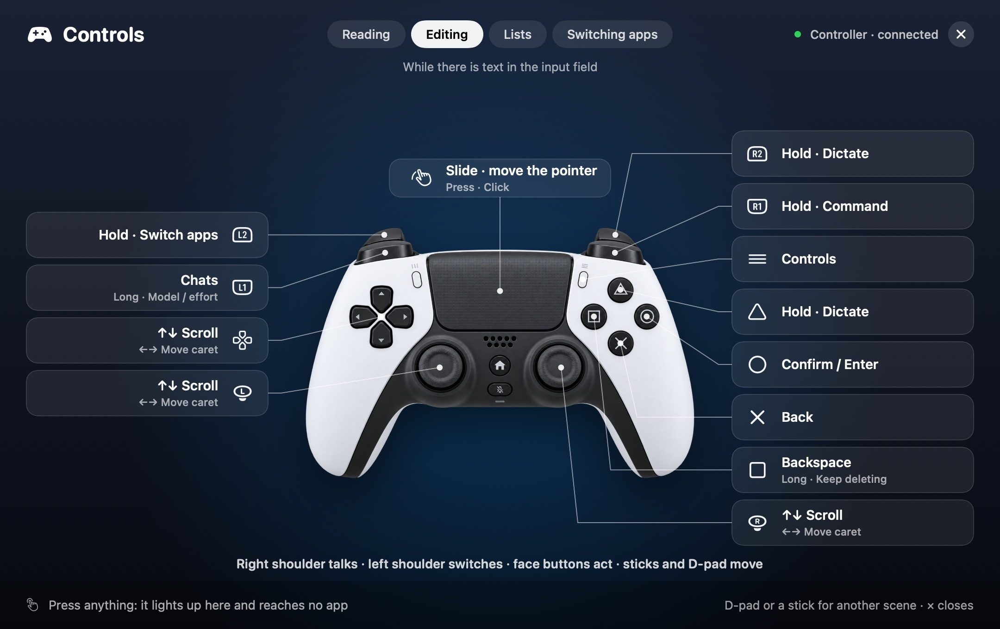

# Default controls and everyday workflows

[简体中文](core-experience.md) · [Getting started](getting-started.en.md) · [Documentation](README.md)

These are the 0.10.2 template defaults; the [Controller](#controller-one-job-a-button) layout was rearranged in this version. Saved custom mappings take precedence; reset the active template if you want its defaults. Complete controls and hardware boundaries are in [Device templates](device-templates.en.md).

## Navigation follows context

| Foreground context | Default navigation |
| --- | --- |
| Reading or an empty draft | Scroll the conversation. Dial left scrolls down and dial right up; on a controller the D-pad and the sticks scroll up when pushed up and down when pushed down. |
| Observed nonempty draft | Move the caret left / right. On a controller the D-pad and the sticks move it sideways and still scroll up and down. |
| Recognized conversation, model, or effort picker | Select the previous / next candidate. |
| macOS app switcher | Select the previous / next application. |
| Browser | Scroll the page, including when a page input has focus. |
| Terminal (iTerm2) | Scroll at an empty prompt; move the caret left / right when the prompt holds a draft; previous / next inside a `/resume` or `/model` list that VibeWand opened. |

A shortcut alone does not establish that a picker opened. Supported adapters inspect available controls before applying picker behavior. Input-method candidates and unknown dialogs take priority and keep native confirmation/cancellation. A terminal has no controls to inspect, so the adapter reads the few rows of text next to the cursor to tell the prompt, a draft and a list apart; see [Applications](applications.en.md#claude-code-codex-and-opencode-in-a-terminal). Which apps have these contexts is in [Supported programs at a glance](applications.en.md#supported-programs-at-a-glance).

## VibeKey / AU05

| Control | Default action |
| --- | --- |
| Dial turn | Navigate according to context above |
| Dial press | Open conversations; next browser tab; confirm in a picker |
| Dial double-press | Open macOS app switching |
| Dial long press | Open models / reasoning controls where supported |
| Microphone hold / release | Start / finish dictation |
| OK press | Confirm / Return |
| ESC press | Delete before the caret or a selection in an observed editable draft; otherwise cancel |
| ESC long press | Keeps deleting while a draft is being edited, until released; elsewhere the same as a press |

In the app switcher, turn to choose, press the dial or OK to confirm, and use ESC to cancel. Switching cancels after 15 seconds of device inactivity.

## Controller: one job a button

**Rearranged in 0.10.2.** In one line: **the right shoulder talks, the left shoulder switches, the face buttons confirm and delete, the sticks and the D-pad move.**

The picture is the app's controls card, rendered off screen, showing the default layout while the input field holds text.

| Control | Default action |
| --- | --- |
| R1 hold / release | Speak a command; only once command mode has a model |
| R2 hold / release | Dictation, the same as △. The index finger holds it while the thumb keeps scrolling |
| L1 | Press for the chat list, or the next tab in a browser; long press for models / effort; with a list open, press again for the next item |
| L2 hold / release | Switch apps. A tap returns to the app before; while held, choose with the D-pad or a stick, and release to switch |
| △ hold / release | Dictation |
| ○ | Confirm / Return; in a list, confirm the chosen item |
| × | Back / Escape; in a list, cancel |
| □ | Backspace, hold to keep deleting; no action in a list |
| D-pad, left stick, right stick | Up and down scroll; with a draft, left and right move the caret; in a list and in the app switcher they are previous / next. They act as they go down and keep going while held |
| Touchpad | Single-finger movement controls the pointer and a press left-clicks, when exposed by macOS |
| ☰ | Show / hide the controls card |

A button means the same thing in every scene: ○ always confirms and × always goes back, in the chat list as well. The default layout uses no double press, so a press acts the moment it is released. One hand on the right side reads, speaks, corrects and sends: the right stick scrolls and moves the caret, R1 / R2 / △ talk, and the face buttons confirm, go back and delete. Changing chat, model or app is on L1 / L2 under the left hand, where the D-pad and the left stick do what the right stick does. L3, R3, Share, Home and Mute start unassigned. Touchpad taps, two-finger scrolling and dragging are not implemented.

What changed from 0.10.1:

- R1 and R2 were one step of previous / next and took no long press, double press or hold. They are now buttons like the rest, with press, double press, long press and hold; by default they are held to speak.
- The command key moved from L2 to R1.
- × no longer doubles as “double press for apps, long press for chats”, nor ○ as “long press for models”; those three moved to L1 and L2.
- In the chat list × used to confirm and ○ to go back, the reverse of everywhere else. It is now the same everywhere.
- The D-pad did nothing. It now moves as the sticks do, and keeps moving while held.
- Pushing a stick up used to scroll down. Up now scrolls up.
- On upgrade, buttons you had not changed take the new layout and the ones you had changed stay as they are; see [Device templates](device-templates.en.md#gestures-and-persistence).

### The controls card

Press ☰ on the controller, or open it from “Controls” in the menu-bar menu or under Settings → Devices & inputs. A card appears in the middle of the screen: the device in the middle, and beside each control what it does now. It draws your layout as it stands, so a button you changed shows what you gave it.

- Four scenes: reading, editing, lists, switching apps. Turn the pages with the D-pad, a stick or L1, or click a tab.
- While it is open the device is in practice mode: a pressed button lights up on the picture and the bottom-left corner says what that press would do in this scene, and nothing reaches the app in front. Presses, long presses and holds can all be tried.
- × or ☰ closes it. The touchpad stays a mouse, so the tabs and the close button can be clicked with it. When command mode needs an answer from you, the card closes by itself.
- The VibeKey, Remote and Keyboard layouts have the card too, from the menu-bar menu; their own previous / next turn the pages and their back button closes it.

The card has been rendered off screen in the app's own window and driven by tests only. It has not been looked at in the running app with a real controller connected; see [native controller records](controller-input.md).

## Remote: configurable preset

Left / right navigate, center confirms, double-center switches apps, and long-center opens conversations. Since 0.10.2 Up / Down scroll, and step through a list. Menu opens conversations / the next browser tab, long-Menu opens models, voice holds dictation, and back cancels or deletes by context. The preset requires a verified device profile; it is not ready-to-use hardware support.

## Keyboard: with no device

With the Keyboard layout selected, six key combinations stand in for the buttons, with VibeKey's default actions: ⌃⌥⌘ Space held dictates, ⌃⌥⌘ ↑ is the main button (press for chats, double press to switch apps, long press for models), ⌃⌥⌘ ← / → navigate, ⌃⌥⌘ Return confirms, and ⌃⌥⌘ Backspace deletes or goes back. Each one can be recorded as another key by pressing it, a custom keyboard's extra keys included; see [Device templates](device-templates.en.md#keyboard).

## Dictate, edit, then confirm

Focus a draft → hold the microphone key, or △ / R2 on a controller → speak → release → move the caret or delete → confirm when ready. Your selected external input method, system SDK or speech API handles recognition. Releasing a dictation hold does not also click, confirm, or send.

Return can send or insert a newline depending on the target app. Check its preference before using confirmation on a real conversation. Application-specific shortcuts and support limits are in [Applications](applications.en.md).

## The command key

Command mode is on by default and takes effect once a model is set up; until then the keys below do not exist. After that there is a hold-to-speak command key: a long press of the VibeKey dial that you keep holding (the model entry moves to a long press of OK), R1 on a controller (L2 up to 0.10.1), and right ⌘ held on its own on the keyboard. On release the sentence goes to command mode and is not typed into any field. When it needs a choice or a confirmation from you it asks on the overlay: turning chooses, the confirm button confirms and the back button stops, and none of these reach the app in front at that time. By default only actions such as deleting and sending need confirming. See [Command mode](command-mode.en.md).

## Timing and customization

VibeKey uses a 0.28-second double-press window and 0.55-second long press; Controller and Remote use 0.32 and 0.65 seconds. A single press waits when a double-press action exists. Hold actions take priority over click gestures. Hold-and-turn is specific to the VibeKey dial. The controller's default layout has no double press, so every press acts on release. The D-pad and the sticks act as they go down, then step again every 0.09 seconds after 0.35 seconds held, and stop on release; since 0.10.2 any controller button can be given this “press at once, repeat while held”.

Disconnecting, sleeping, changing templates/configuration/modes, or quitting cancels pending actions and releases held Fn and app-switch modifiers. To remap a control or adjust timing, see [Settings](settings.en.md). For verification history, see [native controller records](controller-input.md) and [AU05 records](direct-device-plan.md).

## Several devices at once

From 0.7.0, a connected VibeKey and controller both listen. Press any button on the other device and it becomes current: the overlay shows its artwork, buttons follow its own layout, and the press that caused the switch still acts. If the current device disconnects for a few seconds, the one still connected takes over. Editing a layout under Settings → Devices is not interrupted by other devices, and "Follow the device in use" turns the behaviour off entirely.

A Bluetooth controller powers itself off after roughly ten idle minutes. With Settings → General → Keep the controller awake, VibeWand rewrites the light bar every 40 seconds (no visible change), at the cost of a little controller battery.
