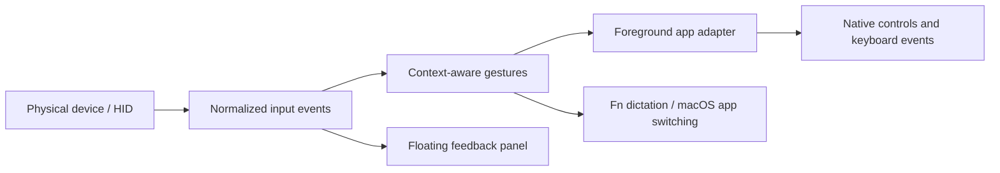

# VibeWand core experience and features

[简体中文](core-experience.md) · [Project home](../README.md) · [Documentation](README.md)

This guide describes version 0.5.1 and its implementation boundaries. The [AU05 engineering record](direct-device-plan.md) retains historical experiments. VibeWand was previously named VibeKey Bridge; VibeKey is now one of its device templates.

## One set of controls, adapted to the task

VibeWand brings reading, choosing, editing, dictation, and switching to a few physical controls. Rotation scrolls while reading, moves the caret in a nonempty draft, and changes the candidate in a recognized conversation, model, or reasoning-effort picker. Pressing enters or confirms; Escape deletes or returns; the microphone button holds dictation.



The device reports which control moved. The template assigns an action to the gesture. The app adapter decides how that action works in the current application. This separation lets new controllers share the workflow while preserving each app's shortcuts and UI behavior.

## Default VibeKey interaction

| Context | Dial press | Turn left / right | OK press | ESC press |
| --- | --- | --- | --- | --- |
| Reading / empty draft | Open conversations | Scroll down / up | Return | Escape |
| Nonempty draft | Open conversations | Move caret left / right | Return | Delete before caret or selected text |
| Recognized picker | Confirm candidate | Previous / next candidate | Confirm candidate | Cancel picker |
| macOS app switcher | Confirm application | Previous / next application | Confirm application | Cancel switching |
| Browser | Next tab | Scroll down / up | Return | Native cancellation / editing context |

Double-pressing the dial opens macOS `⌘Tab` application switching. Turn to choose, then press the dial or OK to confirm; ESC cancels. Application switching works even when another app is in front, and cancels after 15 seconds without device activity to release `⌘`.

Holding the dial opens model controls in supported AI apps. Holding ESC sends native Escape. Turning while holding the dial suppresses an additional click or long press on release.

The default double-press window is 0.28 seconds; the long-press threshold is 0.55 seconds. A button with a double-press binding delays its single press until that window closes. With no double-press action, its single press executes on release. Hold-to-dictate responds immediately on down/up.

An assigned hold action owns the entire press, taking priority over single, double, and long presses. Releasing dictation therefore does not also confirm or send. Hardware that reports pulses without press / release events cannot substitute for a sustained dictation hold. Hold-and-turn combinations are specific to the VibeKey dial; Controller and Remote buttons do not create hidden combinations.

## Dictation and audio

Physical microphone-button events directly update the overlay. In live mode, a separate adapter sends Fn down/up for an input method already configured to use Fn. VibeWand does not record, transcribe, choose an audio device, or upload audio to a model service.

macOS manages the AU05 USB audio interface. [JoyHarness research](https://github.com/nixihz/JoyHarness/blob/main/docs/research/dualsense-wireless-microphone.md) reports a controller USB microphone exposed through Core Audio; Bluetooth controller connectivity does not establish an audio input endpoint. That hardware path has not been validated in this VibeWand iteration.

Selecting a Controller or Remote template does not make its microphone available. Button input and audio input must be validated separately. Disconnection, sleep, normal exit, and changes to modes or configuration cancel pending actions and release Fn / `⌘` held by VibeWand.

## Unified settings and graphical editing

The menu bar keeps everyday entry points. One native settings window groups configuration into six sidebar pages. The editor follows the Steam Input pattern: a recognizable device photo, an input list, and an inspector for the selected physical button. Version 0.5.1 uses a compact header and bounded photo height to keep the input list visible. Settings appears in the Dock while open or minimized; clicking its Dock icon restores the window. Closing settings returns to menu-bar operation without stopping device input.

| Page | Purpose |
| --- | --- |
| General | Interface language, device and foreground-app status, Accessibility permission, and dictation information |
| Devices & inputs | Device photo hotspots, input groups, contextual gestures, action library, timing, and layout import / export |
| Applications | Built-in adapter switches, custom apps, Chat / Browser presets, and editable shortcuts |
| Overlay | Visibility, descriptions, size, opacity, position, and image export |
| Developer | Demo, physical-event capture, compatibility, diagnostics, and reconnect |
| About | Version, license, author, and personal / project website links |

The editing flow is **template → physical button → context → gesture → action**. Click the photo or its input list, then edit that button in the inspector. Controller groups include face buttons, shoulders, stick presses, D-pad, and auxiliary controls. Physical names such as “□ Square” stay separate from the assigned action, so remapping does not make the button's name misleading.

Contexts include default, reading / empty draft, editing, conversations, models, effort, and application switching. Open a gesture to choose from the searchable action library. **Use default** restores inheritance; **Unassigned** explicitly disables it. Reset the selected input in the current context, or restore the whole template. Edits are saved locally as they happen.

The library groups **System** actions (dictation, application switching), **Application** actions (conversations, models, candidates, editing, native keys), and **VibeWand** actions (settings, overlay, button guide). An embedded assistant remains a possible future extension; it is not implemented.

Each template stores its own gestures and timing. The visible **Import**, **Export**, and **Reset** buttons manage the active template's gesture JSON. **Connect device…** shows live connection status. Controller automatically discovers USB or paired Bluetooth devices through macOS GameController, without an HID import. Advanced compatibility allows an explicit override or a return to automatic detection; Remote still needs a measured profile. Switching layouts stops old input and updates the floating panel's device and input indicators. Importing a layout does not pair hardware or create an audio input.

## Language and About

Switch between Chinese and English on the General page. The initial choice follows the first preferred system language: Chinese selects Simplified Chinese; other languages select English. Explicit choices are saved locally. Menus, settings, action names, and floating feedback update without restarting or altering stored mappings. App recognition continues to accept its existing Chinese and English Accessibility labels.

The About page identifies the author as **Dr. Hao Xu, Tenure-track Associate Professor at Nanjing University**, and includes [personal](http://xuhao1.me) and [project](https://vibewand.xuhao1.me) website links, the app version, PolyForm Noncommercial license, and source-available project information and commercial licensing requirements.

See [Settings design](settings-design.md) for the concept and implemented interface, and [Device photography](design-device-assets.md) for image provenance and physical-control hotspots.

## Application behavior

The Apps tab lets you enable or disable each adapter, with settings saved locally. Unsupported or disabled apps receive no business-action keystrokes. App actions apply to the foreground target. Delayed actions do not continue in an unrelated app or window after focus changes. Recognized input-method candidates and unknown dialogs take precedence and receive native confirm / cancel behavior.

### Codex

The adapter supports conversations, draft editing, models, and reasoning effort. Conversation entry uses native `⌘K`; model entry uses native `⌃⇧M`. VibeWand reads available model and effort options from the actual UI instead of maintaining its own model catalog.

A picker must be observed before picker-specific navigation and confirmation are allowed. Sending a shortcut is not proof that a picker opened. Where possible, the adapter locates accessibility candidates and performs their native actions; it can fall back to a candidate's position or standard keyboard events. Effort controls are handled according to their exposed control type.

### DeepSeek Harness

A separate application identity and control lookup reuse the reading, editing, conversation, and model workflow. The local client inspected for this implementation is `0.2.0-rc.2`, bundle identifier `com.deepseek.dsh`.

`⌘K` focuses “Search conversation name.” Model entry performs the accessibility action on a positively identified “Select model, current …” button, opening “Model and reasoning effort.” The adapter does not assume Codex's model shortcut or insert a guessed command into the draft. These UI entry points were inspected locally; the full physical-controller workflow still needs validation and should be retested after app updates.

### Browsers

The browser allowlist includes Safari, Chrome, Edge, Brave, Firefox, Opera, and Vivaldi. Default rotation scrolls the page. Pressing the dial sends `⌃Tab` for the next tab; the model-entry action maps to `⌘L` for the address bar.

A focused webpage input does not automatically turn default rotation into caret movement. Explicit caret actions remain configurable. Double-press still opens global application switching.

### WeChat and Feishu

These apps share reading, editing, search, confirm, and cancel behavior through keyboard mappings: `⌘F` for WeChat and `⌘K` for Feishu. A nonempty draft supports caret movement and deletion; reading / empty drafts scroll. Candidates and dialogs take priority. OK sends Return, whose send/newline meaning follows the application's own preference.

Feishu’s `⌘K` search dialog was checked on the local client. WeChat 4.1.15 did not expose readable chat controls to Accessibility, so `⌘F` remains a compatibility mapping and search-candidate / draft automation is unverified. Destructive editing is allowed only after observing an editable input.

This integration does not use Feishu cloud APIs, organization profiles, contact lists, or account credentials.

### Add a custom application

In Applications, add an app and choose its local `.app` bundle to read its name and full bundle ID, or enter them manually. Rules match that exact bundle ID; another app with the same display name does not match. Start with Chat app, Browser, or Custom, then assign a key and ⌘ / ⌥ / ⌃ / ⇧ modifiers to each operation. Rules can be edited, enabled / disabled, or removed and are saved locally.

| Preset | Primary: chats / tabs | Secondary: search / address bar | Context behavior |
| --- | --- | --- | --- |
| Chat app | `⌘K` | `⌘K` | Reading, draft editing, and observed search-candidate behavior |
| Browser | `⌃Tab` | `⌘L` | Default navigation scrolls even while a webpage input has focus |
| Custom | Unassigned | Unassigned | Uses configured shortcuts without assuming chat or model pickers |

All three presets provide Return confirmation, Escape cancellation, up / down candidates, left / right caret movement, and Backspace deletion; each shortcut is editable. Empty scroll bindings use native scrolling, or you can specify an app's own scroll shortcuts. Input-method candidates and unknown dialogs retain native Return / Escape, so a chat-send binding does not replace native confirmation.

A custom rule takes precedence over a built-in adapter for the same bundle ID. Disabling that rule disables adaptation for that app; removing it restores the built-in rule. Presets are editable starting points: the target app must support the chosen shortcuts. Sending a key is not evidence of an observed picker or universal compatibility with all chat apps and browsers.

## Templates and physical devices

| Template | Design | Hardware boundary |
| --- | --- | --- |
| VibeKey | Dial, microphone, OK, ESC; preserves the existing workflow | Dedicated AU05 vendor HID backend implemented |
| Controller | Every default action uses the right hand: R1/R2 navigation, □ Backspace, ○ confirm, × back / context entry, △ dictate | Automatic macOS GameController discovery over USB / paired Bluetooth; supported devices need no imported profile |
| Remote | Direction ring for navigation, center confirm, back cancel, voice dictation | Editable preset; macOS pairing, button reports, and audio remain unverified |

Controller and Remote use a 0.32-second double-press window and 0.65-second long press. See [Device templates](device-templates.en.md) for complete mapping and integration constraints.

Controller and Remote use generic names. The Controller offers 19 physical buttons and eight directions across its two sticks, for 27 input entries; the Remote offers 12. The touchpad moves the pointer and clicks; other additional buttons start unassigned. The Sticks group exposes up, down, left, right, and press for each stick. Directions are independently assignable. Centered-axis decoding includes a dead zone, hysteresis, repeated movement, and release on return to center; supported controllers supply stick input through the native backend; measured axis profiles are only needed for HID overrides. No left stick, D-pad, or left shoulder button is required for the Controller's default actions.

| Controller control | Default operation |
| --- | --- |
| R1 / R2 | Previous / next direction: scroll, move caret, or navigate candidates by context |
| □ | Backspace |
| × | Press: back; double: app switching; long: conversations / next browser tab |
| ○ | Press: confirm / Return; long: model entry |
| △ | Hold Fn for dictation, release to finish |
| Touchpad | Slide one finger to move the pointer; short press to left-click |

On the Remote, center single-press confirms, double-press switches apps, and long-press opens conversations. Menu single-press opens conversations / the next browser tab, and long-press opens models; left/right navigate; voice holds dictation; back cancels or deletes. A real device profile must map its controls to these logical inputs.

A template describes logical controls. The actual event path depends on the device interface and profile, not its appearance. Controller uses macOS GameController by default; button coverage depends on the controls the system exposes. Optional standard HID profiles support buttons, pulses, relative / absolute encoder axes, and centered-stick axes. Private reports or handshakes require a dedicated device implementation; see [HID setup](hid-profiles.md).

The AU05 backend opens only its selected vendor HID interface. It does not modify USB audio, firmware, or persistent button configuration. Input is dispatched only after the temporary hooks acknowledgment arrives; normal shutdown closes hooks. VibeWand yields to Studio and rejects ambiguous interfaces or another owner instead of selecting a device arbitrarily.

## Floating feedback

The overlay shows connection state, interaction context, action hints, and physical press / release / rotation feedback. It avoids taking keyboard focus, can be dragged, and follows system appearance. Size, opacity, and button descriptions are configurable, and the panel can be exported as PNG. A small gear in its upper-right corner opens settings in both live and demo modes.

Live feedback comes from physical events. Demo mode allows clicking the panel to operate simulated conversations and drafts. Image export renders only the panel, not the target application's contents.

## Live, capture, and demo modes

| Mode | Behavior |
| --- | --- |
| Live | Physical gestures perform real keyboard / accessibility operations in the target app |
| Physical-event capture | Temporarily owns the selected device and displays events without app shortcuts or Fn output |
| Demo | Uses simulated conversations, drafts, models, and effort; sends no actions to a real app or input method |

Automatic demo enters demo mode and plays a scripted interaction sequence. Troubleshooting controls live under Developer.

```sh
bash scripts/run.sh --capture-only
bash scripts/run.sh --demo --settings
bash scripts/run.sh --capture-only --diagnostics-path /absolute/path/status.json
```

Diagnostics contain connection, authorization, mode, counters, held controls, and action status, not conversation text, audio, or credentials. Draft checks prefer character-count metadata; when needed, a confirmed input field's value is immediately reduced to whether text is present.

## Verification and limits

- Historical AU05 checks confirmed the handshake and all six input types. The user has verified parts of conversation selection, app switching, caret movement, and deletion.
- Swift tests cover protocol handling, acknowledgment gating, input decoding, lifecycle, hold priority, device-specific gesture combinations, mappings, app logic, and language persistence / switching; they cannot establish real UI or hardware compatibility.
- New app adapters, model menus, end-to-end dictation, firmware sleep recovery, and physical Controller / Remote devices require acceptance testing for the actual app version and connection method.
- Firmware recovery after a crash or forced termination has not been established; reconnecting or reinserting the receiver may be necessary.
- Accessibility trees, input methods, and shortcuts can change with app versions. Use compatibility settings when needed and include a private-content-free reproduction when reporting a problem.

The rename keeps `org.vibekey.bridge` and existing preference keys. Internal module names may still say VibeKeyBridge, while the built app is `VibeWand.app`.
