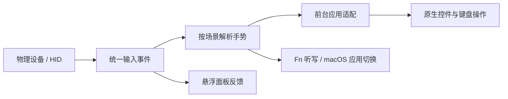

# VibeWand 核心体验与功能

[English](core-experience.en.md) · [项目首页](../README.zh-CN.md) · [文档目录](README.md)

本文描述 0.5.1 的产品行为与实现边界。历史版本的试验记录见 [AU05 直连记录](direct-device-plan.md)。VibeWand 原名 VibeKey Bridge；VibeKey 现在是它支持的设备与模板之一。

## 一套手势，跟随当前工作

VibeWand 把「读、选、改、说、切换」放到几个实体控件上。旋转不是固定发送左右方向键：阅读时滚屏，编辑时移动光标，在已识别的会话 / 模型 / 强度选择器中切换候选。单击负责进入或确认，ESC 负责删除或返回，麦克风键负责按住听写。

操作由四层组成：



设备描述「哪个控件按下或转动」，模板描述「手势对应什么动作」，应用适配描述「动作在当前应用中怎样执行」。这让其他控制器可以复用现有体验，同时保留不同应用的快捷键与 UI 差异。

## VibeKey 默认交互

| 场景 | 旋钮单击 | 左旋 / 右旋 | OK 单击 | ESC 单击 |
| --- | --- | --- | --- | --- |
| 阅读 / 空草稿 | 打开会话入口 | 向下 / 向上滚屏 | Return | Escape |
| 有字的草稿 | 打开会话入口 | 光标向左 / 向右 | Return | 删除光标前字符或选区 |
| 已识别的选择器 | 确认候选 | 上一个 / 下一个候选 | 确认候选 | 取消选择 |
| macOS 应用切换 | 确认应用 | 上一个 / 下一个应用 | 确认应用 | 取消切换 |
| 浏览器 | 下一标签页 | 向下 / 向上滚屏 | Return | 按原生取消 / 编辑上下文处理 |

旋钮双击打开 macOS `⌘Tab` 应用切换，旋转选择，再单击旋钮或 OK 确认，ESC 取消。应用切换可以在其他程序前台时使用；15 秒没有设备操作会取消并释放 `⌘`。

旋钮长按默认打开支持的 AI 应用的模型入口。ESC 长按默认是原生 Escape。VibeKey 按住旋钮转动后，松手不会补发一次单击或长按；手柄与遥控器的按钮不会触发这种按住旋转组合。

默认双击窗口为 0.28 秒、长按阈值为 0.55 秒。存在双击绑定时，单击等待双击窗口结束；没有双击绑定时，单击在松手时执行。听写的按住 / 松开立即响应，不等待单双击判断。只要当前控件已配置「按住 / 松开」动作，该动作就优先占用整次按压，单击、双击和长按不会再附带执行。只上报脉冲而没有按下 / 松开事件的硬件不能模拟持续按住听写。

## 听写与音频

麦克风键的物理按下和松开直接更新面板高亮；实时控制时，独立的听写适配器对应发送 Fn down / up，配合已经配置为 Fn 听写的输入法。VibeWand 不录音、不选择系统麦克风、不转写语音，也不向模型服务传音频。

AU05 的 USB 音频由 macOS 管理。[JoyHarness 的实测研究](https://github.com/nixihz/JoyHarness/blob/main/docs/research/dualsense-wireless-microphone.md)记录了手柄 USB 麦克风被 macOS Core Audio 枚举的情况；蓝牙控制器连接不等于存在音频输入端点。VibeWand 未在本轮完成该硬件链路验收。对于手柄和遥控器，能在应用里选择模板不代表系统能使用其麦克风；按钮输入和音频输入必须分别验证。断开、睡眠、正常退出、改变模式或配置时，VibeWand 会取消待执行动作并释放自己保持的 Fn / `⌘`。

## 统一设置与图形化编辑

菜单栏保留常用入口，完整配置集中在同一个原生设置窗口，侧栏提供六个页面。布局编辑参考 Steam Input，以可辨认的设备照片、按键列表和当前按键编辑器建立对应关系。0.5.1 压缩标题区并限制照片高度，让按键列表保持可见。设置打开或最小化期间显示 Dock 图标，点击图标恢复窗口；关闭设置后返回菜单栏运行，设备控制继续。

| 页面 | 用途 |
| --- | --- |
| 通用 | 界面语言、设备与前台应用状态、辅助功能权限、听写说明 |
| 设备与按键 | 模板、设备照片热点、按键分组、场景与手势动作、动作库、时序、配置导入 / 导出 |
| 应用适配 | 内置适配开关，自定义应用、聊天 / 浏览器预设和快捷键 |
| 悬浮面板 | 调整可见性、说明、大小、透明度，重置位置与导出图片 |
| 开发者 | 演示、物理事件采集、自动演示、兼容选项、诊断与重新连接 |
| 关于 | 版本、许可、作者和个人 / 项目主页链接 |

编辑流程是「模板 → 实体按键 → 场景 → 触发方式 → 动作」。点击设备照片的热点或下方按键列表，在右侧查看该按键；手柄按面键、肩键、摇杆、方向键和其他控件分组。名称始终描述实体按键，例如「□ 方形键」，实际绑定另行显示，改动作不会让按键名称失真。

场景包括通用默认、阅读 / 空草稿、编辑、会话、模型、强度与应用切换。打开某种触发方式后，在可搜索动作库中选择动作；「沿用默认」恢复继承，「不执行」明确禁用。可恢复当前按键在当前场景下的默认配置，也可恢复整套模板。更改立即在本机保存。

动作库分为系统功能（听写、应用切换）、应用功能（会话、模型、候选、编辑与原生按键）、VibeWand 内功能（打开设置、显示 / 隐藏面板、切换按键说明）。未来可扩展内置智能体入口，目前未实现智能体。

每套模板独立保存手势与时序。顶部「导入」「导出」「恢复默认」直接管理当前模板的手势 JSON；「连接设备…」显示实时连接状态。手柄通过 macOS GameController 自动接入 USB 或已配对蓝牙设备，无需先导入 HID 配置；高级兼容设置可覆盖或恢复自动识别。遥控器仍需实测配置。切换模板会停止旧输入，悬浮面板同步显示对应设备及按键状态。导入布局不会配对硬件或创建音频输入。

## 中英文与关于页面

在「通用」切换中文 / English。初始语言跟随系统首选语言：中文系统使用简体中文，其他语言使用英文；手动选择在本机保存，重新打开仍保留。切换后菜单、设置、动作名称与悬浮提示更新，无需重启，也不改变已经保存的按键配置。目标应用的辅助功能识别仍同时支持已有中英文标签。

「关于」注明作者为**南京大学徐浩博士，准聘（Tenure-track）副教授**，并提供[个人主页](http://xuhao1.me)和[项目主页](https://vibewand.xuhao1.me)链接。页面同时显示版本、PolyForm Noncommercial 非商用许可与源码公开与商用授权说明。

设计概念、实际界面与交互说明见[设置设计](settings-design.md)；照片风格素材、实体按键热点及来源见[设备图像设计](design-device-assets.md)。

## 应用适配

在「应用适配」中可分别启用或关闭适配，设置保存在本机；未适配或禁用的应用不会收到业务按键。应用操作针对当前前台应用执行；切换前台或窗口后，不继续发送原上下文中延迟的操作。未知弹窗与已识别输入法候选优先得到原生确认 / 取消，避免把旋转错误解释为编辑动作。

### Codex

沿用会话、草稿、模型与推理强度的操作逻辑。会话入口使用原生 `⌘K`，模型入口使用原生 `⌃⇧M`。模型和强度来自实际应用 UI，不在 VibeWand 中维护模型目录。

先观察到真实选择器，才允许按选择器逻辑导航与确认。发送了快捷键不等于已经打开了选择器。模型菜单优先定位辅助功能暴露的候选并执行原生动作；必要时使用候选位置或标准键盘事件。强度控件按真实类型进行操作。

### DeepSeek Harness

通过独立应用身份与控件识别接入同一套阅读、编辑、会话切换与模型操作。适配依据本机已安装的图形客户端，不能假设其快捷键或模型 / 强度结构与 Codex 完全一致。本机检查版本为 `0.2.0-rc.2`，bundle identifier 为 `com.deepseek.dsh`；`⌘K` 聚焦「搜索会话名称」。模型入口通过辅助功能点击已识别的「选择模型，当前…」按钮，打开「模型与推理等级」菜单，不虚构通用模型快捷键。已检查实际 UI 入口；设备到完整操作的链路仍需实测，目标应用升级后也需复测。

### 浏览器

浏览器适配名单包括 Safari、Chrome、Edge、Brave、Firefox、Opera、Vivaldi。默认旋转滚动网页，旋钮单击发送 `⌃Tab` 切到下一标签页；模型入口动作在浏览器中改为 `⌘L` 聚焦地址栏。浏览器不会仅因网页输入框有焦点就把旋转自动改成移动光标；需要编辑光标时可配置显式光标动作。双击仍可进入全局应用切换。

### 微信与飞书

复用阅读、编辑、搜索 / 会话入口、确认与取消逻辑，微信使用 `⌘F`，飞书使用 `⌘K` 打开搜索 / 切换入口。草稿有字时移动光标与删除，空草稿时滚动；候选与弹窗优先处理。OK 对应 Return，消息发送还是换行由应用现有设置决定。

飞书的 `⌘K` 搜索界面已在本机核对。微信 4.1.15 未向辅助功能暴露可读的聊天控件，因此 `⌘F` 仍是兼容映射，搜索候选与草稿编辑尚未实机验证；只有识别到可编辑输入框后才允许删除等编辑动作。

这里不使用飞书开放平台、企业身份、聊天 API 或账号凭证，不读取云端通讯录，也不配置组织 Profile。

### 添加自定义应用

在「应用适配」添加应用，选择本机 `.app` 自动取得名称和完整 bundle ID，或手动填写。规则按完整 bundle ID 精确匹配；相同名称的其他应用不会自动命中。可选择聊天工具、浏览器或自定义预设，再为各项操作设置一个按键及 ⌘ / ⌥ / ⌃ / ⇧ 修饰键。规则支持编辑、启用 / 禁用与删除，保存于本机。

| 预设 | 主操作（会话 / 标签页） | 辅助操作（搜索 / 地址栏） | 场景行为 |
| --- | --- | --- | --- |
| 聊天工具 | `⌘K` | `⌘K` | 复用阅读、草稿编辑与搜索候选识别 |
| 浏览器 | `⌃Tab` | `⌘L` | 默认始终滚屏，不因网页输入框有焦点改成光标移动 |
| 自定义 | 不执行 | 不执行 | 使用明确配置的键盘动作，不推定聊天或模型选择器 |

三种预设都提供 Return 确认、Escape 返回、上下候选、左右光标与 Backspace 删除；这些快捷键均可更改。滚屏快捷键为空时使用原生滚动，也可指定应用自己的上下滚动快捷键。输入法候选和未知弹窗仍使用原生 Return / Escape，避免聊天发送映射干扰原生确认。

同一 bundle ID 的自定义规则优先于内置适配；禁用该自定义规则会禁用这个应用的适配，删除后才回到内置规则。预设只是可编辑的起点，目标应用必须实际支持所选快捷键；发送了按键不代表已经识别出选择器，也不代表所有聊天工具或浏览器已经通过实机验收。

## 模板与真实硬件

| 模板 | 设计方向 | 当前硬件边界 |
| --- | --- | --- |
| VibeKey | 单旋钮、麦克风、OK、ESC；保留已有操作习惯 | AU05 专用 vendor HID 直连已实现 |
| 手柄 | 全部默认功能单右手操作：R1 / R2 导航，□ 退格，○ 确认，× 返回 / 切换入口，△ 听写 | macOS GameController 自动发现 USB / 已配对蓝牙手柄；支持的设备无需导入配置 |
| 遥控器 | 方向环浏览，中央确认，返回取消，语音键听写 | 提供可编辑模板；macOS 配对、按键报告及音频支持未完成实测 |

手柄与遥控器的默认双击 / 长按为 0.32 / 0.65 秒，详细映射与设备接入约束见 [设备模板](device-templates.md)。

手柄与遥控器使用通用名称。手柄提供 19 个实体按键与两根摇杆的八个方向，共 27 个输入入口；遥控器提供 12 个按键。触摸板滑动移动光标、短按左键；其他额外按键默认不执行，可按偏好配置。「摇杆」分组分别列出左右摇杆的上、下、左、右和按下，方向可独立绑定。回中轴接入带死区、迟滞和持续重复，回中释放当前方向；系统支持的手柄由原生后端提供摇杆输入；使用高级 HID 覆盖时才需要实测轴配置。手柄不需要左摇杆、十字键或左侧肩键来完成默认操作：

| 控件 | 手柄默认操作 |
| --- | --- |
| R1 / R2 | 上一个 / 下一个逻辑方向：阅读滚屏、编辑移光标、选择器切候选 |
| □ | 单击退格 |
| × | 单击返回；双击应用切换；长按会话 / 浏览器下一标签 |
| ○ | 单击确认 / Return；长按模型入口 |
| △ | 按住 Fn 听写，松开释放 |
| 触摸板 | 单指滑动移动光标；短按鼠标左键 |

遥控器中央键单击确认、双击应用切换、长按打开会话；菜单键单击会话 / 浏览器下一标签页、长按打开模型入口；左右方向键导航；语音键按住听写；返回键取消或删除。具体使用的按键必须在 HID 配置里映射到相应逻辑控件。

模板是 VibeWand 的逻辑控件布局。真实控件怎样送出这些事件，取决于设备接口和映射配置，不能只根据外观推定。手柄默认走 macOS GameController，按键覆盖取决于系统公开的控件。可选标准 HID 后端支持按钮、脉冲、相对 / 绝对编码器轴和回中摇杆轴；私有报告或握手需要设备专用实现。详见 [HID 配置](hid-profiles.md)。

AU05 只打开指定 vendor HID 接口，不改 USB 音频、不升级固件、不写持久按键配置。只有收到临时 hooks 开启 ACK 后才派发输入，正常退出关闭 hooks。Studio 占用时让出通道；多个匹配接口或另一实例已占用时拒绝猜选。

## 悬浮面板

面板显示设备连接、当前场景、动作提示，以及真实控件的按下 / 松开 / 旋转。面板不抢输入框焦点，可拖动并跟随系统外观；大小、透明度和按键说明可配置，也能导出 PNG。右上角的小齿轮随时打开设置，在实时与演示模式都可点击。

实时模式的高亮来自设备事件。演示模式允许点击面板操作模拟会话与草稿。图片导出只渲染面板，不是目标应用的截图。

## 实时、采集与演示

| 模式 | 输入与结果 |
| --- | --- |
| 实时控制 | 物理事件经过手势和应用适配，执行实际键盘 / 辅助功能操作 |
| 只采集物理事件 | 临时接管所选设备，显示按下 / 松开 / 转动，不发送业务快捷键或 Fn |
| 演示 | 使用内部模拟会话、草稿、模型与强度，不向真实应用或输入法发送动作 |

「播放自动演示」进入演示模式，按预置顺序展示操作。开发者模式集中放在设置里，避免常用菜单混入排错开关。

```sh
bash scripts/run.sh --capture-only
bash scripts/run.sh --demo --settings
bash scripts/run.sh --capture-only --diagnostics-path /absolute/path/status.json
```

诊断包括连接、授权、模式、计数、按住控件与操作状态，不包含聊天正文、音频和凭证。草稿判断优先读取字符数元数据；必要时读取已确认输入框的值后立即转换为「是否有字」。

## 验证范围与已知限制

- 历史 AU05 实机记录已确认握手及六类输入，用户已验证部分会话切换、应用切换、光标和删除行为。
- Swift 自动测试覆盖协议、ACK 门控、按键解码、生命周期、按住优先级、设备组合手势边界、映射、应用逻辑以及语言持久化和即时切换；不能替代应用 UI 或实体设备验证。
- 新应用适配、模型菜单、真实听写、固件休眠恢复，以及手柄 / 遥控器的实际设备都需要按实际版本与连接方式逐项验收。
- 强制结束或进程崩溃后的设备固件恢复时限尚未确认；必要时重连或重插接收器。
- 辅助功能结构、输入法和快捷键可能随应用版本变化。识别失败时使用设置中的兼容选项，并提供去除私人内容的复现信息。

项目改名保留 `org.vibekey.bridge` 与已有偏好键，减少升级迁移。旧内部模块名仍可见，但构建产物为 `VibeWand.app`。
