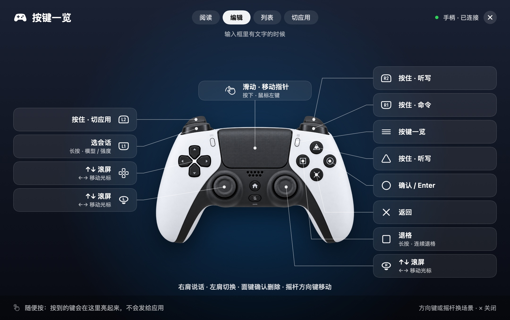

# 默认操作与日常体验

[English](core-experience.en.md) · [快速开始](getting-started.md) · [文档目录](README.md)

本文说明 0.11.0 的模板默认值；[手柄](#手柄一个键一件事)的布局在 0.10.2 重排过。已保存的自定义映射优先；恢复当前模板默认后才能回到下列操作。完整按键和硬件边界见[设备模板](device-templates.md)。

## 导航跟随场景

| 前台场景 | 默认导航 |
| --- | --- |
| 阅读 / 空草稿 | 滚动会话；旋钮左旋向下，右旋向上；手柄的方向键和摇杆上推向上，下推向下。 |
| 已识别的非空草稿 | 光标向左 / 向右移动；手柄的方向键和摇杆左右移动光标，上下仍然滚屏。 |
| 已识别的会话 / 模型 / 强度选择器 | 上一个 / 下一个候选。 |
| macOS 应用切换 | 上一个 / 下一个应用。 |
| 浏览器 | 滚动页面，即使网页输入框有焦点。 |
| 终端（iTerm2） | 空提示符下滚动；提示符里有草稿时光标向左 / 向右移动；VibeWand 打开的 `/resume` 或 `/model` 列表里为上一个 / 下一个。 |

发出快捷键不等于选择器已打开。适配器检查实际控件后才执行选择器操作；输入法候选和未知弹窗优先，使用原生确认 / 取消。终端没有控件可读，适配器改读光标附近的几行文字来判断提示符、草稿和列表，见[应用适配](applications.md#终端里的-claude-codecodexopencode)。哪些应用有这些场景见[支持的程序一览](applications.md#支持的程序一览)。

## VibeKey / AU05

| 控件 | 默认动作 |
| --- | --- |
| 旋钮左旋 / 右旋 | 按上述场景导航 |
| 旋钮单击 | 打开会话；浏览器内下一标签页；选择器内确认 |
| 旋钮双击 | 打开 macOS 应用切换 |
| 旋钮长按 | 在支持的应用中打开模型 / 推理强度入口 |
| 麦克风按住 / 松开 | 开始 / 结束所选听写服务 |
| OK 单击 | 确认 / Return |
| ESC 单击 | 已识别的可编辑草稿中删除光标前字符或选区，其他场景取消 |
| ESC 长按 | 编辑草稿时连续删除，松开即停；其他场景与单击相同 |

应用切换中旋转选择，单击旋钮或 OK 确认，ESC 取消。15 秒没有设备操作会自动取消切换。

## 手柄：一个键一件事

**0.10.2 重排。**一句话：**右肩说话，左肩切换，面键确认和删除，摇杆和方向键移动。**

上图是应用里的“按键一览”画面，取自离屏渲染，显示的是输入框里有文字时的默认布局。

| 控件 | 默认动作 |
| --- | --- |
| R1 按住 / 松开 | 说一句命令；命令模式配好模型后才有 |
| R2 按住 / 松开 | 听写，和 △ 一样。食指扣着说，拇指可以继续翻页 |
| L1 | 单击打开会话列表，浏览器里是下一个标签页；长按打开模型 / 强度；列表打开后再按是下一个 |
| L2 按住 / 松开 | 切换应用。轻按一下回到上一个应用；按住时用方向键或摇杆左右选，松开切过去 |
| △ 按住 / 松开 | 听写 |
| ○ | 确认 / Return；列表里确认选中的那一项 |
| × | 返回 / Escape；列表里取消 |
| □ | 退格，按住连续删除；列表里不执行 |
| 方向键、左摇杆、右摇杆 | 上下滚屏；有草稿时左右移动光标；列表和切换应用时是上一个 / 下一个。按下就动，按住连续移动 |
| 触摸板 | 系统提供触摸坐标时，单指移动指针、按下左键点击 |
| ☰ | 打开 / 关闭按键一览 |

每个键在所有场景里是同一个意思：○ 一直是确认，× 一直是返回，会话列表里也一样。默认布局不用双击，所以单击松手就生效，不用等。右手一只手管“看、说、改、发”：右摇杆翻页和移动光标，R1 / R2 / △ 说话，面键确认、返回和删除；换会话、换模型、换应用在左手的 L1 / L2 上，方向键和左摇杆与右摇杆做同样的事。L3、R3、分享键、主页键和静音键默认未分配。触摸板轻点、双指滚动与拖拽尚未实现。

和 0.10.1 的区别：

- R1 / R2 以前只是“上一个 / 下一个”的一步，不能长按、双击，也不能按住。现在它们和其他键一样，单击、双击、长按、按住都能设；默认用来按住说话。
- 命令键从 L2 换到了 R1。
- × 不再兼着“双击切应用、长按选会话”，○ 不再兼着“长按选模型”；这三件事搬到了 L1 和 L2 上。
- 会话列表里以前是 × 确认、○ 返回，和别处相反；现在处处一致。
- 方向键以前什么都不做，现在和摇杆一样移动，并且按住会连续移动。
- 摇杆以前上推是向下滚，现在上推向上。
- 升级后，没改过的键自动换成新布局，你自己改过的键保持原样；见[设备模板](device-templates.md#手势与配置)。

### 按键一览

在手柄上按 ☰，或从菜单栏的“按键一览”、“设置 → 设备与按键”里打开。屏幕中间出现一张图：设备在中间，每个键旁边写着它现在的作用。它画的是你当前的布局，改过的键显示改过之后的动作。

- 四页场景：阅读、编辑、列表、切应用。用方向键、摇杆或 L1 翻页，也可以用鼠标点。
- 打开期间是“试按”状态：按到的键在图上亮起来，左下角写出这一下在这个场景里会做什么，但不会发给前台应用。单击、长按、按住都可以试。
- × 或 ☰ 关闭。触摸板这时照常是鼠标，可以点页签和关闭按钮。命令模式需要你回答时，它会自己关掉。
- VibeKey、遥控器和键盘布局也有这张图，从菜单栏打开；用它们各自的“前进 / 后退”翻页、返回键关闭。

这张图只在应用自己的窗口里离屏渲染并用测试驱动过，没有在连着真手柄的运行中应用里看过；见[原生手柄记录](controller-input.md)。

## 遥控器：可配置预设

左 / 右导航，中央键确认，双击中央键切应用，长按打开会话。方向上 / 下从 0.10.2 起滚屏，列表里是上一个 / 下一个。菜单键打开会话 / 下一浏览器标签，长按菜单键打开模型，语音键按住听写，返回键按场景取消或删除。需要实测设备配置，尚不是即用硬件支持。

## 键盘：没有设备时

选中“键盘”布局后，六组组合键当按键用，默认动作与 VibeKey 相同：⌃⌥⌘ 空格按住听写，⌃⌥⌘ ↑ 是主键（单击会话、双击切应用、长按模型），⌃⌥⌘ ← / → 导航，⌃⌥⌘ 回车确认，⌃⌥⌘ 退格删除或返回。每个键位都可以按一下来录制成别的键，自定义键盘的扩展键也行，见[设备模板](device-templates.md#键盘)。

## 听写、修改、再确认

聚焦草稿 → 按住麦克风键，或手柄的 △ / R2 → 说话 → 松开 → 移动光标或删除 → 准备好再确认。音频与转写由所选的外置输入法、系统 SDK 或语音 API 处理；松开听写键不会额外单击、确认或发送。

Return 可能发送，也可能换行，取决于目标应用。用于真实对话前先检查其偏好；各应用快捷键与支持范围见[应用适配](applications.md)。

## 命令键

命令模式默认开启，配好模型后才起作用；在那之前下面这些键位不存在。配好后多出一个“按住说话”的命令键：VibeKey 长按旋钮并保持（模型入口随之改为长按 OK），手柄按住 R1（0.10.1 及以前是 L2），键盘单独按住右 ⌘。松开后这句话交给命令模式，不写进任何输入框。它需要你选择或确认时会在悬浮窗提问：转动选候选、确认键确认、返回键停止，这些按键此时不会发给前台应用；默认只有删除、发送这类操作要确认。详见[命令模式](command-mode.md)。

## 触发时序与自定义

VibeKey 双击间隔 0.28 秒、长按 0.55 秒；手柄与遥控器为 0.32 秒和 0.65 秒。存在双击绑定时单击需要等待；按住动作优先于点击手势。按住旋转仅适用于 VibeKey 旋钮。手柄的默认布局没有双击，所有单击松开即生效。方向键和摇杆按下就动，按住 0.35 秒后每 0.09 秒再动一步，松开即停；0.10.2 起，手柄上任何一个键都可以设成这种“按下即触发、按住连发”。

断线、睡眠、切换模板 / 配置 / 模式或退出会取消待处理动作，释放保持的 Fn 和应用切换修饰键。改键和调整时间见[设置指南](settings.md)。实测历史见[原生手柄记录](controller-input.md)和[AU05 记录](direct-device-plan.md)。

## 多设备同时待命

0.7.0 起，已连接的 VibeKey 和手柄同时监听。在另一个设备上按任意键，它就成为当前设备：悬浮面板换成它的图，按键按它自己的布局解释，触发切换的那一下也照常生效。当前设备断开几秒后，自动落到还连着的那个。在“设置 → 设备与按键”编辑布局时不会被别的设备抢走；“跟随正在使用的设备”可以整体关掉。

蓝牙手柄闲置约十分钟会自行关机。打开“设置 → 通用 → 保持手柄唤醒”后，VibeWand 每 40 秒改写一次手柄灯条（肉眼看不出变化），多耗一点手柄电量。
