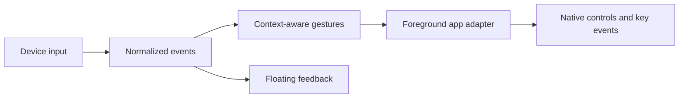

# Development / 开发指南

[Documentation / 文档目录](README.md) · [Contributing / 贡献说明](../CONTRIBUTING.md)

Use an Apple Silicon Mac with full Xcode 26 or later (macOS 26+ SDK) and Homebrew Opus for the bundled application. The source and the published 0.8.5 package target macOS 26; 0.8.4 was the last package for macOS 13+. See [Getting started](getting-started.en.md) / [快速开始](getting-started.md) to build the application bundle.

打包环境需要 Apple Silicon Mac、完整 Xcode 26+（macOS 26+ SDK）及 Homebrew Opus。源码和已发布的 0.8.5 安装包的最低系统都是 macOS 26；0.8.4 是最后一个支持 macOS 13 以上的安装包。

## Build from source / 从源码编译

Download the source from [GitHub](https://github.com/xuhao1/VibeWand), or the source archive attached to the desired [release](https://github.com/xuhao1/VibeWand/releases). The helper currently expects Opus under `/opt/homebrew`. Install the build dependency if absent, then compile the graphical application in the project folder:

从 GitHub 或对应 Release 下载源码。蓝牙组件当前使用 `/opt/homebrew` 下的 Opus；若未安装，请先准备此编译依赖，再构建：

```sh
brew install opus
bash scripts/build-app.sh
```

The script compiles a release build, copies the icon, device images and license notices, and signs the bundle. The result is **`dist/VibeWand.app`**. Open it in Finder or copy it to Applications and double-click it. The application runs from the menu bar; settings, demo, physical capture and diagnostics are available in its graphical interface.

脚本完成 Release 编译、素材与许可证打包和签名，生成 **`dist/VibeWand.app`**。在 Finder 中打开，或复制到「应用程序」后双击；设置、演示、采集与诊断均通过图形界面操作。

The default build targets the build Mac's architecture. The published 0.8.5 package is **arm64 / Apple Silicon**, requires macOS 26+, uses ad-hoc signing, and is not Apple-notarized. The bundled microphone-helper build currently targets arm64, so this packaging flow does not support Intel.

默认编译面向构建机器的架构。已发布 0.8.5 为 **arm64 / Apple Silicon**，要求 macOS 26+，临时签名且未公证；当前麦克风组件固定编译为 arm64，此打包流程不支持 Intel。

## Command kernel / 命令内核

`scripts/build-app.sh` calls `scripts/build-kernel.sh`, which assembles `output/kernel` and copies it into the app as `Contents/Resources/kernel`. It downloads the official Node.js 24.21.0 for Apple Silicon and the packages locked in `kernel/package-lock.json`, checks each against a pinned digest, runs no package script, and then starts the result once (`kernel/smoke.mjs`) before publishing it. An unchanged kernel is reused from `output/kernel`. Set `VIBEWAND_SKIP_KERNEL=1` to build without it; command mode then reports that the build has no kernel.

`scripts/build-app.sh` 会调用 `scripts/build-kernel.sh` 组装 `output/kernel`，并复制到应用的 `Contents/Resources/kernel`。它下载官方 Node.js 24.21.0（Apple Silicon）和 `kernel/package-lock.json` 锁定的包，逐一核对固定的摘要，不运行任何包脚本，并在发布前实际启动一次（`kernel/smoke.mjs`）。内容未变时复用 `output/kernel`。`VIBEWAND_SKIP_KERNEL=1` 可以不带内核构建，命令模式会提示此版本没有内核。

The kernel is DeepSeek Harness driven over the Agent Client Protocol. `kernel/profile/cordis.patch.yml` is its complete plugin tree: a model adapter, a session and the protocol bridge, with no tools of its own. The adapter is the harness's multi-provider one (`dsh-llm-pi-ai`), which speaks OpenAI Chat Completions, OpenAI Responses and Anthropic Messages. The app describes the chosen model as a `ModelRoute`; `KernelInstall` turns it into one provider entry and passes it in `VIBEWAND_ROUTE`, with the key in `VIBEWAND_MODEL_KEY`. Neither is written to disk. The model's whole reach is the catalog in `Sources/WandAgent/Tools.swift`, served to the kernel over a Unix socket that admits only the kernel's own child processes:

内核是经 Agent Client Protocol 驱动的 DeepSeek Harness。`kernel/profile/cordis.patch.yml` 是它完整的插件树：模型适配、会话和协议桥，没有任何自带工具。模型适配用的是 Harness 的多服务组件（`dsh-llm-pi-ai`），支持 OpenAI Chat Completions、OpenAI Responses 和 Anthropic Messages 三种接口。应用把选定的模型描述成 `ModelRoute`，由 `KernelInstall` 转成一条 provider 配置放进 `VIBEWAND_ROUTE`，密钥放进 `VIBEWAND_MODEL_KEY`，两者都不写入磁盘。模型能做的事以 `Sources/WandAgent/Tools.swift` 的工具表为限；这些工具经一个 Unix 套接字提供给内核，只接受内核自己的子进程连接：

| Tools / 工具 | Purpose / 作用 |
| --- | --- |
| `list_targets`, `find_sessions`, `open_session`, `search_in_app`, `activate_app` | Apps and chats / 应用与会话 |
| `choose`, `finish`, `need_user` | Asking the user and ending a task / 询问用户与结束任务 |
| `ui_snapshot`, `ui_press`, `ui_key`, `ui_menu`, `ui_type` | The front window, through its accessibility tree / 经辅助功能控件树操作前台窗口 |

Whether a tool call waits for the user is decided in `Gateway` from the permission mode (`PermissionMode`): every call that changes something, only those the host judges risky, or none. The host (`CommandTools.confirm`) words the question and knows what is risky.

一次工具调用要不要等用户，由 `Gateway` 按权限档位（`PermissionMode`）决定：每个有改动的调用都问、只问宿主判定有风险的、或都不问。问题的措辞和“什么算有风险”在宿主一侧（`CommandTools.confirm`）。

To change the kernel version, edit `kernel/package.json` and the launcher pin in `scripts/build-kernel.sh`, then refresh the lock with `npm install --package-lock-only --ignore-scripts` in `kernel/`. The profile test in `Tests/WandAgentTests` fails if a package is added to the tree without being listed there.

更换内核版本时，修改 `kernel/package.json` 和 `scripts/build-kernel.sh` 里的启动器版本与摘要，再在 `kernel/` 中用 `npm install --package-lock-only --ignore-scripts` 刷新锁文件。`Tests/WandAgentTests` 里的 profile 测试会在插件树多出未登记的包时失败。

## Tests / 测试

For behavior changes, run the test suite with the same Xcode toolchain:

行为变更使用同一 Xcode 工具链运行测试：

```sh
swift test
```

Command mode is tested with a scripted kernel and never touches another app. One opt-in suite drives a real kernel and a real model with a stand-in for the desktop; it needs a key in the environment and an assembled kernel. It reaches DeepSeek over both its OpenAI-compatible and Anthropic-compatible protocols, and checks that a wrong key is reported in the service's words:

命令模式用脚本内核测试，不触碰其他应用。另有一组需要显式启用的测试，用真实内核和真实模型、以假的桌面宿主运行；它需要环境变量里的密钥和已组装的内核。它分别经 DeepSeek 的 OpenAI 兼容和 Anthropic 兼容接口运行，并检查密钥错误时报出的是服务的原话：

```sh
bash scripts/build-kernel.sh
DEEPSEEK_VIBEWAND_DEV=… VIBEWAND_KERNEL_RESOURCES="$PWD/output" swift test --filter KernelLiveTests
```

A second opt-in suite, `CommandLiveTests`, runs the production runtime against real apps, in windows it opens for itself, and reads each result back from the app. Once keyboard and mouse have been idle for a few seconds it takes the screen for a few seconds per scenario, then returns it. Name the scenarios to run:

另一组需要显式启用的 `CommandLiveTests` 用生产运行时操作真实应用：在自己打开的窗口里执行，并从应用里读回每个结果。键盘和鼠标空闲几秒后，每个场景占用屏幕几秒再交还。用环境变量指定要跑的场景：

```sh
VIBEWAND_COMMAND_LIVE=textedit,keyboard,code,codex,search-claude DEEPSEEK_VIBEWAND_DEV=… VIBEWAND_KERNEL_RESOURCES="$PWD/output" swift test --filter CommandLiveTests
```

| Scenario / 场景 | Needs / 需要 | Covers / 覆盖 |
| --- | --- | --- |
| `textedit` | — | Typing, a confirmed and a refused Return, a menu item, switching apps / 输入、确认与拒绝的回车、菜单项、切换应用 |
| `permission` | — | Ask every time: typing asked about, confirmed and declined; Bypass all: Return without a question; the overlay's context line / 每步确认下输入先问，确认与拒绝各一次；跳过全部确认下回车不问；悬浮窗的上下文一行 |
| `keyboard` | — | The keyboard command key, answering with arrows and Return; no model / 键盘命令键与方向键、回车作答；不用模型 |
| `code` | Visual Studio Code | Reading tabs and pressing one by name; the test offers the model no keys or typing there / 读取并按下标签页；测试在这里不给模型按键和输入 |
| `codex` | Codex running / 运行中 | Opening a chat by its link, the window's Back button / 用链接打开会话、窗口的后退按钮 |
| `search-codex`, `search-claude`, `search-feishu` | That app running; one per run / 对应应用运行中，每次一个 | The app's own search opened with the keywords, then the dial / 打开应用自带搜索并填词，再交给旋钮 |
| `say` | `VIBEWAND_COMMAND_LIVE_SAY` | One instruction of your choosing; a choice gets its first option, a confirmation is refused / 任意一句话；候选选第一个，确认一律拒绝 |

`VIBEWAND_COMMAND_LIVE_HOLD=20` keeps each result on screen for that many seconds before the test closes its windows. The scenarios run with the “ask when risky” permission unless they say otherwise, on DeepSeek's `deepseek-flash`; `VIBEWAND_COMMAND_LIVE_MODEL` and `VIBEWAND_COMMAND_LIVE_REASONING` (`off`, `low`, `medium`, `high`) change the model and its thinking. `VIBEWAND_COMMAND_SETTINGS_REVIEW=<folder>` with `swift test --filter testCommandSettingsAndHistoryRenderForReview` renders the settings page and the records window from hidden views. The last run is recorded in [Command mode acceptance / 命令模式验收](command-acceptance.md).

`VIBEWAND_COMMAND_LIVE_HOLD=20` 让每个结果在屏幕上停留这么多秒，然后测试才关闭自己的窗口。除非场景另有说明，都在“只确认有风险的”档位下、用 DeepSeek 的 `deepseek-flash` 运行；`VIBEWAND_COMMAND_LIVE_MODEL` 和 `VIBEWAND_COMMAND_LIVE_REASONING`（`off`、`low`、`medium`、`high`）可以换模型和思考强度。`VIBEWAND_COMMAND_SETTINGS_REVIEW=<目录>` 配合 `swift test --filter testCommandSettingsAndHistoryRenderForReview` 用隐藏的视图渲染设置页和记录窗口。最近一次运行记录在[命令模式验收](command-acceptance.md)。

## Source layout / 源码布局

`AU05Capture` emits normalized input as NDJSON and writes connection status to stderr. The CLI and GUI cannot own the AU05 simultaneously. Normal exit, SIGINT, and SIGTERM release the interface and temporary hooks.

| Location | Responsibility |
| --- | --- |
| `Sources/AU05Device` | Protocol, device discovery, direct HID lifecycle, generic HID profiles |
| `Sources/SpeechInput` | UI-independent recording, Speech SDK, network protocols, preferences, Keychain and dictation lifecycle |
| `Sources/WandAgent` | UI-independent command mode: kernel process and protocol, tool catalog and socket, gateway, task records, Codex chat list |
| `kernel` | The kernel's locked package set, its profile and the boot check |
| `Sources/VibeKeyBridge` | App UI, gestures, application adapters, overlay, voice orchestration, text delivery, application switching, and what command mode's tools do on the desktop |
| `Sources/SpeechAPICheck` | Explicit audio-file API checks, reading credentials only from Keychain |
| `Sources/AU05Capture` | Command-line input capture |
| `Tests` | Protocol, lifecycle, gesture, adapter, and interaction tests |
| `profiles` | Gesture and generic HID examples |
| `docs` | Experience guide, design decisions, device setup, and engineering history |

The internal `VibeKeyBridge` target and bundle identifier `org.vibekey.bridge` remain stable to preserve module references and existing preferences. The app and executable are named VibeWand.

For repeatable signing, set `VIBEWAND_SIGNING_IDENTITY` (the legacy `VIBEKEY_SIGNING_IDENTITY` is also accepted). The script otherwise selects the sole Apple Development identity or uses ad-hoc signing. Ad-hoc updates can require Accessibility permission to be registered again. A successful build replaces the app and preserves the previous bundle under `dist/.previous-build.*`.

## Implementation model / 实现分层



设备负责输入事件，模板负责手势映射，应用适配器负责执行。新增设备先验证事件源；新增应用先定义身份和快捷键。配置不执行脚本、不包含凭证。

Device sources normalize input, templates map gestures, and app adapters perform operations. Verify a new event source before connecting it to app actions. Configuration does not run scripts or contain credentials.

## Xcode toolchain

If Command Line Tools cannot load SwiftUI macros, use the full Xcode developer directory for that command. The build script already chooses `/Applications/Xcode-beta.app` when present. For that installation:

```sh
DEVELOPER_DIR=/Applications/Xcode-beta.app/Contents/Developer swift build
DEVELOPER_DIR=/Applications/Xcode-beta.app/Contents/Developer swift test
```

命令行工具若缺少 SwiftUI 宏插件，请为该次命令指定完整 Xcode 路径；按实际安装位置调整。

## Optional DualSense voice / 可选手柄语音

The main app bundles the HID/Opus audio helper and its library/license. It is disabled by default. The current experimental Bluetooth microphone path requires macOS 26+ and the `gamepolicyctl` tool provided by Xcode or Command Line Tools; the downloaded app's ordinary controller input and other dictation modes do not need these developer tools. See [integration notes](dualsense-microphone-integration.md).

主包已包含音频组件、Opus 库和许可证，蓝牙语音默认关闭。当前实验路径需要 macOS 26+ 及 Xcode / Command Line Tools 提供的游戏模式工具；普通手柄输入和其他听写模式无需这些开发工具。
