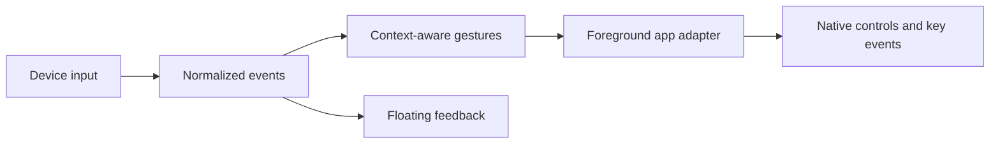

# Development / 开发指南

[Documentation / 文档目录](README.md) · [Contributing / 贡献说明](../CONTRIBUTING.md)

Requires macOS 13+ and Swift 5.9+; use a full Xcode toolchain for SwiftUI and tests. See [Getting started](getting-started.en.md) / [快速开始](getting-started.md) to build the application bundle.

开发环境要求 macOS 13+ 和 Swift 5.9+，SwiftUI 与测试建议使用完整 Xcode。

## Build, test, and inspect input / 构建、测试与采集

```sh
swift build
swift test
swift run AU05Capture --list
swift run AU05Capture --duration 30
swift run AU05Capture --profile /absolute/path/controller.json --duration 30
```

`AU05Capture` emits normalized input as NDJSON and writes connection status to stderr. The CLI and GUI cannot own the AU05 simultaneously. Normal exit, SIGINT, and SIGTERM release the interface and temporary hooks.

| Location | Responsibility |
| --- | --- |
| `Sources/AU05Device` | Protocol, device discovery, direct HID lifecycle, generic HID profiles |
| `Sources/VibeKeyBridge` | App UI, gestures, application adapters, overlay, dictation, application switching |
| `Sources/AU05Capture` | Command-line input capture |
| `Tests` | Protocol, lifecycle, gesture, adapter, and interaction tests |
| `profiles` | Gesture and generic HID examples |
| `docs` | Experience guide, design decisions, device setup, and engineering history |

The internal `VibeKeyBridge` target and bundle identifier `org.vibekey.bridge` remain stable to preserve module references and existing preferences. The app and executable are named VibeWand.

For repeatable signing, set `VIBEWAND_SIGNING_IDENTITY` (the legacy `VIBEKEY_SIGNING_IDENTITY` is also accepted). The script otherwise selects the sole Apple Development identity or uses ad-hoc signing. Ad-hoc updates can require Accessibility permission to be registered again. A successful build replaces the app and preserves the previous bundle under `dist/.previous-build.*`.

## Implementation model / 实现分层



设备负责输入事件，模板负责手势映射，应用适配器负责执行。新增设备先验证事件源；新增应用先定义身份和快捷键。配置不执行脚本、不包含凭证。

Device sources normalize input, templates map gestures, and app adapters perform operations. Verify a new event source before connecting it to app actions. Configuration does not run scripts or contain credentials.

## Xcode toolchain

If Command Line Tools cannot load SwiftUI macros, use the full Xcode developer directory for that command. The build script already chooses `/Applications/Xcode-beta.app` when present. For that installation:

```sh
DEVELOPER_DIR=/Applications/Xcode-beta.app/Contents/Developer swift build
DEVELOPER_DIR=/Applications/Xcode-beta.app/Contents/Developer swift test
```

命令行工具若缺少 SwiftUI 宏插件，请为该次命令指定完整 Xcode 路径；按实际安装位置调整。
