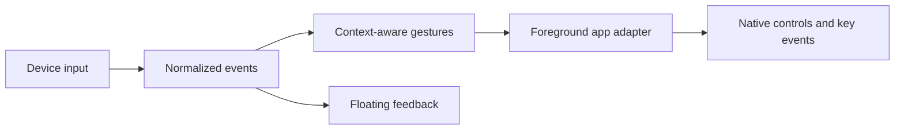

# Development / 开发指南

[Documentation / 文档目录](README.md) · [Contributing / 贡献说明](../CONTRIBUTING.md)

Use an Apple Silicon Mac with full Xcode 26 or later (macOS 26+ SDK) and Homebrew Opus for the bundled application. The source and the published 0.11.2 package target macOS 26; 0.8.4 was the last package for macOS 13+. See [Getting started](getting-started.en.md) / [快速开始](getting-started.md) to build the application bundle.

打包环境需要 Apple Silicon Mac、完整 Xcode 26+（macOS 26+ SDK）及 Homebrew Opus。源码和已发布的 0.11.2 安装包的最低系统都是 macOS 26；0.8.4 是最后一个支持 macOS 13 以上的安装包。

## Build from source / 从源码编译

Download the source from [GitHub](https://github.com/xuhao1/VibeWand), or the source archive attached to the desired [release](https://github.com/xuhao1/VibeWand/releases). The helper currently expects Opus under `/opt/homebrew`. Install the build dependency if absent, then compile the graphical application in the project folder:

从 GitHub 或对应 Release 下载源码。蓝牙组件当前使用 `/opt/homebrew` 下的 Opus；若未安装，请先准备此编译依赖，再构建：

```sh
brew install opus
bash scripts/build-app.sh
```

The script compiles a release build, copies the icon, device images and license notices, and signs the bundle. The result is **`dist/VibeWand.app`**. Open it in Finder or copy it to Applications and double-click it. The application runs from the menu bar; settings, demo, physical capture and diagnostics are available in its graphical interface.

脚本完成 Release 编译、素材与许可证打包和签名，生成 **`dist/VibeWand.app`**。在 Finder 中打开，或复制到「应用程序」后双击；设置、演示、采集与诊断均通过图形界面操作。

The default build targets the build Mac's architecture. The published 0.11.2 package is **arm64 / Apple Silicon**, requires macOS 26+, uses ad-hoc signing, and is not Apple-notarized. The bundled microphone-helper build currently targets arm64, so this packaging flow does not support Intel.

默认编译面向构建机器的架构。已发布 0.11.2 为 **arm64 / Apple Silicon**，要求 macOS 26+，临时签名且未公证；当前麦克风组件固定编译为 arm64，此打包流程不支持 Intel。

## Command kernel / 命令内核

`scripts/build-app.sh` calls `scripts/build-kernel.sh`, which assembles `output/kernel` and copies it into the app as `Contents/Resources/kernel`. It downloads the official Node.js 24.21.0 for Apple Silicon and the packages locked in `kernel/package-lock.json`, checks each against a pinned digest, runs no package script, and then starts the result once (`kernel/smoke.mjs`) before publishing it. An unchanged kernel is reused from `output/kernel`. Set `VIBEWAND_SKIP_KERNEL=1` to build without it; command mode then reports that the build has no kernel.

`scripts/build-app.sh` 会调用 `scripts/build-kernel.sh` 组装 `output/kernel`，并复制到应用的 `Contents/Resources/kernel`。它下载官方 Node.js 24.21.0（Apple Silicon）和 `kernel/package-lock.json` 锁定的包，逐一核对固定的摘要，不运行任何包脚本，并在发布前实际启动一次（`kernel/smoke.mjs`）。内容未变时复用 `output/kernel`。`VIBEWAND_SKIP_KERNEL=1` 可以不带内核构建，命令模式会提示此版本没有内核。

The kernel is DeepSeek Harness driven over the Agent Client Protocol, and what it runs is one bundle, `kernel/coordinator`: a manifest and a patch file that is the complete plugin tree (model adapters, a session and picture store, the protocol bridge, and no tools of its own). The harness VibeWand ships and a harness the user installed load that same bundle; `Harness` (`Sources/WandAgent/Harness.swift`) describes either one and writes the same profile for both. The shipped kernel is assembled from the bundle's own `dependencies`, with the bundle installed as a package among them (`kernel/package.json`, `install-links` in `kernel/.npmrc`), so the tree a unit test reads is the tree that ships. What differs is the profile's patch, written at each start: for the shipped harness one row of the multi-provider adapter (`dsh-llm-pi-ai`, which speaks OpenAI Chat Completions, OpenAI Responses and Anthropic Messages) that reads the chosen `ModelRoute` from `VIBEWAND_ROUTE`, with the key in `VIBEWAND_MODEL_KEY`, neither written to disk; for an installed harness the model rows of the user's own profile, copied as they stand. The model's reach is the catalog in `Sources/WandAgent/Tools.swift`, served to the kernel over a Unix socket that admits only the kernel's own child processes:

内核是经 Agent Client Protocol 驱动的 DeepSeek Harness，它跑的是同一个 bundle：`kernel/coordinator`，一份清单加一个补丁文件，补丁就是完整的插件树（模型适配、会话与图片存储、协议桥，没有任何自带工具）。VibeWand 自带的那份 Harness 和用户自己安装的 Harness 加载的是同一个 bundle；`Harness`（`Sources/WandAgent/Harness.swift`）描述其中任何一个，并为两者写出同样的 profile。自带的内核就是按这个 bundle 自己的 `dependencies` 组装的，bundle 本身也作为其中一个包装进去（`kernel/package.json`，`kernel/.npmrc` 里的 `install-links`），所以单元测试读到的树就是发布出去的树。两者的区别只在 profile 的补丁，每次启动时写：自带的那份是一行多服务适配组件（`dsh-llm-pi-ai`，支持 OpenAI Chat Completions、OpenAI Responses 和 Anthropic Messages），它从 `VIBEWAND_ROUTE` 读选定的 `ModelRoute`，密钥在 `VIBEWAND_MODEL_KEY`，两者都不写入磁盘；用户安装的那份是从用户自己的 profile 里原样抄来的模型行。模型能做的事以 `Sources/WandAgent/Tools.swift` 的工具表为限；这些工具经一个 Unix 套接字提供给内核，只接受内核自己的子进程连接：

| Tools / 工具 | Purpose / 作用 |
| --- | --- |
| `list_targets`, `find_sessions`, `open_session`, `search_in_app`, `activate_app` | Apps and chats / 应用与会话 |
| `choose`, `finish`, `need_user` | Asking the user and ending a task / 询问用户与结束任务 |
| `ui_snapshot`, `ui_press`, `ui_key`, `ui_menu`, `ui_type` | The front window, through its accessibility tree. A snapshot leads with what is new or changed since the one before, reads what the app announces as a status line, and marks the control the app's adapter knows as its model picker; a key can be sent to one control, one press for each call, and the answer carries what the app then announced / 经辅助功能控件树操作前台窗口。快照把上一次之后新出现或变了的排在最前，读应用播报的状态行，并标出适配里认得的模型选择器；按键可以发给指定的控件，一次一下，返回里带上应用随后播报的内容 |
| `ui_screenshot`, `ui_click` | A picture of the window being operated, with the snapshot's ids marked on it and the text read in it on this Mac listed line by line; and a pointer click on one of those lines, on a control of the snapshot or on a point of the picture, answered with the window as it then stands. Mounted only when the user turned on “Let the model see the window and click in it”. This is how a window that publishes no controls is operated; a snapshot of one says so / 被操作窗口的截图，标着快照里的编号，并逐行列出在本机从图里认出的文字；以及用指针点击其中一行、快照里的一个控件或图上的一个位置，返回点击之后的窗口。只有用户打开“让模型看窗口截图并点击”时才挂载。不提供控件的窗口靠这两个工具操作，对这种窗口的快照会直接这样提示 |

Whether a tool call waits for the user is decided in `Gateway` from the permission mode (`PermissionMode`): every call that changes something, only those the host judges risky, or none. The host (`CommandTools.confirm`) words the question and knows what is risky.

一次工具调用要不要等用户，由 `Gateway` 按权限档位（`PermissionMode`）决定：每个有改动的调用都问、只问宿主判定有风险的、或都不问。问题的措辞和“什么算有风险”在宿主一侧（`CommandTools.confirm`）。

**Plugin mode** is that bundle on a DeepSeek Harness the user installed. `scripts/build-app.sh` copies `kernel/coordinator` and `kernel/overlay` into the app as `Contents/Resources/harness/`, apart from any package folder so that an installed harness resolves what they name from its own installation. `Harness.installed` finds the harness's `dsh` command; `launch` asks nothing of it but its version, writes the profile `vibewand` into the harness's home (a manifest naming the bundle, a link to it, and the model rows) and starts `dsh --profile vibewand` there. The manifest's `peerDependencies` on `@deepseek-ai/dsh` and its `engines.dsh` declare the versions in `Harness.verified`; the harness enforces the first. To add a version: run `KernelLiveTests` and the `plugin` scenarios below against that harness, then add it to `Harness.verified` and to both fields of `kernel/coordinator/package.json` and `kernel/overlay/package.json` as an `a || b` range. A unit test fails when they disagree or when the bundle mounts a package it does not list.

**插件模式**就是这个 bundle 跑在用户自己安装的 DeepSeek Harness 上。`scripts/build-app.sh` 把 `kernel/coordinator` 和 `kernel/overlay` 复制到应用的 `Contents/Resources/harness/`，放在任何包目录之外，这样用户的 Harness 会从它自己的安装里解析它们点名的包。`Harness.installed` 找到 Harness 的 `dsh` 命令；`launch` 只向它询问版本，把 `vibewand` 这个 profile 写进 Harness 的目录（一份指向 bundle 的清单、一个指向它的链接，以及模型行），再在那里启动 `dsh --profile vibewand`。清单里对 `@deepseek-ai/dsh` 的 `peerDependencies` 和 `engines.dsh` 声明的就是 `Harness.verified` 里的版本，前者由 Harness 强制执行。新增一个版本：先用那个 Harness 跑通 `KernelLiveTests` 和下面的 `plugin` 场景，再把它加进 `Harness.verified`，并以 `a || b` 的范围写进 `kernel/coordinator/package.json` 和 `kernel/overlay/package.json` 的两个字段。几处不一致，或 bundle 挂了清单之外的包，单元测试会失败。

**The harness's own tools.** With `Harness.Tools.all`, which the user can choose in plugin mode only, the profile names the harness's base bundle, its protocol bundle and `kernel/overlay` instead of the coordinator. The overlay restates three rows: the model choice, VibeWand's system prompt and the session title. The harness's sandbox is set from the permission mode through `DSH_PERMISSION_MODE` (`PermissionMode.sandbox`), and what it asks over the protocol is answered by `Gateway.approve`, the same place every other confirmation comes from.

**Harness 自己的工具。**选了 `Harness.Tools.all`（只有插件模式下用户才能选）时，profile 点名的是 Harness 的基础 bundle、它的协议 bundle 和 `kernel/overlay`，不再是协调器。overlay 只重写三行：模型选择、VibeWand 的系统提示词和会话标题。Harness 的沙箱由权限档位经 `DSH_PERMISSION_MODE` 设定（`PermissionMode.sandbox`），它经协议发来的询问由 `Gateway.approve` 回答，与其余所有确认出自同一处。

**Conversations.** A conversation is the kernel's session, kept in its store and named in VibeWand's preferences (`CommandConversation`). `CommandController` lets the kernel process go after five idle minutes and resumes the session on the next command (`session/resume`) while the user's retention setting and the context allow it; a session that cannot be resumed is replaced by a new one. In the shipped harness's store, which nothing else reads, sessions other than the kept one are removed at start.

**对话。**一段对话就是内核的一个会话，存在它的会话库里，名字记在 VibeWand 的偏好设置里（`CommandConversation`）。`CommandController` 在内核进程空闲五分钟后让它退出，下一条命令到来时，只要用户设定的保留时长和上下文还允许，就把这个会话接上（`session/resume`）；接不上的会话由新的代替。自带那份 Harness 的会话库没有别的程序读，启动时会删掉其中不再保留的会话。

To change the kernel version, edit the versions in `kernel/coordinator/package.json` and `kernel/package.json` and the launcher pin in `scripts/build-kernel.sh`, then refresh the lock with `npm install --package-lock-only --ignore-scripts` in `kernel/`. `HarnessTests` in `Tests/WandAgentTests` fails if a row names a package the bundle does not list, or if the lock no longer holds what the bundle lists.

更换内核版本时，修改 `kernel/coordinator/package.json` 和 `kernel/package.json` 里的版本，以及 `scripts/build-kernel.sh` 里的启动器版本与摘要，再在 `kernel/` 中用 `npm install --package-lock-only --ignore-scripts` 刷新锁文件。某一行点了 bundle 清单之外的包，或锁文件里不再有 bundle 列出的包时，`Tests/WandAgentTests` 里的 `HarnessTests` 会失败。

**The model that listens** (0.11.0). With “One model” chosen under Hearing and speaking, the kernel's model is the voice service's Omni model, which is reached over a Realtime WebSocket and not a chat endpoint. Nothing in the harness changes for it. `ModelEndpoint` (`Sources/WandAgent/ModelEndpoint.swift`) serves `POST /v1/chat/completions` on the loopback interface to whoever presents a key made when it opens; `ListeningModel` (`Sources/VibeWandBridge/ListeningModel.swift`) hands the kernel a `ModelRoute` to that address, and either harness is started on it exactly as on any other route, with `Harness.launch(…, hearing: true)` adding the rules for a model that hears and speaks to the system prompt. Each request the kernel makes there is carried out in a `QwenRealtimeConversation` (`Sources/SpeechInput/QwenRealtimeConversation.swift`): the system prompt becomes the session's instructions, the tools its functions, and the message the app said a recording belongs to is preceded by that recording, so the model has both the audio and the recogniser's reading of it (given the audio alone, it took a spoken “date” for “git”; given a wrong reading beside a clear recording, it acted on the recording). A Realtime session keeps the function calls it made itself and refuses ones it is only told about. So while a turn's tools run the session is kept, and the next request adds their results to it; a request that does not continue that session (a new turn, a retry, a session the service closed meanwhile) opens a new one and tells it the conversation so far as lines, each earlier tool call as a record of what it returned. The model's words go back to the kernel as the reply; its speech goes to `SpeechOutput` and never through the kernel. What VibeWand itself says while that model is in use, a question to confirm or a result the model did not voice, is said by the same model: `QwenRealtimeConversation.say` opens a session with nothing in it but the user's request to say the quoted line. Asked that way it said every line as written, 92 times of 92; told in its instructions to read lines out, it had answered five of fourteen instead. Beside a model with no voice the line is read by `QwenSpeechSynthesis` (`Sources/SpeechInput/QwenSpeechSynthesis.swift`), the voice service's `qwen-audio-3.1-tts-flash`, asked over HTTP at the same host for the whole clip. The voices of both models are listed in `SpeechVoice`, and the `set_voice` tool, mounted only while one of them speaks, lets the model change to another when the user asks; a session opened in the old voice then says nothing more, and what the command ended with is said in the new one. The recording comes from the dictation engine, which for such a command finishes on the recogniser's reading and keeps the audio (`DictationEngine.listening`, `audio`); `SpeechAPICheck --listen …` shows how soon after release that reading arrives. Measured on the service rather than documented by it: one piece of about 190 KB was accepted by a session and one of 395 KB closed it, so a tool result is cut to 60,000 characters; a conversation of 126,000 tokens was accepted, hence the 120,000 the route declares; the model takes no pictures over this route.

**会听的模型**（0.11.0）。「听与说」里选“一个模型”时，内核用的模型就是语音服务的 Omni 模型，它走的是 Realtime WebSocket，不是聊天接口。Harness 这边什么都不用改。`ModelEndpoint`（`Sources/WandAgent/ModelEndpoint.swift`）在本机回环地址上提供 `POST /v1/chat/completions`，只回答出示了它启动时生成的密钥的调用方；`ListeningModel`（`Sources/VibeWandBridge/ListeningModel.swift`）把指向这个地址的 `ModelRoute` 交给内核，两种 Harness 都按任何别的模型服务那样启动，`Harness.launch(…, hearing: true)` 只是在系统提示词里加上“能听、会说”的那几条规则。内核向这个地址发的每个请求，都在一个 `QwenRealtimeConversation`（`Sources/SpeechInput/QwenRealtimeConversation.swift`）里完成：系统提示词成为会话的指令，工具成为它的函数；应用登记了录音的那条消息前面会放上这段录音，于是模型既有音频、也有识别器对它的读法（只给音频时，它把说出来的“date”听成了“git”；录音清楚而读法写错时，它按录音做）。Realtime 会话只认它自己发起的函数调用，别人转述的调用它不接受。所以一轮里工具运行期间会话一直留着，下一个请求只把结果交回去；接不上这个会话的请求（新的一轮、重试、会话被服务关掉了）就新开一个，把到目前为止的对话逐行讲给它，更早的每次工具调用讲成一条“调用了什么、返回了什么”的记录。模型说的字作为回复交回内核；它的语音交给 `SpeechOutput`，不经过内核。这个模型在用时，VibeWand 自己要说的话（待确认的问题、模型没有说出口的结果）也由它来说：`QwenRealtimeConversation.say` 单开一段会话，里面只有用户请它说出引号里那句话的一个请求。这样问，92 次里每次都照原话说了；写进指令让它朗读时，十四句里有五句被它当成问题回答了。旁边是不出声的模型时，这句话由 `QwenSpeechSynthesis`（`Sources/SpeechInput/QwenSpeechSynthesis.swift`）读：语音服务的 `qwen-audio-3.1-tts-flash`，在同一个主机上用 HTTP 取回整段音频。两个模型的音色列在 `SpeechVoice` 里；`set_voice` 工具只在其中一个出声时才挂上，用户开口要换时模型用它换成另一个，旧声音开的那段会话不再出声，命令的结果改用新声音说。录音来自听写引擎：这类命令松开后只等识别器出字，并把音频留下（`DictationEngine.listening`、`audio`）；`SpeechAPICheck --listen …` 可以看松开后多久出字。以下是在服务上量出来的，不是它文档里写的：一次发给会话约 190 KB 可以，395 KB 会让连接被关掉，所以单个工具结果截到 6 万字；12.6 万 token 的对话被接受了，所以路由声明的上下文是 12 万；这条路上模型不能看图。

**SenseVoice.** `kernel/package.json` also lists the harness's SenseVoice plug-in (`@deepseek-ai/dsh-experimental-speech-to-text-sensevoice`) and the service definition its recogniser imports. No row of the coordinator names them, so the harness never loads the plug-in and command mode never starts it. Dictation does: `Harness.speech` says where the shipped harness keeps the plug-in's `lib/worker.js` and `runtime/assets.json`, and `SenseVoice` (`Sources/SpeechInput/SenseVoice.swift`) starts that worker on the kernel's Node with the arguments and environment the plug-in's own host gives it, then posts recordings to it over the loopback interface. The models are not shipped: they are looked for in an installed harness's home and in VibeWand's own folder (`Harness.speechData`), and fetched on request from the addresses the plug-in pins. `SpeechAPICheck senseVoice <node> <plug-in folder> <model folder> <audio-file>` runs the same service on an audio file, and `VIBEWAND_SENSEVOICE_LIVE=<plug-in folder> swift test --filter SenseVoiceTests` fetches the two small model files from the hub for real and takes one of them up again from half way; see [Voice input](voice-input.md).

**SenseVoice。**`kernel/package.json` 里还列着 Harness 的 SenseVoice 插件（`@deepseek-ai/dsh-experimental-speech-to-text-sensevoice`）和它的识别程序要导入的服务定义。协调器没有任何一行点到它们，所以 Harness 不会加载这个插件，命令模式也不会启动它。用它的是听写：`Harness.speech` 给出自带那份 Harness 里插件的 `lib/worker.js` 和 `runtime/assets.json` 在哪，`SenseVoice`（`Sources/SpeechInput/SenseVoice.swift`）用内核的 Node 启动这个 worker，参数和环境与插件自己的宿主给它的一样，再经本机回环地址把录音交给它。模型不随应用分发：先到用户安装的 Harness 的目录里找，再到 VibeWand 自己的目录里找（`Harness.speechData`），没有时按插件固定的地址下载，由用户点按钮触发。`SpeechAPICheck senseVoice <node> <插件目录> <模型目录> <音频文件>` 用同一个服务识别一个音频文件；`VIBEWAND_SENSEVOICE_LIVE=<插件目录> swift test --filter SenseVoiceTests` 真的从 Hugging Face 下载那两个小的模型文件，并把其中一个从一半处续传。见[语音输入](voice-input.md)。

## Tests / 测试

For behavior changes, run the test suite with the same Xcode toolchain:

行为变更使用同一 Xcode 工具链运行测试：

```sh
swift test
```

Command mode is tested with a scripted kernel and never touches another app. One opt-in suite drives a real kernel and a real model with a stand-in for the desktop; it needs a key in the environment and an assembled kernel. It reaches DeepSeek over both its OpenAI-compatible and Anthropic-compatible protocols, and checks that a wrong key is reported in the service's words. With DeepSeek Harness installed it also runs plugin mode on it, in a harness home of the test's own (`VIBEWAND_HARNESS_APP` names the app when it is not in /Applications; `VIBEWAND_HARNESS_SETTINGS=<a profile's cordis.patch.yml>` additionally checks that the model rows of that file compose, reading it only):

命令模式用脚本内核测试，不触碰其他应用。另有一组需要显式启用的测试，用真实内核和真实模型、以假的桌面宿主运行；它需要环境变量里的密钥和已组装的内核。它分别经 DeepSeek 的 OpenAI 兼容和 Anthropic 兼容接口运行，并检查密钥错误时报出的是服务的原话。本机装有 DeepSeek Harness 时，它还会在测试自己的 Harness 目录里跑插件模式（应用不在 /Applications 时用 `VIBEWAND_HARNESS_APP` 指明；`VIBEWAND_HARNESS_SETTINGS=<某个 profile 的 cordis.patch.yml>` 另外检查该文件里的模型行能否组合，只读不写）：

```sh
bash scripts/build-kernel.sh
DEEPSEEK_VIBEWAND_DEV=… VIBEWAND_KERNEL_RESOURCES="$PWD/output" swift test --filter KernelLiveTests
```

`ListeningLiveTests` is the same kind of run for the model that listens: a real kernel on the voice service's own model, a stand-in desktop, and recordings in place of words. Each recording named is one spoken command of one conversation; the reading handed to the kernel is a mishearing on purpose unless `VIBEWAND_LISTENING_LIVE_WORDS` gives the readings (one for each recording, separated by `|`), so what gets done has to come from the audio. `VIBEWAND_LISTENING_LIVE_TOOLS=all` runs on the installed DeepSeek Harness with all of its tools, in a harness home of the test's own. It prints, for each, the tools called, how the command ended, what the model said, and how many seconds of speech it produced. The first recording is expected to say “打开备忘录” unless `VIBEWAND_LISTENING_LIVE_EXPECT` names what its tool calls must mention instead.

`ListeningLiveTests` 是同一类测试，对象是会听的模型：真实内核跑在语音服务自己的模型上，桌面是替身，交给它的是录音而不是文字。列出的每段录音是同一段对话里的一句命令；交给内核的“识别结果”故意写错，所以做出来的事只能来自音频；用 `VIBEWAND_LISTENING_LIVE_WORDS` 可以自己给出每段录音的识别结果（用 `|` 分隔）。`VIBEWAND_LISTENING_LIVE_TOOLS=all` 改在本机安装的 DeepSeek Harness 上带着它的全部工具跑，用的是测试自己的 Harness 目录。它为每一句打印调用了哪些工具、命令怎么结束、模型说了什么、生成了几秒语音。默认第一段录音说的是“打开备忘录”，说别的时用 `VIBEWAND_LISTENING_LIVE_EXPECT` 写明它的工具调用里应该出现什么。

```sh
say -v Tingting -o open.aiff "打开备忘录" && afconvert -f WAVE -d LEI16@16000 -c 1 open.aiff open.wav
VIBEWAND_LISTENING_LIVE=open.wav VIBEWAND_QWEN_ENDPOINT=wss://…/api-ws/v1/realtime VIBEWAND_QWEN_KEY=… VIBEWAND_KERNEL_RESOURCES="$PWD/output" swift test --filter ListeningLiveTests
```

A second opt-in suite, `CommandLiveTests`, runs the production runtime against real apps, in windows it opens for itself, and reads each result back from the app. Once keyboard and mouse have been idle for a few seconds it takes the screen for a few seconds per scenario, then returns it. Name the scenarios to run:

另一组需要显式启用的 `CommandLiveTests` 用生产运行时操作真实应用：在自己打开的窗口里执行，并从应用里读回每个结果。键盘和鼠标空闲几秒后，每个场景占用屏幕几秒再交还。用环境变量指定要跑的场景：

```sh
VIBEWAND_COMMAND_LIVE=textedit,keyboard,code,codex,search-claude DEEPSEEK_VIBEWAND_DEV=… VIBEWAND_KERNEL_RESOURCES="$PWD/output" swift test --filter CommandLiveTests
```

| Scenario / 场景 | Needs / 需要 | Covers / 覆盖 |
| --- | --- | --- |
| `textedit` | — | Typing, a confirmed and a refused Return, a menu item, switching apps / 输入、确认与拒绝的回车、菜单项、切换应用 |
| `permission` | — | Ask every time: typing asked about, confirmed and declined; Bypass all: Return without a question; the overlay's context line / 每步确认下输入先问，确认与拒绝各一次；跳过全部确认下回车不问；悬浮窗的上下文一行 |
| `plugin` | DeepSeek Harness installed / 已安装 | Plugin mode in a real window: typing and switching apps on the installed harness, the conversation kept in its store / 插件模式操作真实窗口：在已安装的 Harness 上输入、切换应用，对话存进它的会话库 |
| `plugin-start`, `probe` | `plugin-start`: DeepSeek Harness | The app's own way of starting plugin mode, without a key, and the model check behind “Save and test”; no window / 应用自己启动插件模式的路径（不带密钥），以及“保存并测试”背后的模型检查；不开窗口 |
| `plugin-tools` | DeepSeek Harness installed / 已安装 | The harness's own tools handed over: one command runs its shell, then types with VibeWand's tool / 交出 Harness 自己的工具：一条命令先跑它的命令行，再用 VibeWand 的工具输入 |
| `resume` | — | A conversation taken up again after its kernel process was let go / 内核进程退出后，下一条命令接上同一段对话 |
| `sight`, `plugin-sight` | Screen Recording for the test process; `plugin-sight`: DeepSeek Harness / 测试进程有屏幕录制权限；`plugin-sight` 还需已安装 DeepSeek Harness | The model reads from a picture of the test's window what its controls do not say; on the installed harness the picture is also kept in its attachment store / 模型从测试窗口的截图里读出控件里没有的内容；在安装的 Harness 上，图片还存进了它的附件库 |
| `pointer` | Screen Recording for the test process / 测试进程有屏幕录制权限 | The model finds a word in the picture of the test's document and double-clicks it; the selection is read back. The pointer is moved and put back / 模型从测试文档的截图里找到一个词并双击，读回选中的词；指针会被移动，结束后放回原处 |
| `netease`, `plugin-netease` | NetEase Cloud Music installed and signed in, Screen Recording; `plugin-netease`: DeepSeek Harness / 已安装并登录网易云音乐，屏幕录制权限；`plugin-netease` 还需已安装 DeepSeek Harness | A window that publishes no controls, operated from its picture: a playlist is searched for, opened and played, read back as the app's process sounding, then the page is paged down. It is the user's own app and account: music plays for a moment and its queue changes; playback is stopped again if it was silent before, and the app is quit if the test started it. `plugin-netease` runs on the installed harness with its own tools handed over / 不提供控件的窗口，靠截图操作：搜索、打开并播放一个歌单，读回的是它的进程开始出声，然后把页面往下翻一页。用的是你自己的应用和账号：会响一小段音乐，播放队列会变；之前没在播放的话结束时会停下，由测试启动的话会退出。`plugin-netease` 在安装的 Harness 上、连同它自己的全部工具一起跑 |
| `keyboard` | — | The keyboard command key, answering with arrows and Return; no model / 键盘命令键与方向键、回车作答；不用模型 |
| `keyboard-layout` | — | The keyboard as the device: a combination taken from the document, dictation by a held combination, other keys untouched, and a key with no modifier recorded by pressing it; no model / 键盘当设备：组合键不进文档、按住组合键听写、其他键照常，以及按一下录制一个不带修饰键的键；不用模型 |
| `code` | Visual Studio Code | Reading tabs and pressing one by name; the test offers the model no keys or typing there / 读取并按下标签页；测试在这里不给模型按键和输入 |
| `codex` | Codex running / 运行中 | Opening a chat by its link, the window's Back button / 用链接打开会话、窗口的后退按钮 |
| `codex-model` | Codex running / 运行中 | The effort and the model set in the popover of Codex's model button by spoken commands, read back from the button, and both put back; it changes the open chat's model and effort while it runs / 用说的命令在 Codex 模型按钮的弹层里改强度和模型，从按钮读回，最后都还原；运行期间会改动当前会话的模型和强度 |
| `search-codex`, `search-claude`, `search-feishu` | That app running; one per run / 对应应用运行中，每次一个 | The app's own search opened with the keywords, then the dial / 打开应用自带搜索并填词，再交给旋钮 |
| `say` | `VIBEWAND_COMMAND_LIVE_SAY` | One instruction of your choosing; a choice gets its first option, a confirmation is refused / 任意一句话；候选选第一个，确认一律拒绝 |

`VIBEWAND_COMMAND_LIVE_HOLD=20` keeps each result on screen for that many seconds before the test closes its windows. The scenarios run with the “ask when risky” permission unless they say otherwise, on DeepSeek's `deepseek-flash`; `VIBEWAND_COMMAND_LIVE_MODEL` and `VIBEWAND_COMMAND_LIVE_REASONING` (`off`, `low`, `medium`, `high`) change the model and its thinking, and `VIBEWAND_COMMAND_LIVE_RECORDS=<folder>` keeps each instruction's task record, with every tool call and what it answered, for working out why a run went as it did. `VIBEWAND_COMMAND_SETTINGS_REVIEW=<folder>` with `swift test --filter testCommandSettingsAndHistoryRenderForReview` renders the settings page and the records window from hidden views, `VIBEWAND_ONBOARDING_REVIEW=<folder>` with `swift test --filter testTheGuideRendersForReview` renders every step of the first-run guide and the keyboard layout's settings the same way, and `VIBEWAND_SENSEVOICE_REVIEW=<folder>` with `swift test --filter testSenseVoiceRendersForReview` renders SenseVoice in the voice settings and in the guide. Liquid Glass does not draw off screen, so these show layout and wording, not the finished look. The last run is recorded in [Command mode acceptance / 命令模式验收](command-acceptance.md).

`VIBEWAND_COMMAND_LIVE_HOLD=20` 让每个结果在屏幕上停留这么多秒，然后测试才关闭自己的窗口。除非场景另有说明，都在“只确认有风险的”档位下、用 DeepSeek 的 `deepseek-flash` 运行；`VIBEWAND_COMMAND_LIVE_MODEL` 和 `VIBEWAND_COMMAND_LIVE_REASONING`（`off`、`low`、`medium`、`high`）可以换模型和思考强度；`VIBEWAND_COMMAND_LIVE_RECORDS=<目录>` 把每条指令的任务记录留下来，里面有每一次工具调用和它的返回，用来弄清一次运行为什么是那样。`VIBEWAND_COMMAND_SETTINGS_REVIEW=<目录>` 配合 `swift test --filter testCommandSettingsAndHistoryRenderForReview` 用隐藏的视图渲染设置页和记录窗口；`VIBEWAND_ONBOARDING_REVIEW=<目录>` 配合 `swift test --filter testTheGuideRendersForReview` 以同样的方式渲染首次引导的每一步和键盘布局的设置页；`VIBEWAND_SENSEVOICE_REVIEW=<目录>` 配合 `swift test --filter testSenseVoiceRendersForReview` 渲染语音设置和引导里的 SenseVoice。离屏渲染画不出 Liquid Glass，这些图只能看排版和文字，不是最终的样子。最近一次运行记录在[命令模式验收](command-acceptance.md)。

## Source layout / 源码布局

`AU05Capture` emits normalized input as NDJSON and writes connection status to stderr. The CLI and GUI cannot own the AU05 simultaneously. Normal exit, SIGINT, and SIGTERM release the interface and temporary hooks.

| Location | Responsibility |
| --- | --- |
| `Sources/AU05Device` | Protocol, device discovery, direct HID lifecycle, generic HID profiles |
| `Sources/SpeechInput` | UI-independent recording, Speech SDK, network protocols, the SenseVoice recogniser on this Mac and its models, preferences, Keychain and dictation lifecycle |
| `Sources/WandAgent` | UI-independent command mode: the harness and its profile, kernel process and protocol, the coordinator's prompt, tool catalog and socket, gateway, task records, Codex chat list |
| `kernel` | The coordinator bundle (`coordinator`), the overlay for a harness's own tools (`overlay`), the shipped kernel's locked package set, the harness's SenseVoice plug-in among it, and its boot check |
| `Sources/VibeWandBridge` | App UI, gestures, application adapters, overlay, voice orchestration, text delivery, application switching, and what command mode's tools do on the desktop |
| `Sources/InputLink` | The wire between the app and its input method, and that input method's whole behaviour (`InputComposer`); Foundation only |
| `Sources/VibeWandInput` | VibeWand's input method: a palette that writes a dictation into the focused text field as it is spoken; a thin shell over `InputComposer` |
| `Sources/SpeechAPICheck` | Explicit audio-file checks of a speech API, reading credentials only from Keychain, and of the SenseVoice recogniser |
| `Sources/AU05Capture` | Command-line input capture |
| `Tests` | Protocol, lifecycle, gesture, adapter, and interaction tests |
| `profiles` | Gesture and generic HID examples |
| `docs` | Experience guide, design decisions, device setup, and engineering history |
| `site` | The project site at [vibewand.xuhao1.me](https://vibewand.xuhao1.me): one static page in both languages, published by `scripts/publish-site.sh` |

The internal `VibeWandBridge` target and the bundle identifier `org.vibewand.bridge` stay as they are, to preserve module references and existing preferences. Until 0.11.0 they were `VibeKeyBridge` and `org.vibekey.bridge`. `FormerIdentity` copies the settings kept under the former identifier at the first launch under the new one and asks a copy of the former version that is still running to quit, and a key in the Keychain under a former service name is written under the new name when it is read. The input method alone keeps its identifier, `org.vibekey.inputmethod.VibeWand`: macOS ties the user's enabling of an input method to it and lets no app enable another (see the [voice input guide](voice-input.md)). macOS grants its permissions to an identifier, so they are asked for again after that update. The app and executable are named VibeWand.

For repeatable signing, set `VIBEWAND_SIGNING_IDENTITY`. The script otherwise selects the sole Apple Development identity or uses ad-hoc signing. Ad-hoc updates can require Accessibility permission to be registered again. A successful build replaces the app and preserves the previous bundle under `dist/.previous-build.*`.

## Project site / 项目主页

`site/` is the whole site: `index.html`, `style.css`, `img/` and the films in `video/`, with no build step for the page. Both languages are in the one page as `lang="zh"` and `lang="en"` twins, so a change to the text is made twice. The images are `cwebp` conversions of files in `assets/` and `docs/images/`; the four-scene strip and the device pictures are illustrations, the overlay is an actual window capture, and the app icons come from `assets/apps/` (see its README for where they are from and whose they are). Preview with `python3 -m http.server --directory site`.

`bash scripts/publish-site.sh` copies `site/` into the public repository [`xuhao1/vibewand-site`](https://github.com/xuhao1/vibewand-site), which GitHub Pages serves as vibewand.xuhao1.me (`site/CNAME`). It publishes the working tree as it is, committed or not, and does nothing when the published copy is already the same.

The film at the top of the page is played from the site itself: `site/video/vibewand-zh.mp4` and `vibewand-en.mp4`, about 20 MB each, with the cover as the picture shown before it plays. They are made from the films in `output/promo/cut/` by `bash promo/tools/web.sh` (see `promo/README.md`) and are not kept in this repository; `site/video/` is ignored. The publishing script uploads them when they are there and leaves the published ones alone when they are not, so a checkout that never built the film can still publish the page. Under the film the Chinese page links to it on Bilibili and the English page on YouTube, never the other way round, and the READMEs' title pictures link the same way.

**The repository was opened on 2026-10-07, with 0.11.2.** Since then the page's downloads are this repository's own releases, and its footer states the license and links to the source and the documentation. The page states the released version in its download links and size, so with each release, once the release is published here, update the version, links and size in `site/index.html` and publish. Until 0.11.2 the repository was private: the download was a release of the site's repository (`gh release create vX.Y.Z -R xuhao1/vibewand-site …`), the page linked to nothing here, and at the owner's wish neither the page nor those release notes carried license terms. The releases of `xuhao1/vibewand-site` up to 0.11.2 stay where they are.

`site/` 就是整个网站：`index.html`、`style.css`、`img/` 和 `video/` 里的宣传片，页面本身没有构建步骤。两种语言写在同一页里，分别标 `lang="zh"` 和 `lang="en"`，改文字要改两处。图片是 `assets/` 和 `docs/images/` 里的文件用 `cwebp` 转出来的；四联场景图和设备图是示意图，悬浮面板是实际窗口截图，应用图标来自 `assets/apps/`（来源和归属见那里的 README）。预览用 `python3 -m http.server --directory site`。

`bash scripts/publish-site.sh` 把 `site/` 复制到公开仓库 [`xuhao1/vibewand-site`](https://github.com/xuhao1/vibewand-site)，GitHub Pages 把它作为 vibewand.xuhao1.me 提供（`site/CNAME`）。它发布的是工作区当前的样子，不管有没有提交；已发布的内容相同时什么都不做。

页面顶部的宣传片由网站自己播放：`site/video/vibewand-zh.mp4` 和 `vibewand-en.mp4`，各约 20 MB，播放前显示的是封面。它们由 `bash promo/tools/web.sh` 从 `output/promo/cut/` 里的成片转出（见 `promo/README.md`），不进本仓库，`site/video/` 已被忽略。发布脚本在它们存在时上传，不存在时保留已发布的那份，所以没有生成过成片的检出照样能发布页面。视频下方，中文页面链接到 B 站，英文页面链接到 YouTube，不要反过来；两份 README 的题图也是这样链接的。

**仓库在 2026-10-07 随 0.11.2 公开。**从那以后，页面的下载用的是本仓库自己的 Release，页脚写着许可并链接到源码和文档。页面的下载链接和大小写着已发布的版本号，所以每次发布，在这里发出 Release 之后，改 `site/index.html` 里的版本号、链接和大小并发布。0.11.2 之前仓库是私有的：下载用的是网站仓库的 Release（`gh release create vX.Y.Z -R xuhao1/vibewand-site …`），页面不链接到这里的任何东西，并且按作者的要求，页面和那些 Release 说明里都不写许可条款。`xuhao1/vibewand-site` 里到 0.11.2 为止的 Release 原样保留。

## Implementation model / 实现分层



设备负责输入事件，模板负责手势映射，应用适配器负责执行。新增设备先验证事件源；新增应用先定义身份和快捷键。配置不执行脚本、不包含凭证。

Device sources normalize input, templates map gestures, and app adapters perform operations. Verify a new event source before connecting it to app actions. Configuration does not run scripts or contain credentials.

## Xcode toolchain

If Command Line Tools cannot load SwiftUI macros, use the full Xcode developer directory for that command. The build script already chooses `/Applications/Xcode-beta.app` when present. For that installation:

```sh
DEVELOPER_DIR=/Applications/Xcode-beta.app/Contents/Developer swift build
DEVELOPER_DIR=/Applications/Xcode-beta.app/Contents/Developer swift test
```

命令行工具若缺少 SwiftUI 宏插件，请为该次命令指定完整 Xcode 路径；按实际安装位置调整。

## Optional DualSense voice / 可选手柄语音

The main app bundles the HID/Opus audio helper and its library/license. It is disabled by default. The current experimental Bluetooth microphone path requires macOS 26+ and the `gamepolicyctl` tool provided by Xcode or Command Line Tools; the downloaded app's ordinary controller input and other dictation modes do not need these developer tools. See [integration notes](dualsense-microphone-integration.md).

主包已包含音频组件、Opus 库和许可证，蓝牙语音默认关闭。当前实验路径需要 macOS 26+ 及 Xcode / Command Line Tools 提供的游戏模式工具；普通手柄输入和其他听写模式无需这些开发工具。
