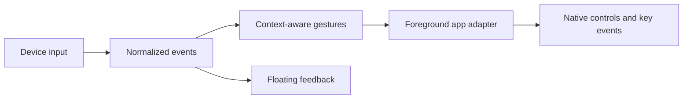

# Development / 开发指南

[Documentation / 文档目录](README.md) · [Contributing / 贡献说明](../CONTRIBUTING.md)

Use an Apple Silicon Mac with full Xcode 26 or later (macOS 26+ SDK) and Homebrew Opus for the bundled application. The main application still targets macOS 13+; the optional Bluetooth microphone helper targets macOS 26+. See [Getting started](getting-started.en.md) / [快速开始](getting-started.md) to build the application bundle.

打包环境需要 Apple Silicon Mac、完整 Xcode 26+（macOS 26+ SDK）及 Homebrew Opus。主应用最低系统仍为 macOS 13；可选蓝牙麦克风组件要求 macOS 26+。

## Build from source / 从源码编译

Download the source from [GitHub](https://github.com/xuhao1/VibeWand), or the source archive attached to the desired [release](https://github.com/xuhao1/VibeWand/releases). The helper currently expects Opus under `/opt/homebrew`. Install the build dependency if absent, then compile the graphical application in the project folder:

从 GitHub 或对应 Release 下载源码。蓝牙组件当前使用 `/opt/homebrew` 下的 Opus；若未安装，请先准备此编译依赖，再构建：

```sh
brew install opus
bash scripts/build-app.sh
```

The script compiles a release build, copies the icon, device images and license notices, and signs the bundle. The result is **`dist/VibeWand.app`**. Open it in Finder or copy it to Applications and double-click it. The application runs from the menu bar; settings, demo, physical capture and diagnostics are available in its graphical interface.

脚本完成 Release 编译、素材与许可证打包和签名，生成 **`dist/VibeWand.app`**。在 Finder 中打开，或复制到「应用程序」后双击；设置、演示、采集与诊断均通过图形界面操作。

The default build targets the build Mac's architecture. The published 0.7.0 package is **arm64 / Apple Silicon**, requires macOS 13+, uses ad-hoc signing, and is not Apple-notarized. The bundled microphone-helper build currently targets arm64, so this packaging flow does not support Intel.

默认编译面向构建机器的架构。已发布 0.7.0 为 **arm64 / Apple Silicon**，要求 macOS 13+，临时签名且未公证；当前麦克风组件固定编译为 arm64，此打包流程不支持 Intel。

## Tests / 测试

For behavior changes, run the test suite with the same Xcode toolchain:

行为变更使用同一 Xcode 工具链运行测试：

```sh
swift test
```

## End-to-end checks / 端到端检查

`scripts/dev-run.sh` builds a debug bundle, signs it with your Apple Development identity (so the Accessibility grant survives rebuilds) and starts it with `--automation-socket`. `scripts/vwctl '<json>'` then drives the same entry points the hardware uses: `{"cmd":"tap","control":"dial"}`, `{"cmd":"turn","control":"right","count":2}`, `{"cmd":"dictate","previews":["…"]}` (replayed transcript, no microphone), `{"cmd":"listen","seconds":6}` (real microphone), `{"cmd":"field"}` (read back the focused editor), `{"cmd":"ax"}` (accessibility dump) and `{"cmd":"overlay","toggle":true}`. The socket exists only with that flag, accepts the same user only, and its raw key command refuses Return, so a check cannot send a draft.

`scripts/dev-run.sh` 构建调试包、用开发证书签名（重新编译后辅助功能授权仍然有效），并带 `--automation-socket` 启动。`scripts/vwctl` 走的是与硬件相同的入口，可以注入按键、回放听写、读回输入框、导出界面结构。套接字只在带该参数时存在，仅限同一用户，原始按键命令拒绝 Return，检查过程不会把草稿发出去。

## Source layout / 源码布局

`AU05Capture` emits normalized input as NDJSON and writes connection status to stderr. The CLI and GUI cannot own the AU05 simultaneously. Normal exit, SIGINT, and SIGTERM release the interface and temporary hooks.

| Location | Responsibility |
| --- | --- |
| `Sources/AU05Device` | Protocol, device discovery, direct HID lifecycle, generic HID profiles |
| `Sources/SpeechInput` | UI-independent recording, Speech SDK, network protocols, preferences, Keychain and dictation lifecycle |
| `Sources/VibeKeyBridge` | App UI, gestures, application adapters, overlay, voice orchestration, text delivery and application switching |
| `Sources/SpeechAPICheck` | Explicit audio-file API checks, reading credentials only from Keychain |
| `Sources/AU05Capture` | Command-line input capture |
| `Tests` | Protocol, lifecycle, gesture, adapter, and interaction tests |
| `profiles` | Gesture and generic HID examples |
| `docs` | Experience guide, design decisions, device setup, and engineering history |

The internal `VibeKeyBridge` target and bundle identifier `org.vibekey.bridge` remain stable to preserve module references and existing preferences. The app and executable are named VibeWand.

For repeatable signing, set `VIBEWAND_SIGNING_IDENTITY` (the legacy `VIBEKEY_SIGNING_IDENTITY` is also accepted). The script otherwise selects the sole Apple Development identity or uses ad-hoc signing. Ad-hoc updates can require Accessibility permission to be registered again. A successful build replaces the app and preserves the previous bundle under `dist/.previous-build.*`.

## Implementation model / 实现分层



设备负责输入事件，模板负责手势映射，应用适配器负责执行。新增设备先验证事件源；新增应用先定义身份和快捷键。配置不执行脚本、不包含凭证。

Device sources normalize input, templates map gestures, and app adapters perform operations. Verify a new event source before connecting it to app actions. Configuration does not run scripts or contain credentials.

## Xcode toolchain

If Command Line Tools cannot load SwiftUI macros, use the full Xcode developer directory for that command. The build script already chooses `/Applications/Xcode-beta.app` when present. For that installation:

```sh
DEVELOPER_DIR=/Applications/Xcode-beta.app/Contents/Developer swift build
DEVELOPER_DIR=/Applications/Xcode-beta.app/Contents/Developer swift test
```

命令行工具若缺少 SwiftUI 宏插件，请为该次命令指定完整 Xcode 路径；按实际安装位置调整。

## Optional DualSense voice / 可选手柄语音

The main app bundles the HID/Opus audio helper and its library/license. It is disabled by default. The current experimental Bluetooth microphone path requires macOS 26+ and the `gamepolicyctl` tool provided by Xcode or Command Line Tools; the downloaded app's ordinary controller input and other dictation modes do not need these developer tools. See [integration notes](dualsense-microphone-integration.md).

主包已包含音频组件、Opus 库和许可证，蓝牙语音默认关闭。当前实验路径需要 macOS 26+ 及 Xcode / Command Line Tools 提供的游戏模式工具；普通手柄输入和其他听写模式无需这些开发工具。
