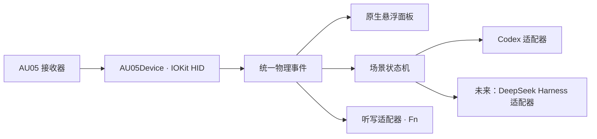

# AU05 直连方案与施工记录

> 本文保留 VibeKey Bridge → VibeWand 演进中的历史方案与实测记录；阶段计划和测试数量以记录当时为准。当前 0.5.1 的体验、统一设置和应用适配见 [核心体验](core-experience.md)。

## 目标和交互约定

去掉 Ulanzi Studio 这一运行依赖，让 AU05 的六类物理操作直接进入我们的控制器。悬浮面板显示真实按下、松开和旋转，听写键高亮不再依赖观察 Studio 注入的 Fn。

| 场景 | 旋钮短按 | 左 / 右旋 | OK | ESC |
| --- | --- | --- | --- | --- |
| 阅读 | 打开会话选择器 | 滚动 | 原生确认 | 原生取消 |
| 会话 / 模型 / 强度选择 | 确认候选 | 上 / 下候选 | 确认候选 | 返回 |
| 输入文字 | 打开会话选择器 | 左 / 右移动光标 | 保留 Enter | 删除光标前字符或选区 |

长按旋钮 0.55 秒打开模型 / 强度入口；长按 ESC 发送原生 Escape。旋钮按住期间转动，不在松手时追加一次点击。未知弹窗、输入法组词、失去目标焦点时保留保守策略。麦克风键按住 / 松开对应豆包的 Fn 听写，属于独立的听写适配器；USB 音频设备保持由系统管理。

## 为什么采用独立设备层

官方插件 SDK 连接 Studio 的 WebSocket，不能替代 Studio 直接访问硬件。当前原型已经验证了交互状态机、悬浮 UI 和左右光标移动；继续补 Studio 的 Fn 观察不能解决依赖链问题。

本机接收器枚举结果：VID `0xFFF1`、PID `0x00DD`。只连接 Usage Page `0xFFFC` / Usage `1` 的 vendor HID 接口，报告长度 64 字节。另一个 Consumer 接口以及 USB 音频接口均不打开、不独占。协议来自公开的 MIT 社区实现，并非厂商正式承诺的硬件 API；固件兼容性需要实测。

设备模块不依赖 Codex、聊天正文、模型目录或 GUI。公开 `HIDEventSource`、`AU05Control`、`AU05Phase`、`AU05Event` 和连接状态，可被其他 macOS 客户端使用。通用 HID input value 后端通过独立 VID / PID / usage 配置接入其他设备；按键映射与协议解码分层，GUI 提供可保存的重映射。详见 [HID 配置](hid-profiles.md)。旋转每个刻度归一化成一次 `pulse`；四个可按控件使用 `down` / `up`，断线使用 `cancel`。业务模式判断和按住时长属于控制器层。

## 连接生命周期

1. 检查 Studio 是否正在运行、是否已有本程序持有设备锁，以及匹配接口数量是否为一。
2. 通过 vendor 接口发送会话握手、心跳和临时 hooks 开启请求。
3. **收到 hooks 开启确认后**才派发物理事件。写入成功不等于接管成功，提前到达的按键丢弃。
4. 每秒保持心跳；确认超时、心跳回复超时、断开、睡眠或另一应用接管时取消所有按住状态，释放我们生成的 Fn。
5. 正常退出和切换后端关闭临时 hooks，不写设备持久配置、不升级固件。异常强制结束后的固件恢复时限仍需实机验证，恢复入口为重新连接 / 重插接收器。

用户确认仅保留直连：删除 Studio 插件、旧 Socket 和快捷键监听路线。检测到 Studio 时让出 AU05 通道并提示，不自动结束其他应用。菜单保留「只采集物理事件」，默认实时直连。启用采集模式会临时接管设备按键，只显示 HUD / 事件，不向目标应用或输入法合成按键。

## 实施阶段与验收

- 第一阶段：独立 Swift 设备模块、报告解码、协议测试、`AU05Capture` 命令行采集器；验证接收器发现、接管 ACK 与六类输入。
- 第二阶段：接入现有 HUD 和状态机、真实麦克风高亮、独立 Fn down/up、断线及后端切换释放。稳定签名继续沿用当时的 `org.vibekey.bridge`（0.11.1 起为 `org.vibewand.bridge`），移除 Studio 备用模式。
- 第三阶段：封装配置、设备日志、录屏介绍和开源发布；项目不包含厂商闭源库或私钥。
- 第四阶段：实际检查 DeepSeek Harness 的可用命令和 UI / 终端接口，添加应用适配器。设备层不变，不预先假设它与 Codex 的快捷键相同。

验收清单：短按与长按、快速连续双向旋转、同时按住旋钮旋转、麦克风按住 / 松开高亮与听写、编辑草稿头尾光标、删除、选择器二次按压、睡眠唤醒、拔插、Studio 并存、切换后端、退出时 Fn 释放。自动测试覆盖协议和生命周期；真实听写和应用行为仍需用户操作确认。

## 来源与许可证

协议编解码与命令格式参考 [elliclee/ulanzi-au05-keys](https://github.com/elliclee/ulanzi-au05-keys)，固定版本 `7819351a5ba5c68874d0519fabe3bf62db47e328`。保留 [原 MIT 许可证](../third-party/AU05-Keys-LICENSE)。社区的按键索引为：0 麦克风、1 OK、2 ESC、3 旋钮按压、4 右旋、5 左旋。报告使用 ID `0x55`，公开固定协议常量不是用户账号凭证。

参考官方 [插件 SDK](https://github.com/UlanziTechnology/plugin-common-node)、[离线模式说明](https://docs.ulanzistudio.com/vibekey/faq/offline-mode.html)、[语音兼容说明](https://docs.ulanzistudio.com/vibekey/faq/voice-input-compatibility.html)。文档中的协议和示例作为技术资料，不作为额外操作授权。

## 当前记录

- 原型：用户已确认会话选择和双向光标可用；Studio 路线的麦克风高亮仍未成功。
- 直连：独立设备库与 CLI 已实现；本机接收器发现、握手与 hooks 开启 ACK 已通过。GUI 已进入直连采集模式；已实际收到旋钮按压（2 次 down/up）、左旋（6 格）、右旋（5 格）、OK（2 次 down/up）、ESC（1 次 down/up）。后续已收到麦克风 3 次 down/up，六类物理输入均已采集到。已切换实时控制，辅助功能授权有效；真实听写与应用操作仍需用户实测。
- 通用设备：标准 usage 配置、输入值解码、明确接口独占、GUI 重映射 / 配置导入已实现；其他硬件尚未实测。
- GUI：六个映射下拉框、配置导入 / AU05 恢复入口已检查；左旋映射修改后已恢复原值。
- 连接恢复：空闲后观察到确认 / 心跳超时，自动重连中；未确认是否与控制器睡眠有关，需要实体唤醒、麦克风及空闲恢复测试。
- 自动化：39 项 Swift 测试通过，涵盖协议、通用 HID、重映射、物理 HUD 与原有交互逻辑。

## 0.2.1 编辑删除修复

用户确认直连输入和光标移动正常，要求在移动光标时用底部 ESC 删除。原实现因为豆包未暴露组词元数据，将短按 ESC 退回 Escape；这与同时允许左右移动光标的规则不一致。现统一编辑判断：已识别输入框、无选择器 / 弹窗、无已识别输入法候选时允许光标移动与删除。组词状态元数据未知本身不禁止删除；真实候选和弹窗仍取消，长按 ESC 保留原生 Escape。

## 0.3.0 可配置手势

用户进一步指定：旋钮双击打开 macOS 应用切换，旋转选择其他程序；所有单击、双击、长按与旋转以现有规则为默认，可按场景配置。新增纯手势识别器、原生配置窗口、JSON 导入导出和 Cmd 修饰键清理。空草稿（即使输入框仍有焦点）上下滚屏，有字则移动光标；删除已由用户确认可用。模型菜单加入独立弹出菜单检测与标准系统按键投递，尚需用户复测。完整默认规则见 [手势配置](gesture-configuration.md)。

- 0.3.0 实机：用户已确认旋钮双击打开应用切换、旋转选择、单击确认可以完成。配置窗口与场景覆盖即时保存已检查。57 项自动测试通过；空草稿滚屏与模型菜单导航继续等待实机反馈。
