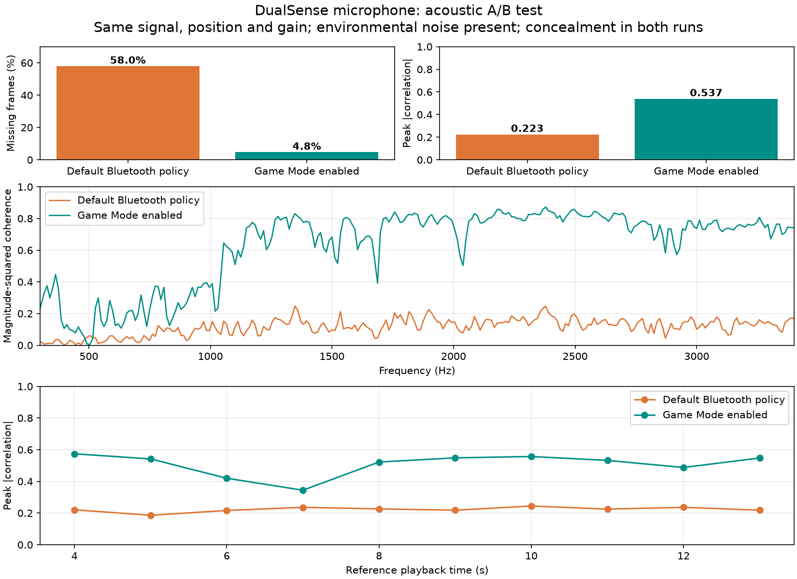
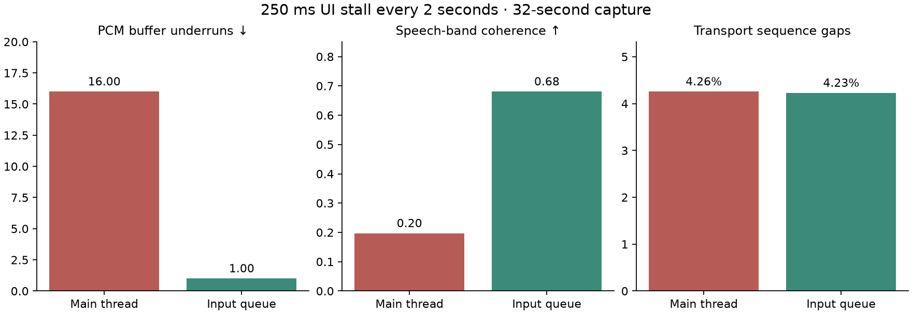

# DualSense 蓝牙麦克风适配调查

日期：2026-10-04。设备：普通 DualSense `054c:0ce6`，Mac 内置蓝牙，macOS 27.0（26A5378j）。

## 结论与完成边界

**已实现本机实验版系统麦克风，并通过声学回环及 Core Audio 实际读取验证。主要瓶颈与 macOS 的蓝牙调度策略有关：同条件对照中，启用游戏模式后，应用层缺帧从 58.0% 降至 4.8%。残余缺帧仍由 Opus 补偿，不能称为无损或已达到正式发布质量。**

实验程序为 `output/dualsense-mic/VibeWand Mic.app`，系统输入名称为 **VibeWand DualSense Mic**。使用方法、限制与构建说明见 [实验版说明](../tools/dualsense-mic/bridge/README.md)。以下保留最初调查和失败试验，最新结果在文末。

本次查阅 Windows 开源实现和跨平台协议源码，并对本机 Apple HID 插件做了导入符号、字符串、工厂选择逻辑检查。没有取得或反编译 Sony 闭源 Windows 驱动，也没有在 Windows 上运行对照试验。用户的 Windows 电脑暂时不可访问。

这不是把 Windows `.sys` 文件直接加载到 Mac。可移植部分是音频控制封包、报告分类、CRC、Opus 解码、缓冲与时钟处理；设备访问和系统音频端点需要分别适配 macOS。

## 一手实现证据

- [Windows DS4Windows 的音频实现说明](https://github.com/hbashton/DS4Windows/blob/36502408cbba17fd20d84e6b258f2258714a39c6/docs/dualsense-bluetooth-audio-haptics.md)：蓝牙麦克风数据经应用处理，送到 VIIPER 提供的虚拟 USB 音频输入。[DualSenseDevice.cs](https://github.com/hbashton/DS4Windows/blob/36502408cbba17fd20d84e6b258f2258714a39c6/DS4Windows/DS4Library/InputDevices/DualSenseDevice.cs)明确区分音频与手柄状态包，使用 71 字节麦克风载荷。
- [DS5Dongle](https://github.com/awalol/DS5Dongle/tree/c67c7f685fe8d8cc44f519d27710c5a639a1be7d)：`src/main.cpp` 按音频标志分流输入，`src/audio.cpp` 实现控制与 Opus 解码，再通过 USB Audio 交付给主机。其外部桥接器实现证明了无线协议，不等于 Mac 内置蓝牙已经兼容。
- [LinuxAudio4Dualsense5](https://github.com/GeorgLegato/LinuxAudio4Dualsense5/tree/54c543ad78e17dd957d71051a5950327c09bb499)：提供 Linux 用户态接收和 PipeWire 输入实现，并明确记录音频包与游戏手柄解析发生冲突的问题。
- [Mac dualsense-bridge 的调查](https://github.com/tomarai85/dualsense-bridge/blob/9472c8aebcba7c21b0e3a87c2423593c80f66b98/docs/MIC-RESEARCH.md)：给出 `0x32` 启用封包、独立写线程及虚拟音频路由方案。本机复现了收包与解码，但不能据该项目的“持续运行”描述推断本机已经达到完整语音采样率。
- [Sony 官方说明](https://www.playstation.com/en-us/support/hardware/pair-dualsense-controller-bluetooth/)把内置麦克风的支持限定为 Windows 上受支持的游戏。这段表述本身没有充分证明普通 Windows 蓝牙连接会自动创建麦克风；需要把连接方式和具体驱动分开检查。

## 已复现的封包

HID 层数据不包含蓝牙 HIDP 前导字节；不要把 L2CAP 抓包的偏移直接用于 IOHID。

| 项目 | 当前验证值 |
|---|---|
| 麦克风启用输出 | `0x32`，142 字节 |
| 控制片段 | 偏移 2 为 `0x91`，偏移 3 为 `7` |
| 启停 | 偏移 4 为 `0xff` / `0xfe`；偏移 5–9 为 64 |
| 输出校验 | 标准 CRC32，输入为前导 `0xa2` 加前 138 字节，末尾小端存储 |
| 输入报告 | `0x31`，78 字节 |
| 音频标志 | 偏移 1 的 bit 1；即使 bit 0 同时存在，也优先认作音频 |
| 麦克风包序号 | 偏移 2，8 位循环 |
| Opus 载荷 | 偏移 3 开始，71 字节 |
| 输入校验 | 前导 `0xa1` 加前 74 字节，末尾小端 CRC32 |
| 本机解码 | 48 kHz、单声道，每帧 480 个样本，即 10 ms |

这条路径是 Sony 的 HID 音频封包，不需要先让手柄成为 HFP 耳机。静音按钮事件仍不能替代真正的音频载荷验证。

## 本机结果

最初探针阶段的统计位于 `output/dualsense-mic/`；该阶段没有保存语音 PCM 或完整音频包。后续按用户要求做的本地录音与回环见文末，均未上传。

| 测试 | 结果 |
|---|---|
| 最初只读基线，4 秒 | 255 个正常状态包，无音频包 |
| 第一次启用，约 6 秒 | 254 个音频包，254 个成功解码，CRC 和解码错误均为 0，非零信号 |
| 带序号测量 | 6.060 秒收到 253 帧，解码时长 2.530 秒；序号显示缺少 349 帧，约 58% |
| 写入间隔降到 10 ms | 实际包含同步写耗时；约 9.015 秒只收到 381 帧，仍有大量序号缺口 |
| 读取扩展模式校准报告后 | 6.045 秒收到 246 帧，无改善 |
| 设置内置麦克风路由和音量后 | 6.015 秒收到 252 帧，振幅提高，但收包速率无改善 |
| 物理重连后，普通 HID 路径 | 4 秒收到 244 个正常状态包，音频已关闭 |
| 同次重连后，显式加载通用 IOHIDLib | 4 秒收到 246 个正常状态包，音频已关闭 |
| 清理后的交付探针复测 | 音频活动 6.000 秒，249 帧全部解码，CRC/解码错误均为 0；仅有 2.490 秒 PCM，缺少 348 个序号位置（58.29%），返回退出码 8 |
| 最终关闭后只读验证 | 4.033 秒收到 264 个正常状态包，0 个音频包；退出码 0 |

收到的音频包没有 CRC 错误，但麦克风序号不连续。普通报告的四位发送序号在已观察区间内连续。这提示需要检查更底层的发送调度/蓝牙参数；**尚不能确定缺帧发生在手柄、无线链路还是 macOS 蓝牙栈，也不能据此声称 Mac 硬件永久只能达到 64 Hz。**

检查发现设备的 IORegistry 插件映射包含 `GCHIDLib`。显式加载 `IOHIDLib` 的恢复后对照仍约 61–62 Hz，不能支持“只需绕开游戏控制器兼容层即可修复”的假设。

曾尝试通过 IOBluetooth 查看/附加已有 HID interrupt L2CAP 通道：没有取得原始回调，随后手柄停止上报。程序关闭及软件重连未恢复完整 HID 会话，用户物理关机重连后恢复。该通道试验不属于交付的探针，不应在日常桥接程序中复用。连接中断期间得到的零报告结果不用于判断通用 HID 的可行性。

## 已交付的开发工具

见 [tools/dualsense-mic](../tools/dualsense-mic/README.md)。默认只读；显式启用才会做短时麦克风试验。探针使用独立写线程、独占打开、CRC 验证、音频与状态包分类、Opus 解码以及序号缺失统计。退出时串行发送关闭包，再释放设备。

离线测试覆盖独立 CRC 固定值、音频与状态标志同时置位、非法长度、损坏数据及合成 Opus 往返。没有改动 VibeWand 的正常输入后端，也没有安装 HAL 插件、修改系统保护或切换默认麦克风。

## 接下来的适配与验收

1. **Windows 同硬件对照。** 先分别用 USB、系统普通蓝牙、已开启蓝牙麦克风的 DS4Windows 记录驱动服务/INF、报告率、音频序号和单位时间样本量。提供了只读 `windows-inventory.ps1` 用于定位驱动；尚未运行。对照时保持同一只手柄、同固件和类似距离。若 Windows 也低速，不能继续把原因单独归于 Mac。
2. **定位接收量不足。** 比较启用前后的蓝牙连接参数和 HID 控制交换；先要求稳定的音频序号和接近实时的解码样本量。丢包补偿可以处理偶发缺口，不能把约 58% 缺帧包装成修复。
3. **实现 Mac 音频端点。** 在传输通过后，将 Opus PCM 经有界缓冲和时钟校准接入系统输入。补充调查发现还可用 Core Audio process tap + aggregate device 实现用户态输入，不必一开始就安装自定义 HAL 插件；HAL 插件或已有虚拟音频设备仍是备选。需要验证输入应用能选中并持续录音；目前没有做这一步。
4. **整合手柄操作。** 独占模式目前会暂停原生手柄导航。正式整合要由同一读取端区分音频与按键，再向 VibeWand 交付正常控制事件，不能让音频字节进入摇杆解码。需要验证同时说话/按键、静音、按住说话、断线、睡眠和恢复。
5. **最终验收。** 至少连续录音 60 秒并核对时长和缺帧率，由用户读句子验证可懂度；确认停止后无音频上行、原有控制正常、系统输入可恢复。当前只通过了协议与短时接收验证。

## 网络补充调查：连接协议与已有解决方法

这一阶段仅检查网络资料和源码；随后经用户指示进行了文末记录的适配与实物试验。

### 官方未支持的原因与本机缺帧要分开

Sony 的兼容页没有披露为什么 Mac 不支持内置麦克风。私有 HID 音频需要显式启用、分流、解码和发布音频端点；系统能够识别手柄按钮，不代表实现了这些步骤。这是可以从公开实现确认的技术要求，不能倒推为 Apple/Sony 的内部决策理由。

本机约 58% 是**应用可见的麦克风序号缺帧率**，不是已经测出的无线空中丢包率。接收到的报告校验正确不能排除无线丢包；缺失可能出现在手柄发送调度、无线传输、主机栈或接收队列。约 64 reports/s 也是本次连接的观测值，不能描述成 Bluetooth HID 标准上限。

### 新线索：Sniff 省电调度

[punktfunk 的 webOS 实测记录](https://github.com/punktfunk/client-webos/blob/main/docs/NOTES.md#dualsense-audio-over-bluetooth-sniff-mode-is-the-whole-problem)报告：LG G5 上 DualSense 音频输出断续，手柄输入约每 77.5 ms 成批到达；退出 Sniff 并定期维持后，观察到约 400 reports/s。[pad_link.rs](https://github.com/punktfunk/client-webos/blob/main/src/platform/webos/pad_link.rs)确实调用该平台的 `stopSniff` / `startSniff`，并恢复原有省电策略。

这是**其他平台的扬声器/手柄输入实测**，不是 Mac 麦克风修复证据。其平台 API 不能直接搬到 macOS，但它明确支持继续调查连接调度。[Bluetooth Core 6.1 的 Sniff 规范](https://www.bluetooth.com/wp-content/uploads/Files/Specification/HTML/Core-61/out/en/br-edr-controller/link-manager-protocol-specification.html)说明双方协商周期性收发时隙，也定义了退出到 Active 模式的流程。后续应以实际 HCI Mode Change 事件、收包时间分布和连接参数来验证，不能仅凭频率接近某个间隔就判定进入了 Sniff。前次旧 IOBluetooth 接口读取曾返回 mode 0 / interval 0，未形成当前 Mac 处于 Sniff 的证据。

### 新的 Mac 纯软件候选：ControlDeck

[ControlDeck 的蓝牙麦克风文档](https://github.com/ihansel/control-deck/blob/main/Docs/BluetoothMicrophone.md)及 Swift 实现提供了另一条可比较路径：完整麦克风状态/流控制、持续 Opus 解码、约 50 ms 抖动缓冲、丢帧补偿、进程音频 tap 和聚合输入设备。已核对相关源码，未安装或进行本机语音验收。文档的功能声明不能代替接收样本率测量。

与当前最小探针有明确可对照的差异：其 `0x32` 输出额外写入偏移 10 的序号，以及偏移 11–12 的 `0x92 0x40` 静音触觉片段；启用时还组合麦克风路由/静音状态。是否改变本机收包量尚未测试。其补帧逻辑使用四位报告序号与到达时间，本探针统计八位麦克风序号；两者不能不经验证就等同。抖动缓冲和 PLC 能处理抖动/短缺口，不能作为恢复大量未收到语音的保证。

[Apple 的 Core Audio tap 示例](https://developer.apple.com/documentation/coreaudio/capturing-system-audio-with-core-audio-taps)确认 macOS 14.2+ 可以把进程输出的 tap 作为聚合设备输入，并可静音该进程的扬声器输出。这支持用户态发布输入端点的技术路线，但**不负责修复 HID 音频传输**，且需要系统音频录制授权。

### 已有 Mac 挂起规避与边界

[hidapi #385](https://github.com/libusb/hidapi/issues/385)讨论同步 HID 写入阻塞；[SDL #8126](https://github.com/libsdl-org/SDL/issues/8126)讨论断线后大量保活写入排队造成挂起。独立写线程、限频、断线及时停止具有针对性，但这些 issue 没有证明解决了本机的持续缺帧。当前探针已分离读写线程，降低/提高保活频率均没有解决接收量不足。

优先顺序因此调整为：对照 ControlDeck 的完整初始化与分流 → 测量真实蓝牙调度及应用接收时间 → 有针对性地验证 Sniff/连接参数假设 → 传输通过后接 process tap 输入。Windows 同硬件对照仍有价值，但源码和初始化比较可在 Windows 可访问前继续。

## 已实现的实验版与声学 A/B 验证

### 实际修复和仍存在的问题

1. 完整 `0x31` 状态 + `0x32` 流初始化本身未解决缺帧。旧 IOBluetooth HCI 查询返回成功却没有更新预置的结果缓冲，因此丢弃其 mode/interval 读数，不据此判断 Sniff 状态。
2. 通过本机 Xcode 的 Apple `gamepolicyctl` 临时启用游戏模式，报告率约从 64/s 增至 128/s，接收量显著改善。[Apple 官方](https://www.apple.com/gw/newsroom/2023/06/macos-sonoma-brings-new-capabilities-for-elevating-productivity-and-creativity/)也说明游戏模式会提高蓝牙手柄采样率。录音停止后恢复捕获前的策略。该实验支持调度策略影响，但没有证明具体是 Sniff。
3. 增加持续 Opus 解码、按八位麦克风序号补偿短缺口、100 ms 预缓冲和过期数据丢弃。音频经私有用途的本程序静音输出、process tap 和公开 aggregate input 交付，不改变系统默认输入，不安装 HAL 驱动。
4. 取消首版额外三倍软件增益。首版真人录音触顶约 18.6%，用户反馈能听清但有断续/失真。后续已知信号回环几乎无削波；两次刺激不同，不能将这两个比例视作严格的增益 A/B。
5. 修复主队列信号退出时的嵌套事件循环等待问题；验证正常停止及 SIGTERM 退出会关闭 HID 音频、恢复游戏模式并移除本程序音频端点。新增单实例锁和仅针对本程序 UID 的孤立端点恢复。强制 SIGKILL/系统崩溃仍无法保证恢复游戏模式。

### 测试方法

用户将手柄放在 Mac 扬声器附近，并提示环境有噪声。使用完全相同的 21 秒刺激：静音段、300–5500 Hz 扫频、300–3400 Hz 带限伪随机信号及多音信号，固定播放音量和手柄位置。分别录制关闭与开启游戏模式的两个约 32 秒试验；两组都使用相同麦克风增益和 PLC。休眠造成的空测已作废，重连后必须先看到有效音频报告才播放。

同时保存了解码/补帧后的 PCM 和由 Core Audio 实际读出的麦克风 PCM。先用互相关对齐，再分析十个 1 秒片段的最大绝对归一化互相关、测试频段的 magnitude-squared coherence 和已知静音段的背景功率估计。互相关取绝对值，避免声学路径的相位/极性差异让相关峰的正负号被误当成质量分数。

| 指标 | 默认蓝牙策略 | 启用游戏模式 |
|---|---:|---:|
| 收到的麦克风帧 | 1338 | 3041 |
| 序号缺失位置 | 1849 | 152 |
| 应用层缺帧率 | 58.02% | 4.76% |
| 系统输入与参考信号的片段峰值绝对相关，中位数 | 0.223 | 0.537 |
| 300–3400 Hz 频谱相干性，中位数 | 0.124 | 0.742 |
| 测试信号相对背景功率的估计值 | 7.47 dB | 15.15 dB |

另外，开启游戏模式的解码 PCM 与 Core Audio 实际输出，对齐后的全段相关系数为 **0.9819**。这验证了声音确实经过系统输入端点，而不只是显示出设备名称。对齐偏移包含文件开始时间差，**不是独立测量的蓝牙延迟**。

[机器可读结果](dualsense-microphone-results.json)。原始音频留在被 Git 忽略的 `output/dualsense-mic/`，没有上传或转写。该测试仅覆盖一只手柄、一台 Mac 和一个有背景噪声的声学场景；相干性/相关性不是语音识别准确率。游戏模式下另有一分钟运输测试，缺帧约 5.18%，收到的帧无 CRC 或解码错误。

### 使用与后续边界

实验版可以让语音应用选择 **VibeWand DualSense Mic**。开启采集时独占手柄，原有手柄导航暂停；停止后恢复。它没有整合进 VibeWand 的发布版，也尚未完成休眠唤醒、各种固件和多机型的产品级验收。真人对“去掉额外增益后的新版本”的主观语音验收仍可继续；本次完成的是可复现的客观回环验证。

残余约 5% 缺帧是下一阶段的重点；PLC 只能估计缺失声音，不能恢复原始采样。后续应继续测连接时序和不同麦克风路由/固件，不能仅靠扩大缓冲或补帧把缺口统计隐藏。

## 剩余约 5% 缺帧的定位分析（2026-10-04，提交原型后）

本节重新分析既有日志与代码，没有进行新一轮硬件采集，也没有声称进一步降低缺帧率。

一分钟探针记录 `audio=5695`、`missingSequenceFrames=311`、`invalid=0`、`decodeErrors=0`；外层 HID 报告共 8185 个，8184 次相邻四位序号差全部为 1。麦克风八位序号则出现 173 次缺口：95 次缺 1 帧、42 次缺 2 帧、21 次缺 3 帧、11 次缺 4 帧、1 次缺 5 帧、1 次缺 6 帧、2 次缺 7 帧。每帧 10 ms，最长缺口 70 ms；216/311（69.5%）的缺失帧来自连续缺多帧的事件。

这使“应用收包/解码慢导致整份 HID 报告丢失”优先级降低：不保存 WAV、不发布虚拟麦克风的 C 探针也有相近缺帧，且收到的外层序号连续。更值得调查的是音频在封装/发送 HID 前的排队、覆盖或调度。但四位序号会回绕，连续并不能排除按 16 个倍数丢失，也没有控制器内部或 HCI 证据确定序号的分配时点。因此仍称应用可见音频序号缺口，不称已证实的无线丢包或 Sniff 根因。

### 优先验证的改进

1. **游戏模式下对照流控制发送节奏。** 原型每 500 ms 发送一次 0x32 控制+静音触觉报告；DS5Dongle 的 `audio_bt_task` 随输出队列持续发送音频/触觉包，其 `update_mic_status` 另有较短的麦克风开关字段。可先保持现有包字节完全一致，仅比较 500、100、30、10 ms，采用交错顺序、每档至少三次 60 秒，记录实际写入耗时。更频繁的发送可能维持活跃调度，也可能挤占上行，不能预先断言有效。既有 `fast-probe.txt` 在未开启 Game Mode 时约 30 ms 发送仍严重缺帧，不能代替组合试验。协议字段差异应作为独立试验，不能同时改多个变量，更不能直接把下行音频时钟当成麦克风时钟。
2. **先补齐逐包时序诊断。** 只记录单调时间、报告种类、外层/音频序号、有效性、Opus TOC/帧长、回调处理耗时和写入开始/结束时间，不保存语音负载。统计音频缺口与 HID 到达停顿、控制写入的时间关系、连续缺口长度以及重排。若缺口靠近控制写入，调整控制节奏；若整体到达停顿，进一步调查主机调度/链路。当前汇总日志无法做这些关联。
3. **把 HID 接收与解码/测试文件写入移出 UI 主线程。** 目前 Swift 回调在主 RunLoop，且同步写 WAV；独立串行接收与解码队列、异步有界录音队列可以减少 UI 忙时的额外缺口。C 探针也有约 5% 缺口，故不能把此改动承诺为根治。需明确单生产者所有权，避免破坏现有环形缓冲。
4. **必要时对照真实 Windows/HCI 轨迹。** 同一手柄比较麦克风序号完整度、发送节奏、链路模式变化与连接参数。只有 Windows 对照也测出更低缺帧，才有证据继续迁移差异。旧 IOBluetooth 查询“成功但不更新结果”不可信；不重复接管现有 L2CAP delegate 的破坏性实验。2.4 GHz 共存/其他蓝牙负载可作为受控环境变量，不在未经说明时关闭用户网络或输入设备。

### 能改善听感但不能自动恢复真实数据的措施

- 100 ms 缓冲用于到达抖动；把它增加至 200–500 ms 不能补回从未送达的音频，只增加延迟。已有 raw→system 相关度约 0.982，也不支持优先重写虚拟麦克风发布层。
- Opus PLC 已启用，仍是缺失内容的估计。可评估更好的 PLC，但应与真实缺帧率分别报告。
- [Opus 解码文档](https://opus-codec.org/docs/html_api/group__opusdecoder.html)与[官方解码实现](https://github.com/xiph/opus/blob/main/src/opus_decoder.c)说明 FEC 依赖编码端提供的信息；CELT-only 的常规带内 FEC 不可用。应先记录实际 TOC 模式并验证冗余，而不是直接设置 `decode_fec=1` 宣称修好。目前日志没有足够信息确认手柄带有可用 FEC。
- `ReportInterval=1000` 与关闭传感器的六秒测试分别约 3.69% 和 3.35%，样本短且没有随机交错对照，不能归因或宣布优于原型。

最优先的路线是“轻量时序记录 → 游戏模式下仅改变发送间隔的对照 → 根据关联结果调整接收线程或链路调度”。只有复测收到更多真实帧，才称为减少缺帧；补帧听感变好单独验收。

## 逐包实验与接收队列改进（2026-10-04）

新增元数据探针，记录接收时间、内外序号、Opus TOC、解码回调及控制写入耗时；不保存语音负载。游戏模式下按顺序各测 20 秒：完整控制包 500/30/100/10 ms 的缺帧率分别为 3.85%/5.21%/6.72%/5.04%；精简控制包 500/30 ms 分别为 6.40%/4.51%；最后回到完整包 500 ms 为 3.45%。这是短时筛选，未出现值得进入三次一分钟复验的优胜参数，故保留原协议和 500 ms 默认间隔。

全部有效 Opus TOC 为 `0xd4`。用 libopus 的 packet 查询函数核对：480 samples/frame、编码双声道、SWB（1104）；按 [RFC 6716 TOC 定义](https://www.rfc-editor.org/rfc/rfc6716#section-3.1)为 CELT-only。此前所称“单声道”应理解为本程序要求的解码输出，不是编码包的声道标志。不能利用常规 SILK 带内 FEC 恢复这些 CELT 包。

接收间隔中位数约 7.5 ms，外层序号仍连续；缺口并不只发生在控制包写入附近。元数据详细保存在本地 output，摘要见 [机器可读结果](dualsense-microphone-timing-results.json)。这进一步降低了优先优化解码速度的价值，没有证明 Sniff 或具体内核丢弃位置。

应用改为独立串行 IOHID 接收/解码队列，UI 通过同步快照读取统计；输出另用原有串行队列。停止先禁止新音频进入，关闭手柄音频，再取消 IOHID，等待取消回调后释放设备和解码器。保持环形缓冲单生产者约束。没有更换系统驱动或蓝牙服务。

同一测试音、同一播放音量，四轮各录 32 秒，读真正的 Core Audio 系统输入：

| 条件 | 音频序号缺帧 | PCM 缓冲断粮次数 | 相关度中位数 | 300–3400 Hz 相干性 |
|---|---:|---:|---:|---:|
| 旧主线程，每 2 秒卡顿 250 ms | 4.26% | 16 | 0.361 | 0.197 |
| 独立队列，同样卡顿 | 4.23% | 1 | 0.436 | 0.681 |
| 独立队列，正常界面 | 5.64% | 1 | 0.500 | 0.710 |
| 旧主线程，正常界面 | 4.01% | 2 | 0.494 | 0.765 |

结论是减少 UI 停顿带来的额外断音，不是把约 5% 传输缺口修好了。每条件仅一次录音，不能用正常条件的细小差别做稳定优劣判断；声学指标受房间噪声与手柄处理影响，不是语音识别准确率，也没有新的真人听感验收。四次采集均无 CRC/解码错误、序号重置或缓冲溢出，停止后恢复游戏模式并正常退出。

验证中还遇到 `AudioDeviceStart` 在“验证系统输入”按钮内阻塞。后续 TCC 日志明确显示重新编译后的临时签名与原先 AudioCapture 授权绑定的 code requirement 不匹配，不能将此直接归因于 macOS 测试版的音频服务缺陷。已将此诊断消费者隔离为有 10 秒超时的子进程，避免卡住 UI；子进程只读取本应用的公开虚拟输入，不打开 HID、不修改游戏模式或默认麦克风。超时显示验证未完成，不伪报成功。实际音频采集与四轮系统输入录制的证据独立于此按钮。

隔离后按钮复测验证了 10 秒超时后 UI 恢复可操作；签名授权失配时没有通过系统输入自检，独立消费者也超时。用户完成 Touch ID 后，将“仅系统音频录制”中的 VibeWand Mic 原有开关重新开启，并按系统提示退出重开；随后 GUI 显示“系统输入验证通过，语音应用可以读取声音”。此次恢复没有扩大权限、操作其他应用授权或重启系统音频服务。游戏模式已恢复 auto/off，默认输入仍为 AU05。

授权刷新后最终 32 秒已知音源复测：收到 3009 帧、缺 182 帧（5.70%），无 CRC/解码错误、序号重置或缓冲溢出，2 次缓冲断粮；实际系统输入录得 1,561,088 个单声道样本。相关度中位数 0.345，300–3400 Hz 相干性 0.383。正常停止、退出和游戏模式恢复均成功，实验版重新打开待机。该结果确认当前授权与整条音频路径恢复可用，仍不宣称解决基础约 5% 缺帧。
