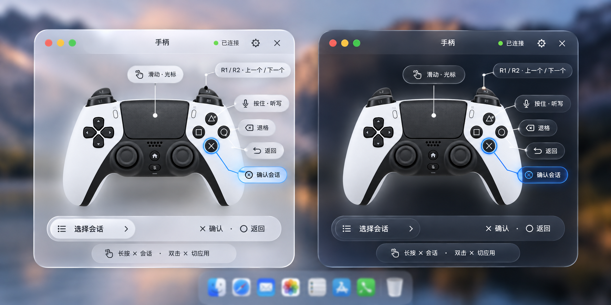

# 原生悬浮窗 / Native overlay

VibeWand 0.6.0 对照 [Apple Liquid Glass 指引](https://developer.apple.com/documentation/technologyoverviews/liquid-glass)实现悬浮窗。原生玻璃是默认材质；已经删除低能耗开关和相关偏好读取，也移除了人为绘制的彩色边框。

VibeWand 0.6.0 follows Apple's Liquid Glass guidance. Native glass is the default; the low-power option and its preference handling have been removed, along with painted color fringes.

## 构建与视图结构 / Build and view structure

- 本机 macOS 27.0、Xcode 27.0。修正 Swift Build 链接参数后，最终 Mach-O 标记为最低系统 13.0、SDK 27.0；打包脚本在签名前校验实际 SDK，避免再次错误标记为 13.0。
- 设备图、提示、按钮放入 `NSGlassEffectView.contentView`，玻璃不再作为空的兄弟背景视图。
- 使用标准 `regular` 材质，完整面板与语音条由 `NSGlassEffectContainerView` 分组，共享背景采样。标签使用普通透明填充，避免叠玻璃。
- 系统明暗外观和减少透明度设置正常生效。旧系统使用原生兼容材质；这不是用户可切换的低能耗模式。

The machine runs macOS/Xcode 27.0. Explicit SDK/linker settings now produce minimum OS 13.0 / SDK 27.0 metadata, verified during packaging. Real content is embedded in `NSGlassEffectView.contentView`. The regular material and a shared glass container provide native background sampling; inner labels use translucent fills. System appearance/accessibility and older-OS compatibility remain respected.

## 布局与交互 / Layout and interaction

悬浮窗使用放大的设备图、单行胶囊、连接真实按键的短引导线和上下文提示。选会话时 × 确认、○ 返回；编辑时仍为 ○ 确认、□ 退格。设置页显示同一原生组件的实时预览。齿轮打开设置，× 隐藏面板，输入焦点不会被面板抢走。

The HUD uses larger artwork, single-line capsules, short physical-control leaders and context hints. Chat selection uses × confirm / ○ back; editing retains ○ confirm / □ Backspace. Settings preview uses the same native component. The gear opens settings and × hides the panel without taking input focus.

原生反射、折射和色彩采样随背景、系统外观和运行中的 WindowServer 变化。静态 PNG 没有真实桌面背景，不能当作色散实测证明。

Native reflection/refraction/color sampling varies with the backdrop and system appearance. Static PNG exports have no live desktop backdrop and do not prove the optical effect.

## 设计参考 / Design reference

上述图片是设计概念，不是运行截图。内置 imagegen 生成的设计图、透明设备图与完整提示词记录在 [生成记录](overlay-image-prompts.md)。透明手柄图只用于悬浮窗，设置设备页保留原图。

The image is a design concept, not a runtime screenshot. The linked record contains the built-in imagegen prompts and output paths. The transparent controller cutout is used only by the HUD.

## Apple 参考 / Apple references

- [Liquid Glass](https://developer.apple.com/documentation/technologyoverviews/liquid-glass)
- [AppKit：contentView 与共享玻璃采样](https://developer.apple.com/videos/play/wwdc2025/310/)
- [材质与层级：regular / clear、避免叠玻璃](https://developer.apple.com/videos/play/wwdc2025/219/)
