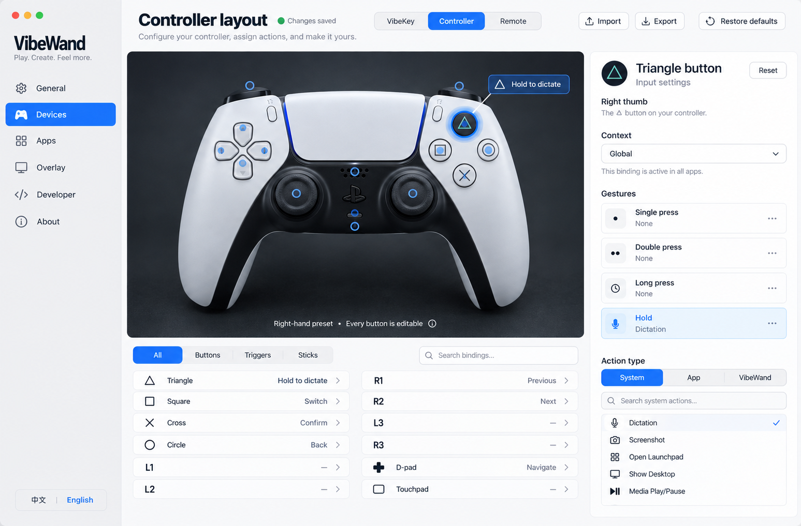
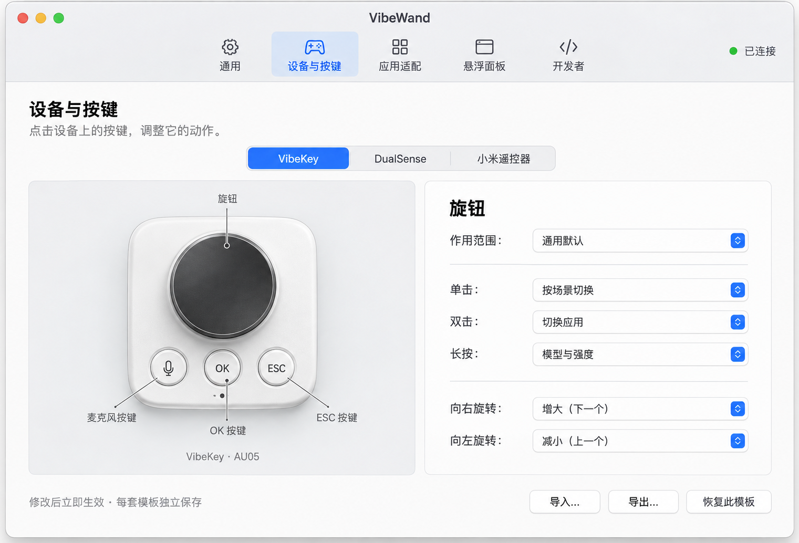

# VibeWand 0.5.3 settings design / 设置设计

[Documentation / 文档目录](README.md) · [Appearance audit / 外观审查](ui-appearance-audit.md) · [Full gallery / 全页图集](ui-appearance-gallery.html) · [核心体验](core-experience.md)

## Design before implementation / 先设计，再实现

The 0.5 redesign began with this generated visual concept. It establishes a recognizable controller photograph, selectable physical buttons, a persistent navigation sidebar, and a dedicated input inspector. The configuration flow takes inspiration from Steam Input. This image is a **design concept, not an application screenshot**; labels and available actions in the implemented app remain authoritative.

0.5 改版先生成这张视觉概念图，再实现原生界面。设计以可辨认的手柄照片、可选择的实体按键、固定侧栏和独立按键编辑器为核心，配置流程参考 Steam Input。此图是**设计概念，不是程序截图**，具体文案与可用动作以实际程序为准。

## Implemented interface / 实际界面

This image is rendered from the implemented native settings view. The photo's hotspots and the input list select the same control; its inspector shows context and gesture bindings. The action library, layout import / export, timing controls, language selector, and six settings pages are functional. A pictured controller is not evidence of hardware compatibility.

此图从已实现的原生设置界面渲染。照片热点与按键列表选择同一实体控件，右侧显示作用场景和各触发方式的绑定。动作库、布局导入 / 导出、时序设置、语言切换和六个设置页面均已实现。界面中出现设备照片不代表硬件已经通过兼容性验收。

The device images are generated product-photo assets, not manufacturer photographs. [Device photography and hotspot notes](design-device-assets.md) describe their source, dimensions, and physical-control coordinates. The earlier AU05 artwork is retained for the VibeKey layout.

设备图采用生成的产品照片风格素材，并非厂商实拍图。[设备图像与热点说明](design-device-assets.md)记录素材来源、尺寸及实体按键坐标，VibeKey 布局继续使用已有 AU05 图像。

## Compact layout and window access / 紧凑布局与窗口入口

Version 0.5.1 reduces the header height and bounds the photo area, preserving space for the input list instead of letting the artwork dominate the window. The input inspector remains alongside the selected control. An open or minimized settings window appears in the Dock, where its icon restores the existing window. Closing settings removes that Dock entry and leaves device control running from the menu bar. The floating panel has its own small settings gear, available in live and demo modes.

0.5.1 减少标题区高度并限制照片区高度，为按键列表留出可用空间；按键编辑器仍紧邻当前选择。设置窗口打开或最小化期间显示 Dock 图标，点击可恢复原窗口；关闭设置后移除 Dock 入口，设备控制继续在菜单栏运行。悬浮窗右上角增加设置齿轮，实时与演示模式都可使用。

## Whole-window appearance pass / 全窗口外观整理

### Readable typography and brand header / 字号与品牌区域

The settings UI uses a 14 pt default, 14–15 pt content and action labels, 13 pt supporting copy and 22 pt page headings. The navigation uses 15 pt text in rows at least 44 pt high. Longer input names and bindings can occupy two lines instead of being reduced to small text. Sheets have wider content areas to accommodate the larger type.

设置界面默认字号为 14pt，正文与动作名称为 14–15pt，辅助说明为 13pt，页面标题为 22pt。导航使用 15pt 字体和至少 44pt 高的行。较长的按键名称与绑定说明允许显示两行；弹窗加宽，为更大的文字保留空间。

The 208 pt sidebar begins with a 56 pt brand mark beside an 18 pt rounded bold name and a 12 pt supporting line. This gives the icon more presence while keeping the product name compact. The artwork continues to follow light and dark appearance.

208pt 宽的侧栏顶部采用 56pt 品牌图标，右侧排列 18pt 圆角粗体名称和 12pt 辅助文案。图标更突出，产品名称保持紧凑，并继续适配亮色与深色界面。

Version 0.5.2 extends the compact layout to every settings page and all four configuration sheets. It changes presentation and discoverability; it does not add a device backend or expand hardware compatibility.

0.5.2 将紧凑布局扩展到全部设置页面和四种配置弹窗，修改外观、信息层级和操作入口，不新增设备后端或扩大硬件兼容性声明。

- **Shared page frame / 统一页面框架。** A 20 pt semibold heading and 12 pt subtitle sit above a separated scrolling body. Content uses consistent 20 pt outer spacing and 16 pt card padding; longer pages scroll inside the body rather than stretching their heading area. / 20 pt 半粗体标题和 12 pt 副标题位于独立内容区上方，统一 20 pt 外边距与 16 pt 卡片内边距；长页面在主体中滚动。
- **Device-specific proportions / 适合设备的比例。** The Controller keeps its horizontal photo above a two-column input list. VibeKey and Remote place a tall photo beside the list, while the input inspector stays on the right. / 手柄横图下方采用双列按键列表；VibeKey 与遥控器竖图和列表并排，右侧持续显示按键编辑器。
- **Consistent hierarchy / 一致的信息层级。** General separates status, permissions and preferences. Applications uses aligned built-in cards and a clear custom-app entry. Overlay exposes numeric appearance values. Developer groups modes, compatibility and diagnostics. About balances product, author and links. / 通用区分状态、权限与偏好；应用页统一内置适配卡片并突出自定义入口；悬浮面板显示外观数值；开发者区分模式、兼容与诊断；关于页协调产品、作者和外链。
- **Native appearance / 原生外观。** Text and ordinary cards use semantic system colors for light and dark appearance. The device photograph stage intentionally keeps a dark background. All custom copy remains bilingual and allows longer English text to wrap. / 文字和普通卡片使用系统语义颜色，适应浅色与深色外观；设备照片区保留深色底。全部自定义文案保持双语，较长英文说明允许折行。

### Native glass and appearance / 原生毛玻璃与明暗外观

Version 0.5.3 uses native translucent materials for the settings shell and shared surfaces. Semantic text, borders and selected states follow macOS light or dark appearance. The compact page hierarchy and dark photo stage remain intact. The user-facing device name is simply **VibeKey**; technical AU05 identifiers remain in hardware documentation and backend configuration.

0.5.3 为设置框架与公共界面加入原生半透明材质。文字、边框和选中状态采用系统语义颜色，跟随 macOS 浅色或深色外观；保留紧凑页面层级和深色设备照片区。界面的设备名称简化为 **VibeKey**；硬件文档与后端配置保留 AU05 技术标识。

### Four configuration sheets / 四种配置弹窗

| Sheet / 弹窗 | Appearance changes / 外观变化 |
| --- | --- |
| Action library / 动作库 | Current/default/custom labels, search with clear and empty states, dense selectable rows, and a separate restore-default footer / 当前、默认、自定义标记；搜索清除与空状态；紧凑动作行及独立恢复默认底栏 |
| Gesture timing / 手势时序 | Matched timing rows, numeric capsules, range endpoints, a timing explanation and automatic-save feedback / 对齐的时间设置行、数值胶囊、范围端点、时间关系说明与自动保存反馈 |
| Device connection / 设备连接 | Device thumbnail, truthful profile-readiness state, separated connection and microphone sections, prominent import / 设备缩略图、准确的配置就绪状态、连接与麦克风分区、醒目的导入操作 |
| Application profile / 应用适配编辑 | App identity and template sections above an aligned shortcut table, consistent modifier buttons, and persistent save/cancel footer / 应用身份与模板区域、对齐的快捷键表、统一修饰键按钮与固定保存/取消底栏 |

### Screenshot coverage / 截图覆盖

The 0.5.2 visual pass is recorded in the [appearance audit](ui-appearance-audit.md) and [gallery](ui-appearance-gallery.html). The screenshot set covers six pages in Chinese at standard size, English at compact size, and dark appearance at compact size. All 18 screenshots were visually inspected, followed by native sheet and device-template checks. The final pass also corrected switch alignment, faint range labels and view refresh when changing layouts.

0.5.2 的视觉检查记录在[外观审查](ui-appearance-audit.md)和[图集](ui-appearance-gallery.html)。截图集覆盖六个页面的中文常用尺寸、英文紧凑尺寸及深色紧凑尺寸。18 张截图均已逐张验收，并检查了原生弹窗和三套设备布局；最后一轮还修正了开关对齐、范围文字对比度及切换布局时的视图刷新。

| Page / 页面 | 中文 / Standard | English / Compact | Dark / Compact |
| --- | --- | --- | --- |
| 通用 / General | [PNG](images/ui-audit/zh-general.png) | [PNG](images/ui-audit/en-compact-general.png) | [PNG](images/ui-audit/dark-compact-general.png) |
| 设备 / Devices | [PNG](images/ui-audit/zh-devices.png) | [PNG](images/ui-audit/en-compact-devices.png) | [PNG](images/ui-audit/dark-compact-devices.png) |
| 应用 / Applications | [PNG](images/ui-audit/zh-applications.png) | [PNG](images/ui-audit/en-compact-applications.png) | [PNG](images/ui-audit/dark-compact-applications.png) |
| 悬浮面板 / Overlay | [PNG](images/ui-audit/zh-overlay.png) | [PNG](images/ui-audit/en-compact-overlay.png) | [PNG](images/ui-audit/dark-compact-overlay.png) |
| 开发者 / Developer | [PNG](images/ui-audit/zh-developer.png) | [PNG](images/ui-audit/en-compact-developer.png) | [PNG](images/ui-audit/dark-compact-developer.png) |
| 关于 / About | [PNG](images/ui-audit/zh-about.png) | [PNG](images/ui-audit/en-compact-about.png) | [PNG](images/ui-audit/dark-compact-about.png) |

## Six-page navigation / 六页导航

| Page / 页面 | Contents / 内容 |
| --- | --- |
| General / 通用 | Language, device and foreground-app status, Accessibility and dictation / 语言、设备与前台应用状态、辅助功能与听写 |
| Devices & inputs / 设备与按键 | Photo, input list, context, gestures, action library, timing and import/export / 照片、按键列表、场景、手势、动作库、时序与导入导出 |
| Applications / 应用适配 | Built-in switches and custom app presets / 内置开关与自定义应用预设 |
| Overlay / 悬浮面板 | Visibility, guide, size, opacity, position and image export / 显示、说明、大小、透明度、位置与导出图片 |
| Developer / 开发者 | Demo, capture, compatibility, diagnostics and reconnect / 演示、采集、兼容、诊断与重连 |
| About / 关于 | Version, license, author and website links / 版本、许可、作者与主页链接 |

General contains the single language selector. Chinese and English take effect immediately, persist across launches, and do not change bindings. AppKit menu titles and floating feedback follow the same preference. Sidebar navigation responds across the entire row, including the empty space beside its label.

语言选择统一放在「通用」。中文与英文切换立即生效，重新启动后保留，不改变按键配置；AppKit 菜单和悬浮反馈使用同一语言偏好。侧栏导航整行均可点击，包括文字右侧的空白区域。

## Configure the physical input / 配置实体按键

1. **Select a layout / 选择模板。** VibeKey, Controller, and Remote keep their configurations separate. The Controller defaults remain entirely within the right hand.
2. **Select a physical button / 选择实体按键。** Click a photo hotspot or the corresponding input row. Names describe hardware, such as “□ Square,” while the current action is shown separately. Controller inputs can be filtered by button group.
3. **Choose a context / 选择场景。** The default applies unless reading, editing, a picker, or app switching has an override. Selecting a different context shows its effective bindings.
4. **Assign an action / 分配动作。** Click a gesture to open the searchable action library. “Use default” restores inheritance; “Unassigned” explicitly disables the gesture. The selected input can be reset in the current context.
5. **Keep and share the layout / 保存与分享配置。** Edits save immediately. The visible “Import,” “Export,” and “Reset” header buttons manage the current template's gesture JSON or restore the complete template. Timing is configured separately; device HID profiles are managed under “Connect device…”.

The Controller exposes 19 physical buttons plus eight stick directions, for 27 configurable inputs. The Sticks group provides up, down, left, right, and press for each stick. The Remote exposes 12 inputs corresponding to the photographed buttons. Extra buttons start unassigned. Centered-stick decoding handles dead zones, hysteresis, continuous repeat, and release on return to center. Supported controllers use automatic macOS GameController input; an imported HID override still needs measured interface mappings. VibeKey alone exposes held rotation; Controller and Remote controls do not create hidden chords.

手柄提供 19 个实体按键与八个摇杆方向，共 27 个可配置输入；「摇杆」分组列出每根摇杆的上、下、左、右与按下。遥控器提供与照片对应的 12 个按键。新增按键默认不执行。回中轴解码处理死区、迟滞、持续重复与回中释放，真实 HID 配置仍需测量。只有 VibeKey 提供按住旋转，手柄和遥控器没有隐藏组合键。

A configured hold action takes priority for the entire press and suppresses additional tap, double-press, and long-press actions. This keeps releasing dictation from also confirming or sending. Pulse-only input cannot stand in for a physical hold.

配置了「按住 / 松开」动作后，它优先占用整次按压，不再附带单击、双击或长按，避免听写结束后又确认或发送。只有脉冲、没有按下 / 松开的输入不能代替持续按住。

## Action library / 动作库

| Category / 分类 | Examples / 例子 |
| --- | --- |
| System / 系统功能 | Fn dictation and macOS application switching / Fn 听写与 macOS 应用切换 |
| Application / 应用功能 | Chats, models, candidates, scrolling, editing and native keys / 会话、模型、候选、滚屏、编辑与原生按键 |
| VibeWand / VibeWand 内功能 | Settings, overlay and button guide / 设置、悬浮面板与按键说明 |

The VibeWand category contains local actions today. It leaves room for a future embedded assistant, but this revision does not implement an agent.

VibeWand 分类目前提供本地动作，为未来内置智能体留出扩展空间；本次改版未实现智能体。

## Custom application rules / 自定义应用规则

Applications separates built-in adapter switches from user-added apps. An app picker reads the selected bundle identity; each rule chooses Chat app, Browser, or Custom as a starting point and exposes editable key / modifier mappings. Rules apply only to that exact app identity, can be disabled or deleted, and persist locally. A custom rule overrides the built-in adapter for the same identity. Browser rules preserve viewport scrolling, while Custom makes no chat-picker assumption. See [the behavior guide](core-experience.en.md#add-a-custom-application) for preset defaults and precedence.

应用适配将内置开关与用户添加的应用分开。选择本机应用后读取其标识，选择聊天工具、浏览器或自定义作为起点，再修改各动作的按键与修饰键。规则只匹配这个完整应用标识，可禁用、删除并在本机保存；同一应用的自定义规则优先于内置适配。浏览器规则保持页面滚屏，自定义规则不推定聊天选择器。预设与优先级详见[核心体验](core-experience.md#添加自定义应用)。

## About / 关于

The About page identifies **Dr. Hao Xu, Tenure-track Associate Professor at Nanjing University**, as the author. It includes the [personal website](http://xuhao1.me), [project website](https://vibewand.xuhao1.me), version, and PolyForm Noncommercial license. These are link destinations; this UI revision does not deploy a website.

关于页面注明作者为**南京大学徐浩博士，准聘（Tenure-track）副教授**，并提供[个人主页](http://xuhao1.me)、[项目主页](https://vibewand.xuhao1.me)、版本和 PolyForm Noncommercial 非商用许可信息。此次界面改版添加主页链接，不包含网站部署。

## Hardware and audio boundaries / 硬件与音频边界

The connection sheet separates the chosen input method from live connection status. Controller defaults to automatic macOS detection after USB connection or Bluetooth pairing, with direct access to Bluetooth settings and a detection retry. HID overrides are optional under Advanced compatibility, and removing an override restores automatic detection. Remote still requires a measured profile. A saved layout does not pair a device or create an audio endpoint. USB and Bluetooth microphones require separate verification; dictation uses the macOS / input-method audio source. See the [experience guide](core-experience.en.md#dictation-and-audio).

连接页面区分布局配置与真实输入状态。保存手柄或遥控器布局不等于完成配对，也不会创建音频端点。USB 与蓝牙麦克风需分别验证，听写使用 macOS / 输入法所选音源。详见[核心体验](core-experience.md#听写与音频)。

## Native implementation and verification / 原生实现与验证

An AppKit window hosts the SwiftUI sidebar and pages. Native buttons, segmented controls, switches, sliders, searchable action rows, and open/save panels provide standard macOS behavior. Each photo preserves its original aspect ratio; hotspots are positioned against the displayed image rectangle, not the enclosing card. The floating panel remains the runtime feedback surface.

AppKit 窗口承载 SwiftUI 侧栏与页面，使用原生按钮、分段控件、开关、滑块、可搜索动作列表与文件面板。照片保持原始比例，热点相对实际显示的图片矩形定位，而非整张背景卡片。悬浮面板继续负责运行时反馈。

Verification covers language persistence and immediate updates, multilingual app recognition, independent layout settings, physical-control coverage, hold priority, gesture inheritance, and input cleanup. Visual checks should cover both languages, every page, photo/list selection, the action library, and smaller window sizes. Automated tests cannot establish physical-device compatibility.

验证包括语言持久化与即时切换、应用中英文识别、独立模板配置、实体按键覆盖、按住优先级、手势继承和输入清理。界面检查需覆盖双语、全部页面、照片与列表选键、动作库及较小窗口尺寸。自动测试不能证明实机兼容性。

## Earlier design / 历史设计

This earlier concept is retained as design history. Its five-tab structure, schematic input presentation, and early device-specific names are superseded by the six-page photo-based interface above. It is not the current UI or a product screenshot.

保留此旧概念图作为设计历史。其五选项卡结构、示意图式控件和早期型号名称已被上方六页照片式界面取代；它不是当前界面，也不是程序截图。
